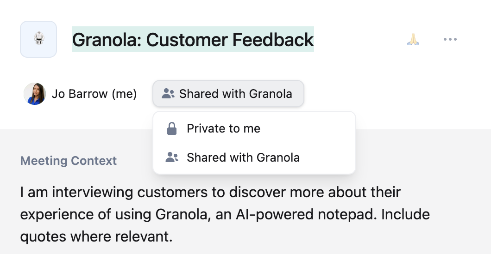
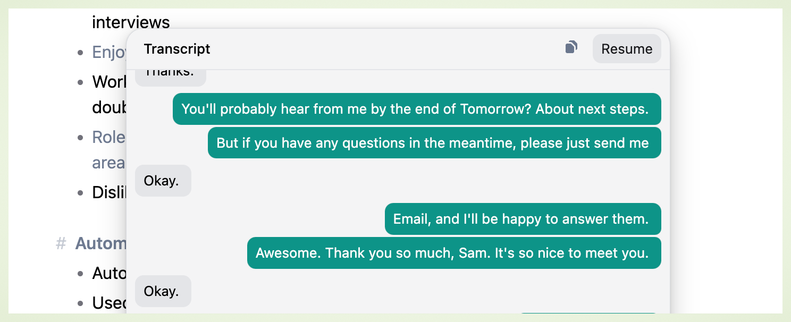
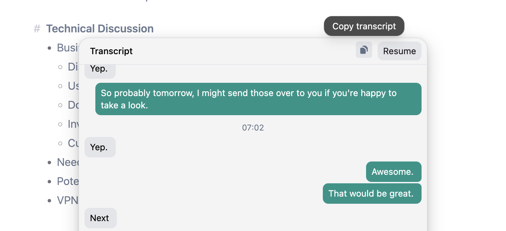

---
title: "5.175.0"
description: "Released on 2024-12-20"
---
---
title: "5.208.0"
description: "Released on 2025-01-16"
---

---
title: "Changelog"
description: "Latest updates and improvements"
---
---
title: "Setting up your account on Granola"
description: "Everything you need to know before you have your first meeting"
---

### Platform Availability 🤠

Granola currently runs on Mac, with an ios app in development. While we don't have specific release dates, we maintain a [waitlist for ](https://tally.so/r/3EXKgL?utm_source=email%2Cweb)[the Windows version](https://tally.so/r/3EXKgL?utm_source=email%2Cweb). If you join the waitlist, you will be the first to hear when we are building functionality for windows. You can stay updated on new platform releases through:

* Our [Slack community channels](https://join.slack.com/t/meetgranola/shared_invite/zt-2toq0kcts-uaUMQMWkeVMWSk4N_EhZ7A)

* Email updates

* [Twitter announcements](https://x.com/meetgranola)

If you're interested in beta testing future platforms, you can join our Slack community and contact our team directly.

### Email & Login Options

Granola is designed for professional teams and works best with company email accounts. When signing up, you'll use your Google Workspace account for seamless calendar integration and meeting management.

<Info>
  If you try to sign up with your personal Google account, you will be added to our waitlist and given access to the platform anywhere between two minutes and four weeks.&#x20;
</Info>

### Calendar Integration

Currently, Granola only offers full native support for Google Calendar. Granola integrates with your calendar for three critical reasons:

1. Granola sends notifications reminding you to join meetings and take notes

2. It uses context from calendar events to ensure your meeting notes are useful to you

3. You can add notes ahead of or to prepare for a meeting when Granola is integrated with your calendar

<Info>
  &#x20;For Outlook users, you can try this workaround that involves linking your Outlook calendar to Google Calendar. The success of this depends on your organization's IT policies – some companies may restrict calendar sharing between platforms.
</Info>

Granola only supports multiple calendars through your primary account. To access multiple calendars:

1. Share additional calendars with your primary Google account

2. In Granola, hover over "Coming Up" and click the Settings cog

3. Toggle visibility for your additional calendars

If you're experiencing calendar visibility issues, first check your calendar settings in Granola. Sometimes the app may default to the wrong calendar if you have multiple ones shared with your account.---
title: Templates
description: "Create your own templates or choose from our library for recurrent meeting types"
icon: file-lines
iconType: thin
---

Templates in Granola are a nifty way to make sure your notes are returned consistently in the most helpful way for you. 

### Accessing the templates feature:

Open your Granola app and navigate to the “Enhance” menu within your notes. This is where all your templates and enhancements can be managed. There's a built in library of common meeting types for you to start with, or to be inspired by.&#x20;

### Creating a new template:

* In the “Enhance” menu, click on “All Templates.”

* Select “Create Template” to start a new template document.

### Designing your template

* Start by writing a description of the purpose of the meeting, you might want to put specific instructions about the level of detail you want ("Include quotes, numbers and data wherever mentioned", or a description of the meeting, "This is a user interview, I am trying to understand what the user thinks about my product, Granola, an AI note-taking tool for meetings")

* Then outline the structure which is the most useful for your meetings. Common elements might include:

  * Key Discussion Points

  * Decisions Made

  * Action Items or Follow-ups

* Of course, you can also be much more specific with your headers. A user interview template for Granola might include

  * What are their current note taking tools?

  * How do they share their notes?&#x20;

  * Who introduced Granola to the team and how did they share it?&#x20;

### Applying templates to meetings

* Once created, templates can be applied to any future meetings, which will let you have more focused note taking during the meeting.&#x20;

### Sharing templates with your team

* You can share templates with your team so you can all benefit from consistent notes. Just go to the template's page and click where it says "Private to me", and change to "Shared with \[your company]" This will share your template with anyone using Granola who has the same company domain as you, so be certain you want everyone to have access to it before sharing it. 

### **Best practices**

* Test your templates to ensure they meet all your needs during a meeting. Adjust as needed to improve workflow and efficiency.

* Share templates with team members to maintain uniformity in notes across your organization.---
title: Editing your enhanced notes
description: "Everything you can do to your meeting notes to make them great"
icon: pen-to-square
iconType: thin
---

### What happens when I finish a call?

Once Granola recognises that a call has ended, it will automatically enhance your notes using the default format. This format is designed to create the best possible notes without the additional context of a custom template.

If you have typed your own notes, the enhanced notes will be both grey and black. The black notes are notes that have been brought through from your own notes, and the grey notes are notes that have been added by Granola.

### Understanding where the enhanced notes come from

Because LLMs aren't always reliable, Granola includes two tools to help you investigate your enhanced notes to feel confident in them:

1. Use the magnifying glass beside each note to see where in the transcript or raw notes the note came from

2. Use Ask Granola (cmnd+F) to pull out quotes from the transcript that support the point you're investigating

### Editing your notes after they've been enhanced

Even after Granola has generated your meeting notes, you can still change them, either by editing the enhanced notes directly, or by returning to the raw notes and editing them there, before re-enhancing them.

* #### Editing the enhanced notes directly

  * You can just directly click on any note and edit it. If a note was grey because it was added by Granola, it will turn black to show that you authored it.

* #### Editing the raw notes

  * You can also return to the raw notes and edit them there, before re-enhancing them. Be careful though, this will completely regenerate the enhanced notes, so if you have made any changes to the enhanced notes, they will be lost.

### Using templates

Once your meeting is finished, you can apply a template to your notes. This is especially helpful if you have lots of recurring meetings and you want to keep your notes consistent.---
title: Generating your notes
description: "Your notes should "
icon: sparkle
iconType: thin
------
title: Sharing with Granola
description: "How to get your notes out into the world - or not."
icon: share-nodes
iconType: thin
---

Sharing your notes and meeting summaries with Granola is straightforward and secure. Here’s how you can effectively manage sharing features:

### Basic Sharing

Granola allows you to share your meeting notes with colleagues and team members. Sharing is done through custom-generated links that you can easily manage within the app settings.&#x20;

### Generating sharing links

When you sign up to Granola, sharing links will automatically be turned on by default.&#x20;

1. Access your note or summary you wish to share.

2. Click the "Share" button.

3. You'll receive a unique URL that you can distribute to others, granting them view-only access to the content.

4. They'll be able to "Ask Granola" more questions about the meeting

### Turning off sharing links by default

1. Navigate to your settings in Granola.

2. Click "Enable sharing links" on or off, depending on your preferences.

### Turn sharing links on and off per set of notes

In each set of notes, you can turn link sharing on and off. This means that if you've shared a link with someone and you no longer want them to access it, you can disable the link they have.

* If your links are default switched off, you can click "Create link" to generate a new link

* If you want to turn off a link that has been shared publicly, click the drop down arrow beside "Copy link" and select "Disable link"

### Auto-sharing notes

Granola prioritizes your privacy, and does not auto-share your notes to attendees.&#x20;

* Notes and summaries remain private unless you manually create a share link.

* You can control who accesses your content by deciding when and with whom to share your link.

*

<Info>
  Read more about Granola's privacy and security policies here.&#x20;
</Info>---
title: Automatic Consent Messaging
description: "Turn this feature on to automatically share a consent message in Teams and Zoom."
icon: arrows-to-circle
iconType: thin
---
Granola offers a way to automatically share a message with the participants of your meeting using the inbuilt chat function in Teams and Zoom. 

### Setting Consent Messaging up

If you navigate to the settings tab in Granola, navigate to the Labs tab and find the "Enable sharing links" toggle

When you toggle it on for the first time, a security dialog will pop up with the quite scary request to "control your computer"

The way we've built this feature requires that we can control which window is foregrounded and run some related processes in the background. This is the only part of Granola that requires this permission, we do not use it elsewhere in the app. 

Once you've granted this permission, you'll see a text entry box. You can either use our default consent notice, or write your own. 

Now, every time you have a meeting in Google Meet or Zoom, your consent message will automatically send in the chat window of your meeting. 

### Troubleshooting

## Loom

If you have Loom running when you're on Granola, it will break this functionality unless you switch off the keyboard shortcut for confetti. 

Open up the Loom widget and click on the three dots to open the settings. 

Open up Preferences and x out of the keyboard shortcut for confetti

---
title: Understanding transcription
description: "Everything you need to know about Granola's live transcription tool"
icon: file-pen
iconType: thin
---

### How Granola captures transcription

Granola passes audio directly from your meetings to our transcription provider for the purpose of transcription. It does not record or save audio or video at any point during the call.&#x20;

### Speaker identification system 

The speaker identification system in Granola uses advanced algorithms to differentiate between voices. Although it does not log speaker information explicitly, it does its best to maintain accuracy in identifying turn-taking and dialogue splits within the transcription output. We provide additional tools once the meeting has ended to help you feel confident in Granola's output.&#x20;

### In-person meetings

Granola works remarkably well for in-person meetings, but because the app uses system audio, the transcript will register everyone as just one person speaking, so it is a less reliable feature. However, while processing, Granola is fairly good at identifying who has spoken, and so the notes are still great - although if you want to help Granola out, you can be sure to use peoples' names during the call.&#x20;

We're building an ios app that's designed for in-person meetings and has enhanced voice recognition and diarization functionality, [**join the waitlist here**](https://www.granola.ai/app).&#x20;

### When does transcription begin?

For a calendar event, Granola begins transcribing only when you have opened a set of meeting notes, and only from the start time of the calendar event. You can choose to start transcription manually if you want to start it earlier. &#x20;

It does not auto-transcribe any call without you manually clicking into it, either through the notification that pops up, or from the home screen.&#x20;

If you have an impromptu meeting that is not attached to a calendar event, such a Slack huddle, transcription will begin as soon as you open the set of notes, or click on the impromptu meeting notification.&#x20;

### When does transcription end?

Transcription ends under these circumstances:

* You exit out of your set of notes (the notes must be open to ensure transcription)

* You manually end the transcription by clicking the stop button

* Granola automatically recognises that the meeting has ended

* Granola identifies that there has been a long period of silence

### Resuming transcription

If your transcription has ended, you can resume it by opening the transcription window and clicking resume in the top right hand corner.&#x20;

### Dancing bars

The green dancing bars show when Granola is actively transcribing. Occasionally, if your network connection drops or Granola detects silence for too long, transcription may stop. You can resume transcription and open the live transcript window to check that it's working again.

### Viewing the transcript

Open your live transcript at any time during the meeting by clicking the "dancing bars" icon. This lets you:

* See what's being captured in real-time

* Verify audio is working correctly

* Review recent discussion points

<Info>
  The live transcription may not be 100% accurate, but the quality of the notes shouldn't be affected by what you see being generated live, as long as it's picking up both mic and system audio.&#x20;
</Info>

### How can I query a live meeting?

Use cmnd+S to open the Ask Granola sidebar and ask questions of the transcript up til the point you're asking. It can help you catch up on missed details or inform a question you need to ask. Sample questions might be:

* "In bullet points, what did I just miss?"

* "What did David say about SOC2 compliance at the start of the meeting?"&#x20;

* "Can you list all the actions I've agreed to take in this meeting so far?"&#x20;

### Exporting the transcript

You can copy/paste the transcript to another platform by opening the transcript and clicking on the clipboard button.&#x20;

### Common Transcription Issues 

Several issues can impact the quality and timeliness of Granola's transcription:

* **Quiet microphone input**: If Granola is failing to pick up what you're saying correctly, make sure your mic input volume is set to maximum through your computer's system audio settings.

* **Delayed transcripts**: This can happen if there are temporary disconnects or slow internet speeds affecting the transcription feed’s processing time

* **Intermittent transcription stops**: This may occur due to hardware conflicts or system resource limitations on your computer. Check your system audio settings are correct, that you're not accessing Granola through a restrictive VPN or that your company's IT system isn't too limited. 

* **Linguistic accuracy**: When meetings are conducted in multiple languages or accents not supported by the current version of Granola, transcription may not accurately capture the dialogue

To make sure your transcription is being captured accurately, open up the transcription box during the call, and keep Granola as a sidebar during your call.&#x20;

### FAQs

<AccordionGroup>
  <Accordion title="Why doesn't the transcript show exactly who is speaking?" defaultOpen={false}>
    Our system uses system audio and microphone audio to distinguish between speakers ("me" vs "them") without needing a meeting bot in your calls. As a result, your transcripts will only distinguish between audio that comes from your mic vs your system audio and real-time speaker identification remains technically challenging.

    We offer two tools to help you get the information you need from the transcripts:

    * A zoom in function in your enhanced notes for detailed transcript review

    * An Ask Granola chat for transcript analysis and information retrieval&#x20;

    While speaker identification works better in post-processing, live identification is more complex. Though this technology is advancing quickly, implementation depends on industry-wide progress. For now, we're focusing on providing reliable live transcription and useful analysis tools. We expect both the technology and Granola's transcription to improve rapidly.
  </Accordion>

  <Accordion title="How can I access the video or audio from my meeting?" defaultOpen={false}>
    Granola does not record or store audio or video of your meetings. We pass your audio through to our transcription service and receive the transcription back. At no point is there an accessible audio file from your meetings.
  </Accordion>

  <Accordion title="My transcription ended randomly during a meeting" defaultOpen={false}>
    We're working on a bug which means that transcriptions fails when you access Granola through a VPN, on some managed computers or with some complex audio/mic setups. Please email hey@granola.so with your bug report to help us fix this. Let us know:

    * Are you using a VPN?

    * Are you on a managed laptop?

    * Can you confirm that transcription began? (Did you open the transcription box and see that it was capturing your words?)

    * Do you have an external mic / complex audio set up?
  </Accordion>

  <Accordion title="I want to fix the transcript" defaultOpen={false}>
    Right now that's not possible on Granola, although we recognise that it could be a very useful feature! Workarounds include editing your raw notes to include the correction and editing the final enhanced notes to ensure everything is accurate.&#x20;
  </Accordion>
</AccordionGroup>---
title: "Taking notes"
description: "Granola's notes app is designed to be simple and intuitive"
icon: pen
iconType: thin
---

### The Granola note editor

Your notes editor enables you to write your own notes that help guide Granola when generating your enhanced meeting notes.&#x20;

* Type your own notes

* Add context to the conversation

* Mark important moments

You can format your notes in real time using Markdown:&#x20;

* Type # for headers

* Use \* for bullet points

* Add **bold** with asterisks

<Info>
  You *do not need to write your own notes.* Even if you don't write any notes at all, Granola will generate a great summary using context from the transcript and your event. You can even apply a template after the notes are generated if you want to have more control over the output.
</Info>

### Adding headers to create structure

Granola will always take your notes into account when generating your meeting notes, but during your call, you might want to ensure that certain sections are pulled through in your enhanced notes.&#x20;

Any header you add by typing # at the beginning of your sentence will become a section header in your final meeting notes.&#x20;

### Adding images as context

You can easily add images to your notes by capturing screenshots or attachments during your meetings and dragging and dropping the images into your notes editor. For now, you can only see the images in the raw notes version of the app, but the context contained within the images will be added to enhance your Granola notes.&#x20;

There's a limit of ten images per set of notes.&#x20;

<Info>
  For now Granola can only upload JPG and PNG files, we're looking at adding more file types, including PDFs, in the future.
</Info>

### Keyboard Shortcuts

Speed up your note-taking:

* ⌘N: New note

* ⌘F: Ask Granola

* ⌘B: Bold text

* Use - to create bullet points

* Use the tab button to create indented bullet lists---
title: "Using Granola with Outlook Calendar"
description: "GA workaround for people whose workplace use Outlook"
mode: wide
icon: windows
iconType: thin
---

Granola uses Google Calendar to view and take notes on your meetings. If you use Outlook for your work calendar, you’ll need to connect it to Google first. Here’s how:

### Watch this 3 minute video, or follow the steps below

<video
  controls
  className="w-full aspect-video"
  src="https://www.loom.com/share/d09ac60fd71246b5b4259347914fef75?sid=fb7f2289-7b6f-41b8-ac28-f9656914c984"
/>

### 1. Open settings on [outlook.com](http://outlook.com)

Head to [outlook.com](http://outlook.com) and sign in with your work account, then open settings

### 2. Get a publish URL for your work calendar

1. In settings, navigate to `Calendar` → `Shared Calendars`

2. Under `Publish a calendar` , select your main work calendar, and then select `Can view all details` from the dropdown

3. Click `Publish`
   

4. Click the `ICS` url and then copy it
   

## 3. Add a new calendar in Google Calendar

1. Head to Google Calendar ([calendar.google.com](http://calendar.google.com))

2. Click the plus next to `Other Calendars` and then select `From URL`
   

3. Paste the link you got from Outlook and click `Add Calendar`
   

## 4. Turn your new calendar on in Granola

1. In Granola, click the Gear icon next to `Coming Up`

2. Your recently added calendar should appear in this list. Toggle it on to see your outlook events

\<aside> ℹ️ The calendar name in Granola might not always be accurate, so just look for new calendars in this list

\</aside>

\<aside> ⏱️

Granola can take a few minutes to sync and recognise your newly added calendar. If it’s taking a reeaally long time, try signing out and back in again.

\</aside>

## 5. Get stuck? Message us and we’ll help!

Email us at [help@granola.so](mailto:help@granola.so) and we’ll get you unstuck
---
title: "Integrating your calendar"
description: "Make sure Granola has all the information it needs to work well!"
icon: calendar
iconType: thin
---

Granola seamlessly integrates with Google Calendar to display your upcoming meetings. Here's how to set it up:

### Calendar integration

Currently, Granola only offers full native support for Google Calendar. Granola integrates with your calendar for three critical reasons:

1. Granola sends notifications reminding you to join meetings and take notes

2. It uses context from calendar events to ensure your meeting notes are useful to you

3. You can add notes ahead of or to prepare for a meeting when Granola is integrated with your calendar

<Info>
  &#x20;For Outlook users, we provide a [**workaround**](/docs/101/gettingstarted/21Outlookintegration) that involves linking your Outlook calendar to Google Calendar. The success of this workaround depends on your organization's IT policies – some companies may restrict calendar sharing between platforms.figjam
</Info>

### **First-time setup**

* Sign in to Granola using your Google Workspace account.

* When prompted, grant the necessary calendar access permissions.

* Allow a few seconds for your meetings to sync.

* Verify the sync by checking your "Coming Up" section.

<Info>
  Granola requires calendar permissions to do two things

  * Send you notifications when there are upcoming meetings

  * Use context from the calendar to help generate better notes

  It is possible to use Granola without integrating your calendar, but the experience will be more manual and the notes will be less high quality.&#x20;
</Info>

### **Support for multiple calendars**

Granola only supports multiple calendars through your primary account. To access multiple calendars:

1. [Share additional calendars](https://support.google.com/calendar/answer/37082?hl=en) with your primary Google account

2. In Granola, hover over "Coming Up" and click the Settings cog

3. Toggle visibility for your additional calendars

If you're experiencing calendar visibility issues, first check your calendar settings in Granola. Sometimes the app may default to the wrong calendar if you have multiple ones shared with your account.

### **Checking calendar connection**

* Click on the settings cog next to "Coming Up".

* Make sure your primary calendar is selected.

* Turn on any additional calendars you wish to view.

* Confirm that your upcoming meetings are displaying correctly.

### **Managing multiple calendars**

* Granola doesn't support multiple direct logins, but you can still access multiple calendars:

  1. Share additional calendars with your primary Google account.

  2. Accept these shared calendars in Google Calendar.

  3. In Granola, access the settings cog next to "Coming Up" to toggle visibility for additional calendars.

  4. Changes in calendar visibility take immediate effect.

### **Working with Outlook**

While Granola is optimized for Google Calendar, you can join [this waiting list](https://tally.so/r/wzWb78) to be the first to hear about an Outlook integration - until then, Outlook users can use a workaround:

* **Outlook integration steps:**

  1. Link your Outlook calendar to Google Calendar.

  2. Use Granola with your Google account.

  3. Meetings should now appear from both calendars.

*Note:* This workaround's success may depend on your organization's IT policies.

### **Common calendar issues**

* **No Events Showing:** If no meetings are visible,

  1. Check if the wrong calendar is selected by default.

  2. Verify your primary calendar is selected under "Coming Up".

  3. Toggle other calendars as needed.

* **Calendar sync problems:** If you're experiencing sync issues,

  1. Ensure you are using the latest version of Granola.

  2. Double-check calendar permissions in Google.

  3. Consider signing out and back in.

  4. Contact support at hey@granola.so if problems persist.

* **IT restrictions:** Check if internal security settings affect your calendar integration by:

  1. Consulting your IT department about third-party calendar access.

  2. Verifying VPN settings that might impact connection.

  3. Requesting necessary permissions if required.

### **Best practices:**

* **Regular Checks:** Regularly verify if your calendar is syncing correctly.

* **Setup Tips:**

  1. Use your main work calendar as default.

  2. Only turn on the calendars you actively need.

For additional support or inquiries, feel free to reach out at [hey@granola.so](mailto:hey@granola.so) or join our Slack community.

<Info>
  If juggling multiple calendars, set your most-used calendar as primary in Granola so that you never miss a vital meeting notification.
</Info>

### FAQs

<AccordionGroup>
  <Accordion title="Is there a way to use my Mac local calendar?" defaultOpen={false}>
    For now, Granola primarily relies on online integrations but recognises that this is a limitation for users with restricted online calendar access due to company policies. We're interested in exploring the use of local calendars, but this feature is not yet part of the current functionality.&#x20;
  </Accordion>

  <Accordion title="Can I add multiple gmail accounts to one Granola account?" defaultOpen={false}>
    Not yet, but if you share your [gmail calendars](https://support.google.com/calendar/answer/37082?hl=en) with each other, you can access all your events from one Granola account. Some organization's IT policies won't allow this, so check with your IT administrator first of all.&#x20;
  </Accordion>

  <Accordion title="I didn't enable Calendar permissions when I signed up, help!" defaultOpen={false}>
    If you quit Granola completely by tapping on the small Granola g in the top bar across your screen, and reopen it, you'll be prompted to give calendar permission again when you log back in.&#x20;
  </Accordion>

  <Accordion title="What should I do if my Google Calendar events aren't syncing with Granola?" defaultOpen={false}>
    First check that you've given Granola the right permissions. If you log out, then quit Granola completely by tapping on the small Granola g in the top bar across your screen, you'll be prompted to give calendar permissions again when you log back in. 
    
    If your calendar permissions are set up correctly, make sure your company's IT policy allows for calendar integrations into apps, and that the VPN you're on isn't restricting access in any way. 
    
    If the problem still persists, report a bug through the Granola settings window.&#x20;
  </Accordion>
</AccordionGroup>

Ensure you’ve granted all necessary permissions for Granola to access your calendar. Double-check that your account settings in Granola are linked correctly. Reach out to support if issues persist[4].
###---
title: "Granola 101"
description: "Get started with Granola"
icon: keyboard
iconType: thin
---

Granola is an AI note-taking app where your own notes are blended with context from a transcript to create relevant, useful notes.&#x20;

<AccordionGroup>
  <Accordion title="Download Granola from the website" defaultOpen={false}>
    Download Granola from our website and move it to your Applications folder. Granola currently supports Mac, with **native** integration for Google Calendar and common meeting platforms like Zoom, Teams, and Google Meet.
  </Accordion>

  <Accordion title="Connect your Google Calendar" defaultOpen={false}>
    Link your Google Workspace or personal Gmail account to see all your upcoming meetings in Granola. The **automatic** calendar sync means you'll never miss a meeting or forget to take notes.
  </Accordion>

  <Accordion title="Set up your first meeting notes" defaultOpen={false}>
    When your first meeting starts, Granola will send you a notification. Click it to start **transcribing** - no need to invite bots or share meeting links. Your notes will automatically begin capturing everything important.
  </Accordion>

  <Accordion title="Check your audio settings" defaultOpen={false}>
    Granola works with your system audio, meaning it can capture both your microphone and other participants clearly through your computer. The **flexible** audio settings work with headphones or speakers, making it perfect for any setup.
  </Accordion>

  <Accordion title="Test your first transcription" defaultOpen={false}>
    Start with a low-stakes meeting to get comfortable with how Granola works. The **live** transcription view lets you see exactly what's being captured, and you can add your own notes alongside the automatic transcript.
  </Accordion>
</AccordionGroup>

## Power up your notes

<AccordionGroup>
  <Accordion title="Use markdown formatting" defaultOpen={false}>
    Granola supports markdown syntax for quick formatting. Use # for headers, \* for bullets, and \*\* for bold text. The **intuitive** editor makes it easy to structure your notes exactly how you want them.
  </Accordion>

  <Accordion title="Add manual headings" defaultOpen={false}>
    Guide Granola's note enhancement by adding # headings in your raw notes. These **structured** markers help ensure the most important points are highlighted in your enhanced notes.
  </Accordion>

  <Accordion title="Add images" defaultOpen={false}>
    Screenshot presentations or calls during your meeting and drag the images directly into Granola so the context they bring can be added to your enhanced meeting notes.&#x20;
  </Accordion>

  <Accordion title="Use templates" defaultOpen={false}>
    For recurring meeting types, access the templates library through the "Auto" button at the bottom of your notes. You can only apply templates after the meeting has ended.&#x20;
  </Accordion>

  <Accordion title="Create custom templates" defaultOpen={false}>
    Build templates for recurring meeting types to ensure consistent note-taking. Templates are powerful tools that help Granola understand exactly what information you need from each meeting.
  </Accordion>
</AccordionGroup>---
title: "Setting your account up"
description: "How to install and set up Granola"
icon: download
iconType: thin
---

Welcome to Granola! This guide will take you through the initial installation and setup process. Whether you're integrating Granola with your existing workflows or starting fresh, follow these steps to get started quickly.

### Platform availability

Granola currently runs on Mac, with an ios app in development. While we don't have specific release dates, we maintain a [waitlist for ](https://tally.so/r/3EXKgL?utm_source=email%2Cweb)[the Windows version](https://tally.so/r/3EXKgL?utm_source=email%2Cweb). If you join the waitlist, you will be the first to hear when we are building functionality for windows. You can stay updated on new platform releases through:

* Our [Slack community channels](https://join.slack.com/t/meetgranola/shared_invite/zt-2toq0kcts-uaUMQMWkeVMWSk4N_EhZ7A)

* Email updates

* [Twitter announcements](https://x.com/meetgranola)

If you're interested in beta testing future platforms, you can join our Slack community and contact our team directly.

### **Initial Installation and Setup**

**Step 1: Download Granola**

* Visit the [Granola website](https://granola.so/) and click Download Granola for Mac. (Granola isn't yet available on Windows, [join the waitlist to be the first to hear when we are.](https://tally.so/r/3EXKgL?utm_source=email%2Cweb))

**Step 2: Install Granola**

* For macOS: Open the .dmg file, drag the Granola app into your Applications folder, and launch it.

**Step 3: Initial Launch**

* Open Granola from your Applications folder or Start Menu.

* You may be presented with security prompts to authorize Granola to access certain permissions. Accept these prompts to ensure optimal performance.

### Email & login options

Granola is designed for professional teams and works best with company email accounts. When signing up, you'll use your Google Workspace account for seamless calendar integration and meeting management.

<Info>
  If you try to sign up with your personal Google account, you will be added to our waitlist and given access to the platform anywhere between two minutes and four weeks.&#x20;
</Info>

### Account setup FAQs

<AccordionGroup>
  <Accordion title="Can I sign up with my personal Gmail account?">
    Granola is designed for a professional company environment, so for now, we're focusing on developing it for teams.

    If you prefer to sign up with a personal account, you'll be added to a waitlist for approval. We periodically invite groups from the waitlist to join, but it might take anywhere from a few minutes to a few weeks
  </Accordion>

  <Accordion title="Can I sign up with Outlook or another email platform?">
    We’re trying to make the experience as good as possible for Google users for now, but expanding the platform to serve other platforms is in the roadmap. Join [the waitlist](https://google.com).

    In the meantime, [this workaround](/docs/integrations/using-granola-with-outlook.mdmx) works for some people who have Outlook accounts. It depends how strict your IT department is though.
  </Accordion>

  <Accordion title="Can I use Granola on Windows?">
    Not just yet, but you can join [our waitlist](https://go.granola.so/windows) and do keep an eye on our Twitter page for announcements around our latest product releases.
  </Accordion>

  <Accordion title="Does Granola work with calendars other than Google Calendar?">
    Granola is designed to work best with Google Calendar. For Outlook users, we have a workaround available, but it may not be as seamless depending on your organisation's IT policies.
  </Accordion>

  <Accordion title="Can I use Granola with multiple Google accounts?">
    Yes! While we don't support multiple logins directly, you can still access all your calendars through your primary Granola account by sharing them between your Google accounts. You can find instructions on how to share your calendar here: https://support.google.com/calendar/answer/37082?hl=en

    Once that's set up, just hover over "Coming Up" in Granola, click the Settings cog, and you'll be able to toggle your additional calendars on and off from there.
  </Accordion>

  <Accordion title="Is there a mobile app for Granola?">
    A mobile app is on our roadmap, but we don't have a specific release date yet. We'll announce it through our Slack channels and email updates when it's available.
  </Accordion>

</AccordionGroup>

###---
title: Account Setup & Access
mode: wide
icon: key
iconType: solid
---

<AccordionGroup>
  <Accordion title="Can I sign up with my personal Gmail account?">
    Granola is designed for a professional company environment, so for now, we're focusing on developing it for teams.

    If you prefer to sign up with a personal account, you'll be added to a waitlist for approval. We periodically invite groups from the waitlist to join, but it might take anywhere from a few days to a few weeks
  </Accordion>

  <Accordion title="Can I sign up with Outlook or another email platform?">
    We’re trying to make the experience as good as possible for Google users for now, but expanding the platform to serve other platforms is in the roadmap. Keep an eye on our emails and Twitter for the latest product release announcements.

    In the meantime, this workaround works for some people who have Outlook accounts. It depends how strict your IT department is though.
  </Accordion>

  <Accordion title="Can I use Granola on Windows?">
    Not just yet, but you can join our waitlist and do keep an eye on our Twitter page for announcements around our latest product releases.
  </Accordion>

  <Accordion title="Does Granola work with calendars other than Google Calendar?">
    Granola is designed to work best with Google Calendar. For Outlook users, we have a workaround available, but it may not be as seamless depending on your organisation's IT policies.
  </Accordion>

  <Accordion title="Can I use Granola with multiple Google accounts?">
    Yes! While we don't support multiple logins directly, you can still access all your calendars through your primary Granola account by sharing them between your Google accounts. You can find instructions on how to share your calendar here: https://support.google.com/calendar/answer/37082?hl=en

    Once that's set up, just hover over "Coming Up" in Granola, click the Settings cog, and you'll be able to toggle your additional calendars on and off from there.
  </Accordion>

  <Accordion title="Is there a mobile app for Granola?">
    A mobile app is on our roadmap, but we don't have a specific release date yet. We'll announce it through our Slack channels and email updates when it's available.
  </Accordion>

  <Accordion title="Wow!" defaultOpen={false}>
    Words go here!
  </Accordion>
</AccordionGroup>---
title: Languages
mode: wide
icon: globe
iconType: thin
---

### What languages does Granola support?
  Currently, Granola only supports English. We're actively working on adding
  support for more languages in the future. Stay tuned for updates!

---
title: "Consent & Granola"
description: "We recommend always asking for consent before transcribing others."
mode: "wide"
icon: "handshake"
iconType: "thin"
---

Granola transcribes your computer audio in realtime. It does not store recorded audio or video. Instead, it saves the transcript and uses it to enhance your notes. For more information about how Granola collects, uses, and stores transcripts and other data, please see Granola’s Privacy Policy, located at [www.granola.so/pp](https://www.granola.so/pp).

Depending on where your meeting participants are located, you may need to get consent from participants in meetings prior to using Granola to transcribe. You can find more information on recording laws state by state [here](https://url.us.m.mimecastprotect.com/s/9qhYCpYmqOfOpRJnfDYFqL?domain=justia.com/). Please note, this is a third-party resource and Granola is not responsible for the accuracy of third-party websites.

Ultimately, you are responsible for obtaining consent from participants where required by law. Regardless of whether you are legally required to do so, we strongly recommend that you always ask for consent before transcribing.---
title: "Popular feature requests"
description: "We love that our users have so many great ideas about how to make Granola better. This page contains some information about the most frequently requested features and when you might be able to expect them."
icon: "heart"
iconType: "thin"
---

### Multi-language Support

Multi-language support is a highly requested feature and we're actively exploring ways to incorporate this in 2025, but we are dependent on when our transcription provider releases new languages and can't control this ourselves. It's likely that the world's most-used languages will be prioritized. You can register your interest in hearing about when we launch languages [here](https://tally.so/r/mDAZlZ)

### Automatic start for all meetings

The ability to opt into automatically starting Granola for all meetings is under consideration. We're mindful of the complexities this might cause when people accidentally transcribe meetings or moments that they didn't want to be transcribed, and so we want to build better functionality around deleting or editing transcripts first.&#x20;

### Automatic export to Notion

This is our most requests integration and as Notion users ourselves, we hear you! Right now we're focusing on organizing notes on-platform better, but more integrations is something we're evaluating for 2025.&#x20;

### Mobile or tablet version of Granola

It's coming! Join the waitlist [here](https://www.granola.ai/app)!

### Windows support

It's coming! Join the waitlist [here](https://tally.so/r/3EXKgL)!

### Add templates before the meeting

We've experimented with this as a feature and we haven't found a way for it to not interrupt the flow of your own notes during the call. We're still looking into whether we can make this work, as we understand having prompts for interviews or regular calls would be helpful!

### Better in-app sharing

Better team functionality including sharing notes with your team is a priority for us in early 2025! Keep an eye out for updates on this front.;

### Querying all meetings

We think this is one of the most helpful things Granola is going to be able to do, and we're working on it as a priority.  

---
title: "Reporting bugs"
description: "If you're unlucky enough to run into a bug, help our engineers out by sharing the most information possible."
icon: "bug"
iconType: "solid"
---

### Guide to Perfect Bug Reporting for Granola

To ensure our development team can address any technical issues effectively, it's vital to provide detailed and clear bug reports. Follow these guidelines to create a perfect bug report:

1. Clear Description of the Issue:

Begin with a brief summary of the problem. Clearly state what isn't working as expected. Avoid vague statements such as "It's broken," and instead use specifics like "Granola fails to sync meetings when VPN is active".

2. Steps to Reproduce:

Provide a step-by-step account of how you encountered the issue. This should be detailed enough that someone else could follow and experience the bug themselves.

3. Expected vs. Actual Results:

Clearly outline what you expected to happen versus what actually occurred. This helps the team understand the discrepancy and identify potential causes.

4. Include Screenshots or Videos:

Visual evidence can often expedite the troubleshooting process. Include screenshots or short video clips that capture the bug in action.

5. Device and System Information:

Specify the hardware (such as MacBook or Dell laptops) and the operating system you are using. Include version numbers wherever possible as some bugs may be specific to certain setups.

6. Recent Changes or Updates:

Mention if there were any recent changes such as software updates or configuration changes prior to the issue beginning. This information can help trace the origin.

7. Severity and Frequency:

Indicate how severe the issue is (e.g., minor annoyance vs. critical blocker) and how often it occurs. This helps prioritize fixes.

8. Log Files or Error Messages:

If applicable, attach logs or specific error messages that appear when the bug is triggered. These provide critical insights for developers.

9. Additional Environment Details:

Detail any running background processes, VPN use, or third-party applications that might interact with Granola.

10. Report Through Proper Channels:

Use the in-app 'Send Feedback' option under 'Settings' to report the issue, ensuring it is logged systematically for tracking.

By adhering to these guidelines, you can provide comprehensive and helpful reports. These are crucial for our engineering team to diagnose, replicate, and address issues efficiently, ensuring Granola continues to serve your needs optimally.
---
title: "Home"
description: "(don't worry, we're still writing the rest)"
---

Hello friend! You've found our work-in-progress new help center. Consider everything you see here WIP except for our legal terms, which are legit! Check back soon to see more new stuff here.

You can find our original FAQs [here.](https://www.notion.so/granola-labs/FAQs-eef135b65cf44b6e97b407d899880aea?pvs=13)&#x20;---
title: Affinity CRM
description: "Once connected to Affinity, Granola makes sending your meeting notes to your CRM as easy as one click."
mode: wide
icon: star-of-david
iconType: thin
---

Here's how to set it up:

### Add your API key

<Info>
  **Bear this in mind:** Your API key is tied to your account, and you only get
  one at a time. If you’re using it for anything else, you’ll need to use the
  same API key for both services.
</Info>

<Steps>
  <Step >
  Sign into Affinity at [https://www.affinity.co/](https://www.affinity.co/)

  <Frame>
    
  </Frame>
  </Step>
  <Step >
  Click `settings` in your left hand menu

  <Frame>
    
  </Frame>
  </Step>
  <Step>
  Click the API tab, then click `Generate API Key`
  <Frame>
    
  </Frame>
  </Step>
  <Step >
  Head to `Settings` in Granola (click your avatar in the top right), then `Integrations` and paste your Affinity API key in the box provided . It will save automatically
  <Frame>
    
  </Frame>
  </Step>
  <Step>
  You’ll now see save to Affinity buttons on the homescreen of granola, and on the right-side of any summary

  <Frame>
    
  </Frame>
 
  <Frame>
    
  </Frame>
  </Step>
</Steps>
---
title: "Outlook calendar"
description: "Granola uses Google Calendar to view and take notes on your meetings. If you use Outlook for your work calendar, you’ll need to connect it to Google first."
icon: windows
iconType: thin
---

Here’s how:

**Watch this 3 minute video, or follow the steps below**

<iframe
  src="https://www.loom.com/embed/d09ac60fd71246b5b4259347914fef75"
  frameborder="0"
  sandbox="allow-scripts allow-popups allow-top-navigation-by-user-activation allow-forms allow-same-origin allow-storage-access-by-user-activation allow-popups-to-escape-sandbox"
  allowfullscreen=""
  height="420"
  width="1005"
></iframe>

### 1\. Open settings on outlook.com

Head to [outlook.com](http://outlook.com/) and sign in with your work account, then open settings

{" "}
<Frame>
  
</Frame>

### 2\. Get a publish URL for your work calendar

1. In settings, navigate to `Calendar` → `Shared Calendars`

2. Under `Publish a calendar` , select your main work calendar, and then select `Can view all details` from the dropdown

3. Click `Publish`

{" "}
<Frame>
  
</Frame>

4. Click the `ICS` url and then copy it

{" "}
<Frame>
  
</Frame>

### 3\. Add a new calendar in Google Calendar

Head to Google Calendar ([calendar.google.com](http://calendar.google.com/))

Click the plus next to `Other Calendars` and then select `From URL`

{" "}
<Frame>
  
</Frame>

Paste the link you got from Outlook and click `Add Calendar`

{" "}
<Frame>
  
</Frame>
### 4\. Turn your new calendar on in Granola

In Granola, click the Gear icon next to Coming Up

Your recently added calendar should appear in this list. Toggle it on to see your outlook events

<Info>
  The calendar name in Granola might not always be accurate, so just look for
  new calendars in this list
</Info>

<Note>
  Granola can take a few minutes to sync and recognise your newly added
  calendar. If it’s taking a reeaally long time, try signing out and back in
  again.
</Note>

{" "}
<Frame>
  
</Frame>

### 5\. Get stuck? Message us and we’ll help!

Email us at [help@granola.so](mailto:help@granola.so) and we’ll get you unstuck
At Granola, we take your privacy seriously. Please read this Privacy Policy to learn how we treat your personal data. **By using or accessing our Services in any manner, you acknowledge that you accept the practices and policies outlined below, and you hereby consent that we will collect, use and share your information as described in this Privacy Policy.**

Remember that your use of Granola's Services is at all times subject to our [Terms of Use](file:///C%3A%5CUsers%5Cclb1%5CAppData%5CRoaming%5CiManage%5CWork%5CRecent%5CGranola_%20Inc.-General%20%2829205.001%29%5Cgranola.so%5Ctos), which incorporates this Privacy Policy. Any terms we use in this Policy without defining them have the definitions given to them in the Terms of Use.

You may print a copy of this Privacy Policy by clicking here[INSERT LINK THAT LAUNCHES PRINTABLE VERSION].

As we continually work to improve our Services, we may need to change this Privacy Policy from time to time. We will alert you to of material changes by placing a notice on the Granola website, by sending you an email and/or by some other means. Please note that if you’ve opted not to receive legal notice emails from us (or you haven’t provided us with your email address), those legal notices will still govern your use of the Services, and you are still responsible for reading and understanding them. If you use the Services after any changes to the Privacy Policy have been posted, that means you agree to all of the changes.

# Privacy Policy Table of Contents

- What this Privacy Policy Covers
- Personal Data
  - Categories of Personal Data We Collect
  - Categories of Sources of Personal Data
  - Our Commercial or Business Purposes for Collecting or Disclosing Personal Data
- How We Disclose Your Personal Data
- Tracking Tools and Opt-Out
- Data Security
- Data Retention
- Personal Data of Children
- Other State Law Privacy Rights
- European Union, United Kingdom Data Subject Rights, and Swiss Data Subject Rights
- Contact Information

# What this Privacy Policy Covers

This Privacy Policy covers how we treat Personal Data that we gather when you access or use our Services. “Personal Data” means any information that identifies or relates to a particular individual and also includes information referred to as “personally identifiable information” or “personal information” under applicable data privacy laws, rules or regulations. This Privacy Policy does not cover the practices of companies we don’t own or control or people we don’t manage.

# Personal Data

## Categories of Personal Data We Collect

This chart details the categories of Personal Data that we may collect and may have collected over the past 12 months:

| **Category of Personal Data**                                            | **Examples of Personal Data We Collect**                                                                                                                                                                                                                                                                                                                                                                                                                                        | **Categories of Third Parties With Whom We Share this Personal Data:**                     |
| ------------------------------------------------------------------------ | ------------------------------------------------------------------------------------------------------------------------------------------------------------------------------------------------------------------------------------------------------------------------------------------------------------------------------------------------------------------------------------------------------------------------------------------------------------------------------- | ------------------------------------------------------------------------------------------ |
| **Profile or Contact Data**                                              | - First and last name                                                                                                                                                                                                                                                                                                                                                                                                                                                           |
| - Email                                                                  | _ Service Providers _ Analytics Partners \* Parties You Authorize, Access or Authenticate                                                                                                                                                                                                                                                                                                                                                                                       |
| **Payment Data**                                                         | _ Financial account information _ Payment card type _ Last 4 digits of payment card _ Billing address, phone number, and email                                                                                                                                                                                                                                                                                                                                                  | \* Service Providers (specifically our payment processing partner, currently Stripe, Inc.) |
| **Device/IP Data**                                                       | _ IP address _ IP-address-based location information _ Device ID _ Type of device/operating system/browser used to access the Services \* Other applications that utilize the microphone function                                                                                                                                                                                                                                                                               | _ Analytics Partners _ Parties You Authorize, Access or Authenticate                       |
| **Web Analytics**                                                        | _ Web page interactions _ Referring webpage/source through which you accessed the Services                                                                                                                                                                                                                                                                                                                                                                                      | _ Analytics Partners _ Parties You Authorize, Access or Authenticate                       |
| **Social Network Data**                                                  | \* Social media profiles                                                                                                                                                                                                                                                                                                                                                                                                                                                        | _ Service Providers _ Parties You Authorize, Access or Authenticate                        |
| **Professional or Employment-Related Data**                              | _ Job title and role _ Employer \* Personal website                                                                                                                                                                                                                                                                                                                                                                                                                             | _ Service Providers _ Parties You Authorize, Access or Authenticate                        |
|                                                                          |                                                                                                                                                                                                                                                                                                                                                                                                                                                                                 |                                                                                            |
| **Photos, Videos and Recording**                                         | _ Photos, videos or recordings of you _ Photos, videos or recordings of your environment                                                                                                                                                                                                                                                                                                                                                                                        | _ Service Providers _ Analytics Partners \* Parties You Authorize, Access or Authenticate  |
| **Other Identifying Information that You Voluntarily Choose to Provide** | _ Identifying information in emails, letters, texts, or other communication you send us _ Calendar data, including but not limited to meeting invitations, body text, and sender and recipients _ Meeting data, including but not limited to attendees, audio, and transcriptions _ Any other identifying information you authorize Granola to access or elect to share with Granola \* Any derivatives of such data, including but not limited to transcripts of conversations | _ Service Providers _ Analytics Partners \* Parties You Authorize, Access or Authenticate  |

## Google API Data

Notwithstanding the foregoing, to the extent we collect Personal Data about you through use of a Google API, our use and transfer of such Personal Data to any other third-party will be in compliance with the [Google API Services User Data Policy](https://developers.google.com/terms/api-services-user-data-policy?sjid=2339832302065318022-NA#additional_requirements_for_specific_api_scopes), including the Limited Use Requirements.

## Categories of Sources of Personal Data

We may collect Personal Data about you from the following categories of sources:

- **You**
  - When you provide such information directly to us.
    - When you create an account or use our interactive tools and Services.
    - When you voluntarily provide information in free-form text boxes through the Services or through responses to surveys or questionnaires.
    - When you send us an email or otherwise contact us.
  - When you use the Services and such information is collected automatically.
    - Through Cookies (defined in the “Tracking Tools and Opt-Out” section below).
    - If you use a location-enabled browser, we may receive information about your location.
    - If you download and install certain applications and software we make available, we may receive and collect information transmitted from your computing device for the purpose of providing you the relevant Services, such as information regarding when you are logged on and available to receive updates or alert notices.
- **Third Parties**
  - Vendors
    - We may use analytics providers to analyze how you interact and engage with the Services, or third parties may help us provide you with customer support.
    - We may use vendors to obtain information to generate leads and create user profiles.
  - Third Party Accounts
    - If you provide your social network account credentials to us or otherwise sign in to the Services through a third-party site or service, some content and/or information in those accounts may be transmitted into your account with us.

## Our Commercial or Business Purposes for Collecting or Disclosing Personal Data

- **Providing, Customizing and Improving the Services**
  - Creating and managing your account or other user profiles.
  - Processing orders or other transactions; billing.
  - Providing you with the products, services or information you request.
  - Meeting or fulfilling the reason you provided the information to us.
  - Providing support and assistance for the Services.
  - Improving the Services, including testing, research, internal analytics and product development.
  - Personalizing the Services, website content and communications based on your preferences.
  - Doing fraud protection, security and debugging.
  - Carrying out other business purposes stated when collecting your Personal Data or as otherwise set forth in applicable data privacy laws, such as the California Consumer Privacy Act, as amended by the California Privacy Rights Act of 2020 (the “CCPA”).
- **Marketing the Services**
  - Marketing and selling the Services.
- **Corresponding with You**
  - Responding to correspondence that we receive from you, contacting you when necessary or requested, and sending you information about Granola or the Services.
  - Sending emails and other communications according to your preferences or that display content that we think will interest you.
- **Meeting Legal Requirements and Enforcing Legal Terms**
  - Fulfilling our legal obligations under applicable law, regulation, court order or other legal process, such as preventing, detecting and investigating security incidents and potentially illegal or prohibited activities.
  - Protecting the rights, property or safety of you, Granola or another party.
  - Enforcing any agreements with you.
  - Responding to claims that any posting or other content violates third-party rights.
  - Resolving disputes.

We will not collect additional categories of Personal Data or use the Personal Data we collected for materially different, unrelated or incompatible purposes without providing you notice.

# How We Disclose Your Personal Data

We may disclose your Personal Data to the categories of service providers and other parties listed in this section. Depending on state laws that may be applicable to you, some of these disclosures may constitute a “sale” of your Personal Data. For more information, please refer to the state-specific sections below.

- **Service Providers.** These parties help us provide the Services or perform business functions on our behalf. They include:
  - Hosting, technology and communication providers.
  - Security and fraud prevention consultants.
  - Support and customer service vendors.
  - Product fulfillment and delivery providers.
  - Audio transcription providers and processors.
  - Payment processors.
    - Our payment processing partner Stripe, Inc. (“Stripe”) collects your voluntarily-provided payment card information necessary to process your payment.
    - Please see Stripe’s terms of service and privacy policy for information on its use and storage of your Personal Data.
- **Analytics Partners.** These parties provide analytics on web traffic or usage of the Services. They include:
  - Companies that track how users found or were referred to the Services.
  - Companies that track how users interact with the Services.
- **Parties You Authorize, Access or Authenticate**
  - Organizations through which you access our Services (such as your employer)
  - Third parties you access through the services.
  - Social media services.
  - Other users.

## Legal Obligations

We may share any Personal Data that we collect with third parties in conjunction with any of the activities set forth under “Meeting Legal Requirements and Enforcing Legal Terms” in the “Our Commercial or Business Purposes for Collecting Personal Data” section above.

## Business Transfers

All of your Personal Data that we collect may be transferred to a third party if we undergo a merger, acquisition, bankruptcy or other transaction in which that third party assumes control of our business (in whole or in part). Should one of these events occur, we will make reasonable efforts to notify you before your information becomes subject to different privacy and security policies and practices.

## Data that is Not Personal Data

We may create aggregated, de-identified or anonymized data from the Personal Data we collect, including by removing information that makes the data personally identifiable to a particular user. We may use such aggregated, de-identified or anonymized data and share it with third parties for our lawful business purposes, including to analyze, build and improve the Services and promote our business, provided that we will not share such data in a manner that could identify you.

# Tracking Tools and Opt-Out

The Services use cookies and similar technologies such as pixel tags, web beacons, clear GIFs and JavaScript (collectively, “Cookies”) to enable our servers to recognize your web browser, tell us how and when you visit and use our Services, analyze trends, learn about our user base and operate and improve our Services. Cookies are small pieces of data– usually text files – placed on your computer, tablet, phone or similar device when you use that device to access our Services. We may also supplement the information we collect from you with information received from third parties, including third parties that have placed their own Cookies on your device(s).

We use the following types of Cookies:

- **Essential Cookies.** Essential Cookies are required for providing you with features or services that you have requested. For example, certain Cookies enable you to log into secure areas of our Services. Disabling these Cookies may make certain features and services unavailable.
- **Functional Cookies.** Functional Cookies are used to record your choices and settings regarding our Services, maintain your preferences over time and recognize you when you return to our Services. These Cookies help us to personalize our content for you, greet you by name and remember your preferences (for example, your choice of language or region).
- **Performance/Analytical Cookies.** Performance/Analytical Cookies allow us to understand how visitors use our Services. They do this by collecting information about the number of visitors to the Services, what pages visitors view on our Services and how long visitors are viewing pages on the Services. Performance/Analytical Cookies also help us measure the performance of our advertising campaigns in order to help us improve our campaigns and the Services’ content for those who engage with our advertising.

You can decide whether or not to accept Cookies through your internet browser’s settings. Most browsers have an option for turning off the Cookie feature, which will prevent your browser from accepting new Cookies, as well as (depending on the sophistication of your browser software) allow you to decide on acceptance of each new Cookie in a variety of ways. You can also delete all Cookies that are already on your device. If you do this, however, you may have to manually adjust some preferences every time you visit our website and some of the Services and functionalities may not work.

To explore what Cookie settings are available to you or to modify your preferences with respect to Cookies, you can access your Cookie management settings in your browser settings. To find out more information about Cookies generally, including information about how to manage and delete Cookies, please visit [allaboutcookies.org](http://www.allaboutcookies.org/) or [ico.org.uk/for-the-public/online/cookies](https://ico.org.uk/for-the-public/online/cookies/) if you are located in the European Union.

# Data Security

We seek to protect your Personal Data from unauthorized access, use and disclosure using appropriate physical, technical, organizational and administrative security measures based on the type of Personal Data and how we are processing that data. You should also help protect your data by appropriately selecting and protecting your password and/or other sign-on mechanism; limiting access to your computer or device and browser; and signing off after you have finished accessing your account. Although we work to protect the security of your account and other data that we hold in our records, please be aware that no method of transmitting data over the internet or storing data is completely secure.

# Data Retention

We retain Personal Data about you for as long as necessary to provide you with our Services or to perform our business or commercial purposes for collecting your Personal Data. When establishing a retention period for specific categories of data, we consider who we collected the data from, our need for the Personal Data, why we collected the Personal Data, and the sensitivity of the Personal Data. In some cases we retain Personal Data for longer, if doing so is necessary to comply with our legal obligations, resolve disputes or collect fees owed, or is otherwise permitted or required by applicable law, rule or regulation. We may further retain information in an anonymous or aggregated form where that information would not identify you personally.

For example:

- We retain your profile information, credentials, and User Data for as long as you have an account with us.
- We retain your payment data for as long as we need to process your purchase or subscription.
- We retain your device/IP data for as long as we need it to ensure that our systems are working appropriately, effectively and efficiently.
- We retain Aggregated Data in order to train our machine learning or artificial intelligence models and improving Granola’s products, software and services, including after termination of your account or the Services.

# Personal Data of Children

As noted in the Terms of Use, we do not knowingly collect or solicit Personal Data from children under 16 years of age; if you are a child under the age of 16, please do not attempt to register for or otherwise use the Services or send us any Personal Data. If we learn we have collected Personal Data from a child under 16 years of age, we will delete that information as quickly as possible. If you believe that a child under 16 years of age may have provided Personal Data to us, please contact us at hello@granola.so.

# Other State Law Privacy Rights

## California Resident Rights

Under California Civil Code Sections 1798.83-1798.84, California residents are entitled to contact us to prevent disclosure of Personal Data to third parties for such third parties’ direct marketing purposes; in order to submit such a request, please contact us at hello@granola.so.

## Nevada Resident Rights

If you are a resident of Nevada, you have the right to opt-out of the sale of certain Personal Data to third parties. You can exercise this right by contacting us at hello@granola.so with the subject line “Nevada Do Not Sell Request” and providing us with your name and the email address associated with your account.

# European Union, United Kingdom, and Swiss Data Subject Rights

If you are a resident of the European Union (“EU”), United Kingdom (“UK”), Lichtenstein, Norway or Iceland, you may have additional rights under the EU or UK General Data Protection Regulation (the “GDPR”) with respect to your Personal Data, as outlined below.

For this section, we use the terms “Personal Data” and “processing” as they are defined in the GDPR, but “Personal Data” generally means information that can be used to individually identify a person, and “processing” generally covers actions that can be performed in connection with data such as collection, use, storage and disclosure. Granola will be the controller of your Personal Data processed in connection with the Services.

If there are any conflicts between this this section and any other provision of this Privacy Policy, the policy or portion that is more protective of Personal Data shall control to the extent of such conflict. If you have any questions about this section or whether any of the following applies to you, please contact us at hello@granola.so.

## Personal Data We Collect

The “Categories of Personal Data We Collect” section above details the Personal Data that we collect from you.

## Personal Data Use and Processing Grounds

The “Our Commercial or Business Purposes for Collecting Personal Data” section above explains how we use your Personal Data.

We will only process your Personal Data if we have a lawful basis for doing so. Lawful bases for processing include consent, contractual necessity and our “legitimate interests” or the legitimate interest of others, as further described below.

- **Contractual Necessity:** We process the following categories of Personal Data as a matter of “contractual necessity”, meaning that we need to process the data to perform under our Terms of Use with you, which enables us to provide you with the Services. When we process data due to contractual necessity, failure to provide such Personal Data will result in your inability to use some or all portions of the Services that require such data.
  - Profile or Contact Data
  - Payment Data
  - Professional or Employment-Related Data
  - Photos, Videos and Recording
  - Other Identifying Information that You Voluntarily Choose to Provide
- **Legitimate Interest:** We process the following categories of Personal Data when we believe it furthers the legitimate interest of us or third parties:
  - Profile or Contact Data
  - Payment Data
  - Device/IP Data
  - Web Analytics
  - Professional or Employment-Related Data
  - Photos, Videos and Recording
  - Other Identifying Information that You Voluntarily Choose to Provide
  - We may also de-identify or anonymize Personal Data to further our legitimate interests.
    Examples of these legitimate interests include (as described in more detail above):
  - Providing, customizing and improving the Services.
  - Marketing the Services.
  - Corresponding with you.
  - Meeting legal requirements and enforcing legal terms.
  - Completing corporate transactions.
- **Consent:** In some cases, we process Personal Data based on the consent you expressly grant to us at the time we collect such data. When we process Personal Data based on your consent, it will be expressly indicated to you at the point and time of collection.
- **Other Processing Grounds:** From time to time we may also need to process Personal Data to comply with a legal obligation, if it is necessary to protect the vital interests of you or other data subjects, or if it is necessary for a task carried out in the public interest.

## Sharing Personal Data

The “How We Share Your Personal Data” section above details how we share your Personal Data with third parties.

## Data Subject Rights

You have certain rights with respect to your Personal Data, including those set forth below. For more information about these rights, or to submit a request, please email us at hello@granola.so with the subject line: **“GDPR Request: [nature of request]”**. Your request must include enough information for us to verify your identity, relationship with Granola, and the nature of your request. In some circumstances, we may not be able to fully comply with your request, such as if we are unable to verify your identity, your request it is frivolous or extremely impractical, if it jeopardizes the rights of others, or if it is not required by law, but in those circumstances, we will still respond to notify you of such a decision. Lastly, please note that where we process your Personal Data as a data processor on behalf of another organization, you may need to submit your request directly to that organization.

- **Access**: You can request more information about the Personal Data we hold about you and request a copy of such Personal Data. You can also access certain of your Personal Data by logging on to your account.
- **Rectification**: If you believe that any Personal Data we are holding about you is incorrect or incomplete, you can request that we correct or supplement such data. Please note that due to the nature of our Services, transcripts cannot be modified after creation. However, you can modify summaries of transcripts.
- **Erasure**: You can delete certain account-related information within your account settings. You can request that we erase other Personal Data from our systems.
- **Withdrawal of Consent**: If we are processing your Personal Data based on your consent (as indicated at the time of collection of such data), you have the right to withdraw your consent at any time. Please note, however, that if you exercise this right, you may have to then provide express consent on a case-by-case basis for the use or disclosure of certain of your Personal Data, if such use or disclosure is necessary to enable you to utilize some or all of our Services.
- **Portability**: You can ask for a copy of your Personal Data in a machine-readable format. You can also request that we transmit the data to another controller where technically feasible.
- **Objection**: You can contact us to let us know that you object to the further use or disclosure of your Personal Data for certain purposes, such as for direct marketing purposes.
- **Restriction of Processing**: You can ask us to restrict further processing of your Personal Data.
- **Right to File Complaint**: You have the right to lodge a complaint about Granola's practices with respect to your Personal Data with the supervisory authority of your country or EU Member State. A list of Supervisory Authorities is available [here](https://edpb.europa.eu/about-edpb/board/members_en).

## Transfers of Personal Data

The Services are hosted and operated in the United States (“U.S.”) through Granola and its service providers, and if you do not reside in the U.S., laws in the U.S. may differ from the laws where you reside. By using the Services, you acknowledge that any Personal Data about you, regardless of whether provided by you or obtained from a third party, is being provided to Granola in the U.S. and will be hosted on U.S. servers, and you authorize Granola to transfer, store and process your information to and in the U.S., and possibly other countries. In some circumstances, your Personal Data may be transferred to the U.S. pursuant to a data processing agreement incorporating standard data protection clauses.

# Contact Information:

If you have any questions or comments about this Privacy Policy, the ways in which we collect and use your Personal Data or your choices and rights regarding such collection and use, please do not hesitate to contact us at:

- granola.so
- hello@granola.so
- 1151 Walker Road, Suite 417, Dover, Delaware 19904

If you are located in the UK, you may use the following information to contact our UK-Based Member Representative:

- Granola Labs Ltd
- 68 Hanbury St, Spitalfields, E1 5JL UK
- hello@granola.so
---
title: Troubleshooting
icon: arrows-to-circle
iconType: thin
---

As a rule, keep your macOS and your Granola up to date,
because we're finding and fixing bugs all the time.

### Problem: Transcription won't start

If Granola quickly switches from "dancing bars" to a spinning wheel,
and no transcript appears in the transcript window,
this usually means that Granola can't connect to our transcription API.

Common causes and potential fixes:

- For some users, Granola cannot resolve the domain name for our transcription API.
  Try [using `8.8.8.8` as your DNS server.](https://developers.google.com/speed/public-dns/docs/using#macos)
- For some users, Granola cannot establish a [TLS](https://en.wikipedia.org/wiki/Transport_Layer_Security) connection to our APIs.
  Things we have seen that work:

  - turn off your VPN
  - remove untrusted certificates from Keychain

- For some users, some connections are dropped or time out.
  Try adjusting or removing your firewall.

### Problem: Notes won't enhance

If Granola is stuck on "enhancing notes",
it usually means that Granola can't connect to our "enhance notes" API.

Common causes and potential fixes:

- For some users, Granola cannot resolve the domain name for our transcription API.
  Try [using `8.8.8.8` as your DNS server.](https://developers.google.com/speed/public-dns/docs/using#macos)
- For some users, Granola cannot establish a [TLS](https://en.wikipedia.org/wiki/Transport_Layer_Security connection to our APIs.
  Things we have seen that work:

  - turn off your VPN
  - remove untrusted certificates from Keychain

- For some users, some connections are dropped or time out.
  Try adjusting or removing your firewall.

### Problem: I can't see my calendar events

If Granola is not keeping your calendar up to date,
it usually means that Granola can't connect to our calendar API.

Common causes and potential fixes:

- For some users, Granola cannot resolve the domain name for our transcription API.
  Try [using `8.8.8.8` as your DNS server.](https://developers.google.com/speed/public-dns/docs/using#macos)
- For some users, Granola cannot establish a TLS connection to our APIs.
  Things we have seen that work:

  - turn off your VPN
  - remove untrusted certificates from Keychain

- For some users, some connections are dropped or time out.
  Try adjusting or removing your firewall.

### Problem: When I have Granola open, it slows typing into other applications

If you're on macOS 15.1, try updating to 15.2 or above.

### Problem: When I have Granola open, Zoom or other meeting platforms lag

Try updating to macOS 15.2 or above.
---
title: "Consent & Granola"
publishedAt: "2023-08-15"
summary: "In short: tell people you're using Granola"
group: "guides"
redirect: "https://go.granola.so/consent"
---

In accordance with the DMCA, we've adopted the policy below toward copyright infringement. We reserve the right to (1) block access to or remove material that we believe in good faith to be copyrighted material that has been illegally copied and distributed by any of our advertisers, affiliates, content providers, members or users and (2) remove and discontinue service to repeat offenders.

Remember that your use of Granola, Inc.'s Services is at all times subject to the [Terms of Use](/policies/terms/tos), which incorporates this Copyright Dispute Policy. Any terms we use in this Policy without defining them have the definitions given to them in the [Terms of Use](https://go.granola.so/user-tos).

1. _Procedure for Reporting Copyright Infringements_. If you believe that material or content residing on or accessible through the Services infringes your copyright (or the copyright of someone whom you are authorized to act on behalf of), please send a notice of copyright infringement containing the following information to Granola's Designated Agent to Receive Notification of Claimed Infringement (our "Designated Agent," whose contact details are listed below):

   1. A physical or electronic signature of a person authorized to act on behalf of the owner of the copyright that has been allegedly infringed;
   2. Identification of works or materials being infringed;
   3. Identification of the material that is claimed to be infringing including information regarding the location of the infringing materials that the copyright owner seeks to have removed, with sufficient detail so that Company is capable of finding and verifying its existence;
   4. Contact information about the notifier including address, telephone number and, if available, email address;
   5. A statement that the notifier has a good faith belief that the material identified in (1)(c) is not authorized by the copyright owner, its agent, or the law; and
   6. A statement made under penalty of perjury that the information provided is accurate and the notifying party is authorized to make the complaint on behalf of the copyright owner.

2. _Once Proper Bona Fide Infringement Notification is Received by the Designated Agent_. Upon receipt of a proper notice of copyright infringement, we reserve the right to:

   1. remove or disable access to the infringing material;
   2. notify the content provider who is accused of infringement that we have removed or disabled access to the applicable material; and
   3. terminate such content provider's access to the Services if he or she is a repeat offender.

3. _Procedure to Supply a Counter-Notice to the Designated Agent_. If the content provider believes that the material that was removed (or to which access was disabled) is not infringing, or the content provider believes that it has the right to post and use such material from the copyright owner, the copyright owner's agent, or, pursuant to the law, the content provider may send us a counter-notice containing the following information to the Designated Agent:

   1. A physical or electronic signature of the content provider;
   2. Identification of the material that has been removed or to which access has been disabled and the location at which the material appeared before it was removed or disabled;
   3. A statement that the content provider has a good faith belief that the material was removed or disabled as a result of mistake or misidentification of the material; and
   4. Content provider's name, address, telephone number, and, if available, email address, and a statement that such person or entity consents to the jurisdiction of the Federal Court for the judicial district in which the content provider's address is located, or, if the content provider's address is located outside the United States, for any judicial district in which Company is located, and that such person or entity will accept service of process from the person who provided notification of the alleged infringement.

   If a counter-notice is received by the Designated Agent, Company may, in its discretion, send a copy of the counter-notice to the original complaining party informing that person that Company may replace the removed material or cease disabling it in 10 business days. Unless the copyright owner files an action seeking a court order against the content provider accused of committing infringement, the removed material may be replaced or access to it restored in 10 to 14 business days or more after receipt of the counter-notice, at Company's discretion.

Please contact Company's Designated Agent at the following address:

Granola, Inc.  
Attn: DMCA Designated Agent  
1151 Walker Road, Suite 41  
Dover, Delaware 19904
---
title: "Data Protection Agreement"
publishedAt: "2024-12-16"
summary: "How Granola protects your data"
group: "privacy"
description: "Last updated: 23 December 2024"
---

This Data Processing Addendum (“DPA”) supplements Granola’s standard terms, any related Enterprise Order Form, and/or Terms of Use (the “Agreement”) entered into by and between the customer identified in the Agreement (“Customer”) and Granola. This DPA incorporates the terms of the Agreement, and any terms not defined in this DPA shall have the meaning set forth in the Agreement.

# 1. Definitions

* 1.1. “Affiliate” means (i) an entity of which a party directly or indirectly owns fifty percent (50%) or more of the stock or other equity interest, (ii) an entity that owns at least fifty percent (50%) or more of the stock or other equity interest of a party, or (iii) an entity which is under common control with a party by having at least fifty percent (50%) or more of the stock or other equity interest of such entity and a party owned by the same person, but such entity shall only be deemed to be an Affiliate so long as such ownership exists.

* 1.2. “Authorized Subprocessor” means a third-party who has a need to know or otherwise access Customer’s Personal Data to enable Granola to perform its obligations under this DPA or the Agreement, and who is either (1) listed in Exhibit B or (2) subsequently authorized under Section 4.2 of this DPA.

* 1.3. “Data Exporter” means Customer.

* 1.4. “Data Importer” means Granola.

* 1.5. “Data Protection Laws” means any applicable laws and regulations in any relevant jurisdiction relating to the use or processing of Personal Data including: (i) the California Consumer Privacy Act of 2018, as amended by the California Privacy Rights Act of 2020 (“CCPA”), (ii) the General Data Protection Regulation (Regulation (EU) 2016/679) (“EU GDPR”) and the EU GDPR as it forms part of the law of England and Wales by virtue of section 3 of the European Union (Withdrawal) Act 2018 (the “UK GDPR”) (together, collectively, the “GDPR”), (iii) the Swiss Federal Act on Data Protection; (iv) the UK Data Protection Act 2018, (v) the Privacy and Electronic Communications (EC Directive) Regulations 2003; (vi) the Virginia Consumer Data Protection Act (“VCDPA”); (vii) the Colorado Privacy Act (“CPA”); (viii) the Connecticut Data Privacy Act (“CTDPA”), (ix) the Utah Consumer Privacy Act (“UCPA”), (x) the Montana Consumer Data Privacy Act (“MCDPA”), (xi) the Oregon Consumer Privacy Act (“OCPA”), and (xii) the Texas Data Privacy and Security Act (“TDPSA”), in each case, as updated, amended or replaced from time to time. The terms “Data Subject”, “Personal Data”, “Personal Data Breach”, “processing”, “processor,” “controller,” and “supervisory authority” shall have the meanings set forth in the GDPR.

* 1.6. “Data Privacy Framework” means, as applicable, EU-U.S. Data Privacy Framework, the UK Extension to the EU-U.S. Data Privacy Framework, and/or the Swiss-U.S. Data Privacy Framework.

* 1.7. “EU SCCs” means, as applicable, the standard contractual clauses approved by the European Commission in Commission Decision 2021/914 dated 4 June 2021, for transfers of personal data to countries not otherwise recognized as offering an adequate level of protection for personal data by the European Commission (as amended and updated from time to time), as modified by Section 6.2 of this DPA.

* 1.8. “ex-EEA Transfer” means the transfer of Personal Data, which is processed in accordance with the GDPR, from the Data Exporter to the Data Importer (or its premises) outside the European Economic Area (the “EEA”), and such transfer is not governed by an adequacy decision made by the European Commission in accordance with the relevant provisions of the GDPR.

* 1.9. “ex-UK Transfer” means the transfer of Personal Data covered by Chapter V of the UK GDPR, which is processed in accordance with the UK GDPR and the Data Protection Act 2018, from the Data Exporter to the Data Importer (or its premises) outside the United Kingdom (the “UK”), and such transfer is not governed by an adequacy decision made by the Secretary of State in accordance with the relevant provisions of the UK GDPR and the Data Protection Act 2018.

* 1.10. “Services” shall have the meaning set forth in the Agreement.

* 1.11. “Standard Contractual Clauses” means the EU SCCs and the UK SCCs.

* 1.12 “UK Addendum” has the meaning set forth in Exhibit C.

* 1.13 “UK SCCs” means, as applicable, the EU SCCs, as amended by the UK Addendum.

# 2. Relationship of the Parties; Processing of Data

* 2.1 The parties acknowledge and agree that with regard to the processing of Personal Data, Customer may act either as a controller or processor and, except as expressly set forth in this DPA or the Agreement, Granola is a processor. Customer shall, in its use of the Services, at all times process Personal Data, and provide instructions for the processing of Personal Data, in compliance with Data Protection Laws. Customer shall ensure that the processing of Personal Data in accordance with Customer’s instructions will not cause Granola to be in breach of the Data Protection Laws. Customer is solely responsible for the accuracy, quality, and legality of (i) the Personal Data provided to Granola by or on behalf of Customer, (ii) the means by which Customer acquired any such Personal Data, and (iii) the instructions it provides to Granola regarding the processing of such Personal Data. Customer shall not provide or make available to Granola any Personal Data in violation of the Agreement or otherwise inappropriate for the nature of the Services, and shall indemnify Granola from all claims and losses in connection therewith.

* 2.2 Granola shall not process Personal Data (i) for purposes other than those set forth in the Agreement and/or Exhibit A, (ii) in a manner inconsistent with the terms and conditions set forth in this DPA or any other documented instructions provided by Customer, including with regard to transfers of personal data to a third country or an international organization, unless required to do so by Supervisory Authority to which Granola is subject; in such a case, Granola shall inform Customer of that legal requirement before processing, unless that law prohibits such information on important grounds of public interest, or (iii) in violation of Data Protection Laws. Customer hereby instructs Granola to process Personal Data in accordance with the foregoing and as part of any processing initiated by Customer in its use of the Services.

* 2.3 The subject matter, nature, purpose, and duration of this processing, as well as the types of Personal Data collected and categories of Data Subjects, are described in Exhibit A to this DPA.

* 2.4 Following completion of the Services, at Customer’s choice, Granola shall return or delete Customer’s Personal Data, unless further storage of such Personal Data is required or authorized by applicable law. If return or destruction is impracticable or prohibited by law, rule or regulation, Granola shall take measures to block such Personal Data from any further processing (except to the extent necessary for its continued hosting or processing required by law, rule or regulation) and shall continue to appropriately protect the Personal Data remaining in its possession, custody, or control. If Customer and Granola have entered into Standard Contractual Clauses as described in Section 6 (Transfers of Personal Data), the parties agree that the certification of deletion of Personal Data that is described in Clause 8.1(d) and Clause 8.5 of the EU SCCs (as applicable) shall be provided by Granola to Customer only upon Customer’s request.

* 2.5 U.S. State Privacy Laws. The Parties acknowledge and agree that the processing of personal information or personal data that is subject to the CCPA, VCDPA, CPA, CTDPA, UCPA, MCDPA, OCPA, or TDPSA shall be carried out in accordance with the terms set forth in Exhibit D.

# 3. Confidentiality

Granola shall ensure that any person it authorizes to process Personal Data has agreed to protect Personal Data in accordance with Granola’s confidentiality obligations in the Agreement. Customer agrees that Granola may disclose Personal Data to its advisers, auditors or other third parties as reasonably required in connection with the performance of its obligations under this DPA, the Agreement, or the provision of Services to Customer.

# 4. Authorized Subprocessors

* 4.1 Customer acknowledges and agrees that Granola may (1) engage its Affiliates and the Authorized Subprocessors listed in Exhibit B to this DPA to access and process Personal Data in connection with the Services and (2) from time to time engage additional third parties for the purpose of providing the Services, including without limitation the processing of Personal Data. By way of this DPA, Customer provides general written authorization to Granola to engage subprocessors as necessary to perform the Services.

* 4.2 A list of Granola’s current Authorized Subprocessors can be found at [trust.granola.ai/subprocessors](https://trust.granola.ai/subprocessors) (the “List”). Such List may be updated by Granola from time to time. Granola may provide a mechanism to subscribe to notifications of new Authorized Subprocessors and Customer agrees to subscribe to such notifications where available. At least ten (10) days before enabling any third party other than existing Authorized Subprocessors to access or participate in the processing of Personal Data, Granola will add such third party to the List and notify Customer via email. Customer may object to such an engagement by informing Granola within ten (10) days of receipt of the aforementioned notice to Customer, provided such objection is in writing and based on reasonable grounds relating to data protection. Customer acknowledges that certain subprocessors are essential to providing the Services and that objecting to the use of a subprocessor may prevent Granola from offering the Services to Customer.

* 4.3 If Customer reasonably objects to an engagement in accordance with Section 4.2, and Granola cannot provide a commercially reasonable alternative within a reasonable period of time, Customer may discontinue the use of the affected Service by providing written notice to Granola. Discontinuation shall not relieve Customer of any fees owed to Granola under the Agreement.

* 4.4 If Customer does not object to the engagement of a third party in accordance with Section 4.2 within ten (10) days of notice by Granola, that third party will be deemed an Authorized Subprocessor for the purposes of this DPA.

* 4.5 Granola will enter into a written agreement with the Authorized Subprocessor imposing on the Authorized Subprocessor data protection obligations comparable to those imposed on Granola under this DPA with respect to the protection of Personal Data. In case an Authorized Subprocessor fails to fulfill its data protection obligations under such written agreement with Granola, Granola will remain liable to Customer for the performance of the Authorized Subprocessor’s obligations under such agreement.

* 4.6 If Customer and Granola have entered into Standard Contractual Clauses as described in Section 6 (Transfers of Personal Data), (i) the above authorizations will constitute Customer’s prior written consent to the subcontracting by Granola of the processing of Personal Data if such consent is required under the Standard Contractual Clauses, and (ii) the parties agree that the copies of the agreements with Authorized Subprocessors that must be provided by Granola to Customer pursuant to Clause 9(c) of the EU SCCs may have commercial information, or information unrelated to the Standard Contractual Clauses or their equivalent, removed by Granola beforehand, and that such copies will be provided by Granola only upon request by Customer.

# 5. Security of Personal Data.

Taking into account the state of the art, the costs of implementation and the nature, scope, context and purposes of processing as well as the risk of varying likelihood and severity for the rights and freedoms of natural persons, Granola shall maintain appropriate technical and organizational measures to ensure a level of security appropriate to the risk of processing Personal Data, as described on Granola’s Trust Center, available at: [trust.granola.ai](https://trust.granola.ai) (“Granola Security Page”).

# 6. Transfers of Personal Data

* 6.1 The parties agree that Granola may transfer Personal Data processed under this DPA outside the EEA, the UK, or Switzerland as necessary to provide the Services. Customer acknowledges that Granola’s primary processing operations take place in the United States, and that the transfer of Customer’s Personal Data to the United States is necessary for the provision of the Services to Customer. If Granola transfers Personal Data protected under this DPA to a jurisdiction for which the European Commission has not issued an adequacy decision, Granola will ensure that appropriate safeguards have been implemented for the transfer of Personal Data in accordance with Data Protection Laws.

* 6.2 Ex-EEA Transfers. The parties agree that ex-EEA Transfers will be made (i) pursuant to the Data Privacy Framework, or (ii) if the Data Privacy Framework does not apply or ceases to be available, pursuant to the EU SCCs, which are deemed entered into (and incorporated into this DPA by this reference) and completed as follows:

  * 6.2.1 Module One (Controller to Controller) of the EU SCCs apply when Granola is processing Personal Data as a controller pursuant to Section 9 of this DPA.

  * 6.2.2 Module Two (Controller to Processor) of the EU SCCs apply when Customer is a controller and Granola is processing Personal Data for Customer as a processor pursuant to Section 2 of this DPA.

  * 6.2.3 Module Three (Processor to Subprocessor) of the EU SCCs apply when Customer is a processor and Granola is processing Personal Data on behalf of Customer as a subprocessor.

* 6.3 For each module, where applicable the following applies:

  * 6.3.1 The optional docking clause in Clause 7 does not apply.

  * 6.3.2 In Clause 9, Option 2 (general written authorization) applies, and the minimum time period for prior notice of subprocessor changes shall be as set forth in Section 4.2 of this DPA;

  * 6.3.3 In Clause 11, the optional language does not apply;

  * 6.3.4 All square brackets in Clause 13 are hereby removed;

  * 6.3.5 In Clause 17 (Option 1), the EU SCCs will be governed by the law of the Republic of Ireland;

  * 6.3.6 In Clause 18(b), disputes will be resolved before the courts of the Republic of Ireland;

  * 6.3.7 Exhibit B to this DPA contains the information required in Annex I and Annex III of the EU SCCs;

  * 6.3.8 The Granola Security Page contains the information required in Annex II of the EU SCCs; and

  * 6.3.9 By entering into this DPA, the parties are deemed to have signed the EU SCCs incorporated herein, including their Annexes.

* 6.4. Ex-UK Transfers. The parties agree that ex-UK Transfers will be made (i) pursuant to the Data Privacy Framework, or (ii) if the Data Privacy Framework does not apply or ceases to be available, pursuant to the UK SCCs, which are deemed entered into and incorporated into this DPA by reference, and amended and completed in accordance with the UK Addendum, which is incorporated herein as Exhibit C of this DPA.

* 6.5 Transfers from Switzerland. The parties agree that transfers from Switzerland will be made (i) pursuant to the Data Privacy Framework, or (ii) if the Data Privacy Framework does not apply or ceases to be available, pursuant to the EU SCCs with the following modifications:

  * 6.5.1 The terms “General Data Protection Regulation” or “Regulation (EU) 2016/679” as utilized in the EU SCCs shall be interpreted to include the Federal Act on Data Protection of 19 June 1992 (the “FADP,” and as revised as of 25 September 2020, the “Revised FADP”) with respect to data transfers subject to the FADP.

  * 6.5.1 The terms of the EU SCCs shall be interpreted to protect the data of legal entities until the effective date of the Revised FADP.

  * 6.5.2. Clause 13 of the EU SCCs is modified to provide that the Federal Data Protection and Information Commissioner (“FDPIC”) of Switzerland shall have authority over data transfers governed by the FADP and the appropriate EU supervisory authority shall have authority over data transfers governed by the GDPR. Subject to the foregoing, all other requirements of Clause 13 shall be observed.

  * 6.5.3. The term “EU Member State” as utilized in the EU SCCs shall not be interpreted in such a way as to exclude Data Subjects in Switzerland from exercising their rights in their place of habitual residence in accordance with Clause 18(c) of the EU SCCs.

* 6.6 Supplementary Measures. In respect of any ex-EEA Transfer or ex-UK Transfer made pursuant to the Standard Contractual Clauses, the following supplementary measures shall apply:

  * 6.6.1 As of the date of this DPA, the Data Importer has not received any formal legal requests from any government intelligence or security service/agencies in the country to which the Personal Data is being exported, for access to (or for copies of) Customer’s Personal Data (“Government Agency Requests”).

  * 6.6.2 If, after the date of this DPA, the Data Importer receives any Government Agency Requests, Granola shall attempt to redirect the law enforcement or government agency to request that data directly from Customer. As part of this effort, Granola may provide Customer’s basic contact information to the government agency. If compelled to disclose Customer’s Personal Data to a law enforcement or government agency, Granola shall give Customer reasonable notice of the demand and cooperate to allow Customer to seek a protective order or other appropriate remedy unless Granola is legally prohibited from doing so. Granola shall not voluntarily disclose Personal Data to any law enforcement or government agency. Data Exporter and Data Importer shall (as soon as reasonably practicable) discuss and determine whether all or any transfers of Personal Data pursuant to this DPA should be suspended in the light of the such Government Agency Requests;

  * 6.6.3 The Data Exporter and Data Importer will meet regularly to consider whether:

    * i) the protection afforded by the laws of the country of the Data Importer to data subjects whose Personal Data is being transferred is sufficient to provide broadly equivalent protection to that afforded in the EEA or the UK, whichever the case may be;

    * ii) additional measures are reasonably necessary to enable the transfer to be compliant with the Data Protection Laws; and

    * iii) it is still appropriate for Personal Data to be transferred to the relevant Data Importer, taking into account all relevant information available to the parties, together with guidance provided by the supervisory authorities.

  * 6.6.4. If Data Protection Laws require the Data Exporter to execute the Standard Contractual Clauses applicable to a particular transfer of Personal Data to a Data Importer as a separate agreement, the Data Importer shall, on request of the Data Exporter, promptly execute such Standard Contractual Clauses incorporating such amendments as may reasonably be required by the Data Exporter to reflect the applicable appendices and annexes, the details of the transfer and the requirements of the relevant Data Protection Laws.

  * 6.6.5. If either (i) any of the means of legitimizing transfers of Personal Data outside of the EEA or UK set forth in this DPA cease to be valid or (ii) any supervisory authority requires transfers of Personal Data pursuant to those means to be suspended, then Data Importer may by notice to the Data Exporter, with effect from the date set out in such notice, amend or put in place alternative arrangements in respect of such transfers, as required by Data Protection Laws.

# 7. Rights of Data Subjects

* 7.1 Granola shall, to the extent permitted by law, notify Customer upon receipt of a request by a Data Subject to exercise the Data Subject’s right of: access, rectification, erasure, data portability, restriction or cessation of processing, withdrawal of consent to processing, and/or objection to being subject to processing that constitutes automated decision-making (such requests individually and collectively “Data Subject Request(s)”). If Granola receives a Data Subject Request in relation to Customer’s data, Granola will advise the Data Subject to submit their request to Customer and Customer will be responsible for responding to such request, including, where necessary, by using the functionality of the Services. Customer is solely responsible for ensuring that Data Subject Requests for erasure, restriction or cessation of processing, or withdrawal of consent to processing of any Personal Data are communicated to Granola, and, if applicable, for ensuring that a record of consent to processing is maintained with respect to each Data Subject.

* 7.2 Granola shall, at the request of Customer, and taking into account the nature of the processing applicable to any Data Subject Request, apply appropriate technical and organizational measures to assist Customer in complying with Customer’s obligation to respond to such Data Subject Request and/or in demonstrating such compliance, where possible, *provided that* (i) Customer is itself unable to respond without Granola’s assistance and (ii) Granola is able to do so in accordance with all applicable laws, rules, and regulations. Customer shall be responsible to the extent legally permitted for any costs and expenses arising from any such assistance by Granola.

# 8. Actions and Access Requests; Audits

* 8.1 Granola shall, taking into account the nature of the processing and the information available to Granola, provide Customer with reasonable cooperation and assistance where necessary for Customer to comply with its obligations under the Data Protection Laws to conduct a data protection impact assessment and/or to demonstrate such compliance, *provided that* Customer does not otherwise have access to the relevant information. Customer shall be responsible to the extent legally permitted for any costs and expenses arising from any such assistance by Granola.

* 8.2 Granola shall, taking into account the nature of the processing and the information available to Granola, provide Customer with reasonable cooperation and assistance with respect to Customer’s cooperation and/or prior consultation with any Supervisory Authority or regulatory agency, where necessary and where required by the Data Protection Laws. Customer shall be responsible to the extent legally permitted for any costs and expenses arising from any such assistance by Granola.

* 8.3 Granola shall maintain records sufficient to demonstrate its compliance with its obligations under this DPA, and retain such records for a period of three (3) years after the termination of the Agreement. Customer shall, with reasonable notice to Granola, have the right to review, audit and copy such records at Granola’s offices during regular business hours.

* 8.4 Upon Customer’s written request at reasonable intervals, and subject to reasonable confidentiality controls, Granola shall, either (i) make available for Customer’s review copies of certifications or reports demonstrating Granola’s compliance with prevailing data security standards applicable to the processing of Customer’s Personal Data, or (ii) if the provision of reports or certifications pursuant to (i) is not reasonably sufficient under Data Protection Laws, allow Customer’s independent third party representative to conduct an audit or inspection of Granola’s data security infrastructure and procedures that is sufficient to demonstrate Granola’s compliance with its obligations under Data Protection Laws, provided that (a) Customer provides reasonable prior written notice of any such request for an audit and such inspection shall not be unreasonably disruptive to Granola’s business; (b) such audit shall only be performed during business hours and occur no more than once per calendar year; and (c) such audit shall be restricted to data relevant to Customer. Customer shall be responsible for the costs of any such audits or inspections, including without limitation a reimbursement to Granola for any time expended for on-site audits.If Customer and Granola have entered into Standard Contractual Clauses as described in Section 6 (Transfers of Personal Data), the parties agree that the audits described in Clause 8.9 of the EU SCCs shall be carried out in accordance with this Section 8.4.

* 8.5 Granola shall immediately notify Customer if an instruction, in Granola’s opinion, infringes the Data Protection Laws or Supervisory Authority.

* 8.6 In the event of a Personal Data Breach, Granola shall, without undue delay, inform Customer of the Personal Data Breach and take such steps as Granola in its sole discretion deems necessary and reasonable to remediate such violation (to the extent that remediation is within Granola’s reasonable control).

* 8.7 In the event of a Personal Data Breach, Granola shall, taking into account the nature of the processing and the information available to Granola, provide Customer with reasonable cooperation and assistance necessary for Customer to comply with its obligations under the Data Protection Laws with respect to notifying (i) the relevant Supervisory Authority or regulatory agency and (ii) Data Subjects affected by such Personal Data Breach without undue delay.

* 8.8 The obligations described in Sections 8.6 and 8.7 shall not apply in the event that a Personal Data Breach results from the actions or omissions of Customer. Granola’s obligation to report or respond to a Personal Data Breach under Sections 8.6 and 8.7 will not be construed as an acknowledgement by Granola of any fault or liability with respect to the Personal Data Breach.

# 9. Granola’s Role as a Controller.

The parties acknowledge and agree that with respect to Business Contact Data and Usage Data (as such terms are defined in the Agreement), Granola is an independent controller, not a joint controller with Customer. Granola will process Business Contact Data and Usage Data as a controller (i) to manage the relationship with Customer; (ii) to carry out Granola’s core business operations, such as accounting, audits, tax preparation and filing and compliance purposes; (iii) to monitor, investigate, prevent and detect fraud, security incidents and other misuse of the Services, and to prevent harm to Customer; (iv) for identity verification purposes; (v) to comply with legal or regulatory obligations applicable to the processing and retention of Personal Data to which Granola is subject; and (vi) as otherwise permitted under Data Protection Laws and in accordance with this DPA and the Agreement. Granola may also process Usage Data as a controller to provide, optimize, and maintain the Services, to the extent permitted by Data Protection Laws. Any processing by Granola as a controller shall be in accordance with Granola’s privacy policy set forth at [https://go.granola.so/privacy](https://go.granola.so/privacy).

# 10. Conflict

In the event of any conflict or inconsistency among the following documents, the order of precedence will be: (1) the applicable terms in the Standard Contractual Clauses; (2) the terms of this DPA; (3) the Agreement; and (4) Granola’s privacy policy. Any claims brought in connection with this DPA will be subject to the terms and conditions, including, but not limited to, the exclusions and limitations set forth in the Agreement.

# Exhibit A

**Details of Processing**

**Nature and Purpose of Processing:** Granola will process Customer’s Personal Data as necessary to provide the Services under the Agreement, for the purposes specified in the Agreement and this DPA, and in accordance with Customer’s instructions as set forth in this DPA. The nature of processing includes, without limitation:

* Receiving data, including collection, accessing, retrieval, recording, and data entry

* Holding data, including storage, organization and structuring

* Using data, including analysis, consultation, testing

* Updating data, including correcting, adaptation, alteration, alignment and combination

* Protecting data, including restricting, encrypting, and security testing

* Sharing data, including disclosure, dissemination, allowing access or otherwise making available

* Returning data to the data exporter or data subject

* Erasing data, including destruction and deletion

**Duration of Processing:** Granola will process Customer’s Personal Data as long as required (i) to provide the Services to Customer under the Agreement; (ii) for Granola’s legitimate business needs; or (iii) by applicable law or regulation. Business Contact Data and Usage Data will be processed and stored as set forth in Granola’s privacy policy.

**Categories of Data Subjects:** Customer end-users/customers, Customer employees, and any other Data Subject authorized by Customer.

**Categories of Personal Data:** Granola processes Personal Data contained in Business Contact Data, Usage Data, and Customer Data or otherwise collected by Granola in order to provide the Services or as otherwise set forth in the Agreement or this DPA, including without limitation, any image, video, or audio captured by Customer using the Services.

**Sensitive Data or Special Categories of Data:** None, except as permitted by the Customer.

# Exhibit B

The following includes the information required by Annex I and Annex III of the EU SCCs, and Table 1, Annex 1A, and Annex 1B of the UK Addendum.

### 1. The Parties

**Data exporter(s):** Customer

Contact details: As designated by Customer in the applicable Order Form in connection with the Agreement.

Signature and date: By entering into the Agreement, Data Exporter is deemed to have signed these Standard Contractual Clauses incorporated herein, as of the Effective Date of the Agreement.

Role (controller/processor): The Data Exporter’s role is set forth in Section 2 of this Addendum.

**Data importer(s):** Granola

Address: ... 1151 Walker Road, Suite 417, Dover, Delaware 19904

Contact details: As designated by Customer in the applicable Order Form in connection with the Agreement.

Signature and date: By entering into the Agreement, Data Importer is deemed to have signed these Standard Contractual Clauses incorporated herein, as of the Effective Date of the Agreement.

Role (controller/processor): The Data Importer’s role is set forth in Section 2 of this Addendum.

### 2. Description of the Transfer

| **Data Subjects**                                                                   | As described in Exhibit A of the DPA                                                                                         |
| ----------------------------------------------------------------------------------- | ---------------------------------------------------------------------------------------------------------------------------- |
| **Categories of Personal Data**                                                     | As described in Exhibit A of the DPA                                                                                         |
| **Special Category Personal Data (if applicable)**                                  | As described in Exhibit A of the DPA                                                                                         |
| **Nature of the Processing**                                                        | As described in Exhibit A of the DPA                                                                                         |
| **Purposes of Processing**                                                          | As described in Exhibit A of the DPA                                                                                         |
| **Duration of Processing and Retention (or the criteria to determine such period)** | As described in Exhibit A of the DPA                                                                                         |
| **Frequency of the transfer**                                                       | As necessary to provide perform all obligations and rights with respect to Personal Data as provided in the Agreement or DPA |
| **Recipients of Personal Data Transferred to the Data Importer**                    | Granola’s list of Subprocessors can be found at: [trust.granola.ai/subprocessors](https://trust.granola.ai/subprocessors).   |

### 3. Competent Supervisory Authority

The supervisory authority shall be the supervisory authority of the Data Exporter, as determined in accordance with Clause 13 of the EU SCCs. The supervisory authority for the purposes of the UK Addendum shall be the UK Information Commissioner’s Officer.

## Exhibit C

**UK Addendum**

**International Data Transfer Addendum to the EU Commission Standard Contractual Clauses**

### Part 1: Tables

#### Table 1: Parties

| Start Date       | This UK Addendum shall have the same effective date as the DPA |                             |
| ---------------- | -------------------------------------------------------------- | --------------------------- |
| The Parties      | Exporter                                                       | Importer                    |
| Parties’ Details | Customer                                                       | Granola                     |
| Key Contact      | *See* Exhibit B of this DPA                                    | *See* Exhibit B of this DPA |

#### Table 2: Selected SCCs, Modules and Selected Clauses

| EU SCCs | The Version of the Approved EU SCCs which this UK Addendum is appended to as defined in the DPA and completed by Section 6.2 and 6.3 of the DPA. |
| ------- | ------------------------------------------------------------------------------------------------------------------------------------------------ |

#### Table 3: Appendix Information

“Appendix Information” means the information which must be provided for the selected modules as set out in the Appendix of the Approved EU SCCs (other than the Parties), and which for this UK Addendum is set out in:

| Annex 1A: List of Parties                                                                                                           | As per Table 1 above            |
| ----------------------------------------------------------------------------------------------------------------------------------- | ------------------------------- |
| Annex 2B: Description of Transfer                                                                                                   | *See* Exhibit B of this DPA     |
| Annex II: Technical and organisational measures including technical and organisational measures to ensure the security of the data: | *See* the Granola Security Page |
| Annex III: List of Sub processors (Modules 2 and 3 only):                                                                           | *See* Exhibit B of this DPA     |

#### Table 4: Ending this UK Addendum when the Approved UK Addendum Changes

| Ending this UK Addendum when the Approved UK Addendum changes | ☒ Importer ☒ Exporter ☐ Neither Party |
| ------------------------------------------------------------- | ------------------------------------- |

### Entering into this UK Addendum:

1. Each party agrees to be bound by the terms and conditions set out in this UK Addendum, in exchange for the other party also agreeing to be bound by this UK Addendum.

2. Although Annex 1A and Clause 7 of the Approved EU SCCs require signature by the Parties, for the purpose of making ex-UK Transfers, the Parties may enter into this UK Addendum in any way that makes them legally binding on the Parties and allows data subjects to enforce their rights as set out in this UK Addendum. Entering into this UK Addendum will have the same effect as signing the Approved EU SCCs and any part of the Approved EU SCCs.

### Interpretation of this UK Addendum

1. Where this UK Addendum uses terms that are defined in the Approved EU SCCs those terms shall have the same meaning as in the Approved EU SCCs. In addition, the following terms have the following meanings:

| UK Addendum             | means this International Data Transfer Addendum incorporating the EU SCCs, attached to the DPA as Exhibit C.                                                                                                                                                                                                                            |
| ----------------------- | --------------------------------------------------------------------------------------------------------------------------------------------------------------------------------------------------------------------------------------------------------------------------------------------------------------------------------------- |
| EU SCCs                 | means the version(s) of the Approved EU SCCs which this UK Addendum is appended to, as set out in Table 2, including the Appendix Information                                                                                                                                                                                           |
| Appendix Information    | shall be as set out in Table 3                                                                                                                                                                                                                                                                                                          |
| Appropriate Safeguards  | means the standard of protection over the personal data and of data subjects’ rights, which is required by UK Data Protection Laws when you are making an ex-UK Transfer relying on standard data protection clauses under Article 46(2)(d) UK GDPR.                                                                                    |
| Approved UK Addendum    | means the template Addendum issued by the ICO and laid before Parliament in accordance with s119A of the Data Protection Act 2018 on 2 February 2022, as may be revised under Section ‎18 of the UK Addendum.                                                                                                                           |
| Approved EU SCCs        | means the standard contractual clauses approved by the European Commission in Commission Decision 2021/914 dated 4 June 2021, for transfers of personal data to countries not otherwise recognized as offering an adequate level of protection for personal data by the European Commission (as amended and updated from time to time). |
| ICO                     | means the Information Commissioner of the United Kingdom.                                                                                                                                                                                                                                                                               |
| ex-UK Transfer          | shall have the same definition as set forth in the DPA .                                                                                                                                                                                                                                                                                |
| UK                      | means the United Kingdom of Great Britain and Northern Ireland                                                                                                                                                                                                                                                                          |
| UK Data Protection Laws | means all laws relating to data protection, the processing of personal data, privacy and/or electronic communications in force from time to time in the UK, including the UK GDPR and the Data Protection Act 2018.                                                                                                                     |
| UK GDPR                 | shall have the definition set forth in the DPA.                                                                                                                                                                                                                                                                                         |

1. The UK Addendum must always be interpreted in a manner that is consistent with UK Data Protection Laws and so that it fulfils the Parties’ obligation to provide the Appropriate Safeguards.

2. If the provisions included in the UK Addendum amend the Approved EU SCCs in any way which is not permitted under the Approved EU SCCs or the Approved UK Addendum, such amendment(s) will not be incorporated in the UK Addendum and the equivalent provision of the Approved EU SCCs will take their place.

3. If there is any inconsistency or conflict between UK Data Protection Laws and the UK Addendum, UK Data Protection Laws applies.

4. If the meaning of the UK Addendum is unclear or there is more than one meaning, the meaning which most closely aligns with UK Data Protection Laws applies.

5. Any references to legislation (or specific provisions of legislation) means that legislation (or specific provision) as it may change over time. This includes where that legislation (or specific provision) has been consolidated, re-enacted and/or replaced after the UK Addendum has been entered into.

### Hierarchy

1. Although Clause 5 of the Approved EU SCCs sets out that the Approved EU SCCs prevail over all related agreements between the parties, the parties agree that, for ex-UK Transfers, the hierarchy in Section 10 below will prevail.

2. Where there is any inconsistency or conflict between the Approved UK Addendum and the EU SCCs (as applicable), the Approved UK Addendum overrides the EU SCCs, except where (and in so far as) the inconsistent or conflicting terms of the EU SCCs provides greater protection for data subjects, in which case those terms will override the Approved UK Addendum.

3. Where this UK Addendum incorporates EU SCCs which have been entered into to protect ex-EU Transfers subject to the GDPR, then the parties acknowledge that nothing in the UK Addendum impacts those EU SCCs.

### Incorporation and Changes to the\*\* \*\*EU SCCs:

1. This UK Addendum incorporates the EU SCCs which are amended to the extent necessary so that:

   1. together they operate for data transfers made by the data exporter to the data importer, to the extent that UK Data Protection Laws apply to the data exporter’s processing when making that data transfer, and they provide Appropriate Safeguards for those data transfers;

   2. Sections 9 to 11 above override Clause 5 (Hierarchy) of the EU SCCs; and

   3. the UK Addendum (including the EU SCCs incorporated into it) is (1) governed by the laws of England and Wales and (2) any dispute arising from it is resolved by the courts of England and Wales.

2. Unless the parties have agreed alternative amendments which meet the requirements of Section 12 of this UK Addendum, the provisions of Section 15 of this UK Addendum will apply.

3. No amendments to the Approved EU SCCs other than to meet the requirements of Section 12 of this UK Addendum may be made.

4. The following amendments to the EU SCCs (for the purpose of Section 12 of this UK Addendum) are made:

   1. References to the “Clauses” means this UK Addendum, incorporating the EU SCCs;

   2. In Clause 2, delete the words: “and, with respect to data transfers from controllers to processors and/or processors to processors, standard contractual clauses pursuant to Article 28(7) of Regulation (EU) 2016/679”,

   3. Clause 6 (Description of the transfer(s)) is replaced with: “The details of the transfers(s) and in particular the categories of personal data that are transferred and the purpose(s) for which they are transferred) are those specified in Annex I.B where UK Data Protection Laws apply to the data exporter’s processing when making that transfer.”;

   4. Clause 8.7(i) of Module 1 is replaced with: “it is to a country benefitting from adequacy regulations pursuant to Section 17A of the UK GDPR that covers the onward transfer”;

   5. Clause 8.8(i) of Modules 2 and 3 is replaced with: “the onward transfer is to a country benefitting from adequacy regulations pursuant to Section 17A of the UK GDPR that covers the onward transfer;”

   6. References to “Regulation (EU) 2016/679”, “Regulation (EU) 2016/679 of the European Parliament and of the Council of 27 April 2016 on the protection of natural persons with regard to the processing of personal data and on the free movement of such data (General Data Protection Regulation)” and “that Regulation” are all replaced by “UK Data Protection Laws”. References to specific Article(s) of “Regulation (EU) 2016/679” are replaced with the equivalent Article or Section of UK Data Protection Laws;

   7. References to Regulation (EU) 2018/1725 are removed;

   8. References to the “European Union”, “Union”, “EU”, “EU Member State”, “Member State” and “EU or Member State” are all replaced with the “UK”;

   9. The reference to “Clause 12(c)(i)” at Clause 10(b)(i) of Module one, is replaced with “Clause 11(c)(i)”;

   10. Clause 13(a) and Part C of Annex I are not used;

   11. The “competent supervisory authority” and “supervisory authority” are both replaced with the “Information Commissioner”;

   12. In Clause 16(e), subsection (i) is replaced with: “the Secretary of State makes regulations pursuant to Section 17A of the Data Protection Act 2018 that cover the transfer of personal data to which these clauses apply;”;

   13. Clause 17 is replaced with: “These Clauses are governed by the laws of England and Wales.”;

   14. Clause 18 is replaced with: “Any dispute arising from these Clauses shall be resolved by the courts of England and Wales. A data subject may also bring legal proceedings against the data exporter and/or data importer before the courts of any country in the UK. The parties agree to submit themselves to the jurisdiction of such courts.”; and

   15. The footnotes to the Approved EU SCCs do not form part of the UK Addendum, except for footnotes 8, 9, 10 and 11.

### Amendments to the UK Addendum

1. The parties may agree to change Clauses 17 and/or 18 of the EU SCCs to refer to the laws and/or courts of Scotland or Northern Ireland.

2. If the parties wish to change the format of the information included in Part 1: Tables of the Approved UK Addendum, they may do so by agreeing to the change in writing, provided that the change does not reduce the Appropriate Safeguards.

3. From time to time, the ICO may issue a revised Approved UK Addendum which:

   * a) makes reasonable and proportionate changes to the Approved UK Addendum, including correcting errors in the Approved UK Addendum; and/or

   * b) reflects changes to UK Data Protection Laws;

The revised Approved UK Addendum will specify the start date from which the changes to the Approved UK Addendum are effective and whether the parties need to review this UK Addendum including the Appendix Information. This UK Addendum is automatically amended as set out in the revised Approved UK Addendum from the start date specified.

1. If the ICO issues a revised Approved UK Addendum under Section 18 of this UK Addendum, if a party will as a direct result of the changes in the Approved UK Addendum have a substantial, disproportionate and demonstrable increase in:

   * c) its direct costs of performing its obligations under the UK Addendum; and/or

   * d) its risk under the UK Addendum,
     and in either case it has first taken reasonable steps to reduce those costs or risks so that it is not substantial and disproportionate, then that party may end this UK Addendum at the end of a reasonable notice period, by providing written notice for that period to the other party before the start date of the revised Approved UK Addendum.

2. The parties do not need the consent of any third party to make changes to this UK Addendum, but any changes must be made in accordance with its terms.

# Exhibit D

### United States Privacy Law Exhibit

This United States Privacy Law Exhibit (“Exhibit”) supplements the DPA and includes additional information required by the CCPA, the VCDPA, the CPA, the CTDPA, the UCPA, the MCDPA, the OCPA, and the TDPSA in each case, as updated, amended or replaced from time to time. Any terms not defined in this Exhibit shall have the meanings set forth in the DPA and/or the Agreement.

### A. CALIFORNIA

#### 1. Definitions

1.1 For purposes of this Section A, the terms “Business,” “Business Purpose,” “Commercial Purpose,” “Consumer,” “Personal Information,” “Processing,” “Sell,” “Service Provider,” “Share,” and “Verifiable Consumer Request” shall have the meanings set forth in the CCPA.

1.2 All references to “Personal Data,” “Controller,” “Processor,” and “Data Subject” in the DPA shall be deemed to be references to “Personal Information,” “Business,” “Service Provider,” and “Consumer,” respectively, as defined in the CCPA.

#### 2. Obligations

* 2.1 Except with respect to Business Contact Data and Usage Data (as defined in the Agreement), the parties acknowledge and agree that Granola is a Service Provider for the purposes of the CCPA (to the extent it applies) and Granola is receiving Personal Information from Customer in order to provide the Services pursuant to the Agreement, which constitutes a Business Purpose.

* 2.2 Customer shall disclose Personal Information to Granola only for the limited and specified purposes described in Exhibit A to this DPA.

* 2.3 Granola shall not Sell or Share Personal Information provided by Customer under the Agreement.

* 2.4 Granola shall not retain, use, or disclose Personal Information provided by Customer pursuant to the Agreement for any purpose, including a Commercial Purpose, other than as necessary for the specific purpose of performing the Services for Customer pursuant to the Agreement, or as otherwise set forth in the Agreement or as permitted by the CCPA.

* 2.5 Granola shall not retain, use, or disclose Personal Information provided by Customer pursuant to the Agreement outside of the direct business relationship between Granola and Customer, except where and to the extent permitted by the CCPA.

* 2.6 Granola shall notify Customer if it makes a determination that it can no longer meet its obligations under the CCPA.

* 2.7 Granola will not combine Personal Information received from, or on behalf of, Customer with Personal Information that it receives from, or on behalf of, another party, or that it collects from its own interaction with the Consumer.

* 2.8 Granola shall comply with all obligations applicable to Service Providers under the CCPA, including by providing Personal Information provided by Customer under the Agreement the level of privacy protection required by CCPA.

* 2.9 Granola shall only engage a new subprocessor to assist Granola in providing the Services to Customer under the Agreement in accordance with Section 4.1 of the DPA, including, without limitation, by: (i) notifying Customer of such engagement via the notification mechanism described in Section 4.1 of the DPA at least ten (10) days before enabling a new Subprocessor; and (ii) entering into a written contract with the subprocessor requiring subprocessor to observe all of the applicable requirements set forth in the CCPA.

#### 3. Consumer Rights

* 3.1 Granola shall assist Customer in responding to Verifiable Consumer Requests to exercise the Consumer’s rights under the CCPA as set forth in Section 7 of the DPA.

#### 4. Audit and Remediation Rights

* 4.1 To the extent required by CCPA, Granola shall allow Customer to conduct inspections or audits in accordance with Sections 8.3 and 8.4 of the DPA.

* 4.2 If Customer determines that Granola is Processing Personal Information in an unauthorized manner, Customer may, taking into account the nature of Granola’s Processing and the nature of the Personal Information Processed by Granola on behalf of Customer, take commercially reasonable and appropriate steps to stop and remediate such unauthorized Processing.

### B. VIRGINIA

#### 1. Definitions

* 1.1 For purposes of this Section B, the terms “Consumer,” “Controller,” “Personal Data,” “Processing,” and “Processor” shall have the meanings set forth in the VCDPA.

* 1.2 All references to “Data Subject” in this DPA shall be deemed to be references to “Consumer” as defined in the VCDPA.

#### 2. Obligations

* 2.1 Except with respect to Business Contact Data and Usage Data (as defined in the Agreement), the parties acknowledge and agree that Customer is a Controller and Granola is a Processor for the purposes of the VCDPA (to extent it applies).

* 2.2 The nature, purpose, and duration of Processing, as well as the types of Personal Data and categories of Consumers are described in Exhibit A to this DPA.

* 2.3 Granola shall adhere to Customer’s instructions with respect to the Processing of Customer Personal Data and shall assist Customer in meeting its obligations under the VCDPA by:

  * 2.3.1 Assisting Customer in responding to Consumer rights requests under the VCDPA as set forth in Section 7 of the DPA;

  * 2.3.2 Complying with Section 5 of the DPA with respect to Personal Data provided by Customer;

  * 2.3.3 Assisting Customer in meeting Customer’s obligations pursuant to Virginia’s breach notification laws (Va. Code § 18.2-186.6); and

  * 2.3.4 Providing information sufficient to enable Customer to conduct and document data protection assessments to the extent required by VCDPA.

* 2.4 Granola shall maintain the confidentiality of Personal Data provided by Customer and require that each person Processing such Personal Data be subject to a duty of confidentiality with respect to such Processing.

* 2.5 Upon Customer’s written request, Granola shall delete or return all Personal Data provided by Customer in accordance with Section 2.4 of the DPA, unless retention of such Personal Data is required or authorized by law or the DPA and/or Agreement.

* 2.6 In the event that Granola engages a new subprocessor to assist Granola in providing the Services to Customer under the Agreement, Granola shall enter into a written contract with the subprocessor requiring subprocessor to observe all of the applicable requirements of a Processor set forth in the VCDPA.

#### 3. Audit Rights

* 3.1 Upon Customer’s written request at reasonable intervals, Granola shall, as set forth in Sections 8.3-8.4 of the DPA, (i) make available to Customer all information in its possession that is reasonably necessary to demonstrate Granola’s compliance with its obligations under the VCDPA; and (ii) allow and cooperate with reasonable inspections or audits as required under the VCDPA.

### C. COLORADO

#### 1. Definitions

* 1.1 For purposes of this Section C, the terms “Consumer,” “Controller,” “Personal Data,” “Processing,” and “Processor” shall have the meanings set forth in the CPA.

* 1.2 All references to “Data Subject” in the DPA shall be deemed to be references to “Consumer” as defined in the CPA.

#### 2. Obligations

* 2.1 Except with respect to Business Contact Data and Usage Data (as defined in the Agreement), the parties acknowledge and agree that Customer is a Controller and Granola is a Processor for the purposes of the CPA (to extent it applies).

* 2.2 The nature, purpose, and duration of Processing, as well as the types of Personal Data and categories of Consumers are described in Exhibit A to this DPA.

* 2.3 Granola shall adhere to Customer’s instructions with respect to the Processing of Customer Personal Data and shall assist Customer in meeting its obligations under the CPA by:

  * 2.3.1 Assisting Customer in responding to Consumer rights requests under the CPA as set forth in Section 7 of the DPA;

  * 2.3.2 Complying with Section 5 of the DPA with respect to Personal Data provided by Customer;

  * 2.3.3 Assisting Customer in meeting Customer’s obligations pursuant Colorado’s breach notification laws (Colo. Rev. Stat § 6-1-716); and

  * 2.3.4 Providing information sufficient to enable Customer to conduct and document data protection assessments to the extent required by CPA.

* 2.4 Granola shall require that each person Processing such Personal Data be subject to a duty of confidentiality with respect to such Processing.

* 2.5 Granola shall only engage a new subcontractor to assist Granola in providing the Services to Customer under the Agreement in accordance with Section 4.1 of the DPA, including, without limitation, by: (i) notifying Customer of such engagement via the notification mechanism described in Section 4.1 of the DPA and providing Customer with an opportunity to object and (ii) entering into a written contract with the subcontractor requiring subcontractor to observe all of the applicable requirements set forth in the CPA.

* 2.6 Granola shall be responsible for taking the appropriate technical and organizational measures as described on the Granola Security Page. Customer shall be responsible for implementing appropriate technical and organizational measures to ensure a level of security appropriate to the risk.

* 2.7 Upon Customer’s written request, Granola shall delete or return all Personal Data provided by Customer in accordance with Section 2.4 of the DPA, unless retention of such Personal Data is required or authorized by law or the DPA and/or Agreement.

#### 3. Audit Rights

* 3.1 Upon Customer’s written request at reasonable intervals, Granola shall, as set forth in Sections 8.3-8.4 of the DPA, (i) make available to Customer all information in its possession that is reasonably necessary to demonstrate Granola’s compliance with its obligations under the CPA and (ii) allow and cooperate with reasonable inspections or audits as required or permitted under the CPA.

### D. CONNECTICUT

#### 1. Definitions

* 1.1 For purposes of this Section D, the terms “Consumer,” “Controller,” “Personal Data,” “Processing,” and “Processor” shall have the meanings set forth in the CTDPA.

* 1.2 All references to “Data Subject” in the DPA shall be deemed to be references to “Consumer” as defined in the CTDPA.

#### 2. Obligations

* 2.1 Except with respect to Business Contact Data and Usage Data (as defined in the in the Agreement), the parties acknowledge and agree that Customer is a Controller and Granola is a Processor for the purposes of the CTDPA (to extent it applies).

* 2.2 The nature, purpose, and duration of Processing, as well as the types of Personal Data and categories of Consumers are described in Exhibit A to this DPA.

* 2.3 Granola shall adhere to Customer’s instructions with respect to the Processing of Customer Personal Data and shall assist Customer in meeting its obligations under the CTDPA by:

  * 2.3.1 Assisting Customer in responding to Consumer rights requests under the CTDPA as set forth in Section 7 of the DPA;

  * 2.3.2 Complying with Section 5 of the DPA with respect to Personal Data provided by Customer;

  * 2.3.3 Assisting Customer in meeting Customer’s obligations pursuant Connecticut’s breach notification laws (Conn. Gen. Stat. § 36a-701b); and

  * 2.3.4 Providing information sufficient to enable Customer to conduct and document data protection assessments to the extent required by CTDPA.

* 2.4 Granola shall require that each person Processing such Personal Data be subject to a duty of confidentiality with respect to such Processing.

* 2.5 Granola shall only engage a new subcontractor to assist Granola in providing the Services to Customer under the Agreement in accordance with Section 4.1 of the DPA, including, without limitation, by: (i) notifying Customer of such engagement via the notification mechanism described in Section 4.1 of the DPA and providing Customer with an opportunity to object and (ii) entering into a written contract with the subcontractor requiring subcontractor to observe all of the applicable requirements set forth in the CTDPA.

* 2.6 Upon Customer’s written request, Granola shall delete or return all Personal Data provided by Customer in accordance with Section 2.4 of the DPA, unless retention of such Personal Data is required or authorized by law or the DPA and/or Agreement.

#### 3. Audit Rights

* 3.1 Upon Customer’s written request at reasonable intervals, Granola shall, as set forth in Sections 8.3-8.4 of the DPA, (i) make available to Customer all information in its possession that is reasonably necessary to demonstrate Granola’s compliance with its obligations under the CTDPA and (ii) allow and cooperate with reasonable inspections or audits as required under the CTDPA.

### E. UTAH

#### 1. Definitions

* 1.1 For purposes of this Section E, the terms “Consumer,” “Controller,” “Personal Data,” “Processing,” and “Processor” shall have the meanings set forth in the UCPA.

* 1.2 All references to “Data Subject” in the DPA shall be deemed to be references to “Consumer” as defined in the UCPA.

#### 2. Obligations

* 2.1 Except with respect to Business Contact Data and Usage Data (as defined in the Agreement), the parties acknowledge and agree that Customer is a Controller and Granola is a Processor for the purposes of the UCPA (to extent it applies).

* 2.2 The instructions with respect to the Processing of Customer Personal Data and the parties’ rights and obligations are set forth in this DPA and the Agreement.

* 2.3 The nature, purpose, and duration of Processing, as well as the types of Personal Data and categories of Consumers are described in Exhibit A to this DPA.

* 2.4 Granola shall require that each person Processing such Personal Data be subject to a duty of confidentiality with respect to such Processing.

* 2.5 Granola shall only engage a new subcontractor to assist Granola in providing the Services to Customer under the Agreement in accordance with Section 4.1 of the DPA, including, without limitation, by entering into a written contract with the subcontractor requiring subcontractor to observe all of the applicable requirements set forth in the UCPA.

### G. MONTANA

#### 1. Definitions

* 1.1 For purposes of this Section C, the terms “Consumer,” “Controller,” “Personal Data,” “Processing,” and “Processor” shall have the meanings set forth in the MCDPA.

* 1.2 All references to “Data Subject” in the DPA shall be deemed to be references to “Consumer” as defined in the MCDPA.

#### 2. Obligations

* 2.1 Except with respect to Business Contact Data and Usage Data (as defined in the Agreement), the parties acknowledge and agree that Customer is a Controller and Granola is a Processor for the purposes of the MCDPA (to extent it applies).

* 2.2 The nature, purpose, and duration of Processing, as well as the types of Personal Data and categories of Consumers are described in Exhibit A to this DPA.

* 2.3 Granola shall adhere to Customer’s instructions with respect to the Processing of Customer Personal Data and shall assist Customer in meeting its obligations under the MCDPA by:

  * 2.3.1 Assisting Customer in responding to Consumer rights requests under the MCDPA as set forth in Section 7 of the DPA;

  * 2.3.2 Complying with Section 5 of the DPA with respect to Personal Data provided by Customer;

  * 2.3.3 Assisting Customer in meeting Customer’s obligations pursuant Montana’s breach notification laws (MT. Code § 30-14-1704); and

  * 2.3.4 Providing information sufficient to enable Customer to conduct and document data protection assessments to the extent required by MCDPA.

* 2.4 Granola shall require that each person Processing such Personal Data be subject to a duty of confidentiality with respect to such Processing.

* 2.5 Granola shall only engage a new subcontractor to assist Granola in providing the Services to Customer under the Agreement in accordance with Section 4.1 of the DPA, including, without limitation, by: (i) notifying Customer of such engagement via the notification mechanism described in Section 4.1 of the DPA and providing Customer with an opportunity to object and (ii) entering into a written contract with the subcontractor requiring subcontractor to observe all of the applicable requirements set forth in the MCDPA.

* 2.6 Upon Customer’s written request, Granola shall delete or return all Personal Data provided by Customer in accordance with Section 2.4 of the DPA, unless retention of such Personal Data is required or authorized by law or the DPA and/or Agreement.

#### 3. Audit Rights

* 3.1 Upon Customer’s written request at reasonable intervals, Granola shall, as set forth in Sections 8.3-8.4 of the DPA, (i) make available to Customer all information in its possession that is reasonably necessary to demonstrate Granola’s compliance with its obligations under the MCDPA and (ii) allow and cooperate with reasonable inspections or audits as required or permitted under the MCDPA.

### H. OREGON

#### 1. Definitions

* 1.1 For purposes of this Section H, the terms “Consumer,” “Controller,” “Personal Data,” “Processing,” and “Processor” shall have the meanings set forth in the OCPA.

* 1.2 All references to “Data Subject” in the DPA shall be deemed to be references to “Consumer” as defined in the OCPA.

#### 2. Obligations

* 2.1 Except with respect to Business Contact Data and Usage Data (as defined in the Agreement), the parties acknowledge and agree that Customer is a Controller and Granola is a Processor for the purposes of the OCPA (to extent it applies).

* 2.2 The nature, purpose, and duration of Processing, as well as the types of Personal Data and categories of Consumers are described in Exhibit A to this DPA.

* 2.3 Granola shall adhere to Customer’s instructions with respect to the Processing of Customer Personal Data and shall assist Customer in meeting its obligations under the OCPA by:

  * 2.3.1 Assisting Customer in responding to Consumer rights requests under the OCPA as set forth in Section 7 of the DPA;

  * 2.3.2 Complying with Section 5 of the DPA with respect to Personal Data provided by Customer;

  * 2.3.3 Providing information sufficient to enable Customer to conduct and document data protection assessments to the extent required by OCPA.

* 2.4 Granola shall require that each person Processing such Personal Data be subject to a duty of confidentiality with respect to such Processing.

* 2.5 Granola shall only engage a new subcontractor to assist Granola in providing the Services to Customer under the Agreement in accordance with Section 4.1 of the DPA, including, without limitation, by: (i) notifying Customer of such engagement via the notification mechanism described in Section 4.1 of the DPA and providing Customer with an opportunity to object and (ii) entering into a written contract with the subcontractor requiring subcontractor to observe all of the applicable requirements set forth in the OCPA.

* 2.6 Granola shall be responsible for taking the appropriate technical and organizational measures as described on the Granola Security Page. Customer shall be responsible for implementing appropriate technical and organizational measures to ensure a level of security appropriate to the risk.

* 2.7 Upon Customer’s written request, Granola shall delete or return all Personal Data provided by Customer in accordance with Section 2.4 of the DPA, unless retention of such Personal Data is required or authorized by law or the DPA and/or Agreement.

#### 3. Audit Rights

* 3.1 Upon Customer’s written request at reasonable intervals, Granola shall, as set forth in Sections 8.3-8.4 of the DPA, (i) make available to Customer all information in its possession that is reasonably necessary to demonstrate Granola’s compliance with its obligations under the OCPA and (ii) allow and cooperate with reasonable inspections or audits as required or permitted under the OCPA.

### I. TEXAS

#### 1. Definitions

* 1.1 For purposes of this Section I, the terms “Consumer,” “Controller,” “Personal Data,” “Processing,” and “Processor” shall have the meanings set forth in the TDPSA.

* 1.2 All references to “Data Subject” in the DPA shall be deemed to be references to “Consumer” as defined in the TDPSA.

#### 2. Obligations

* 2.1 Except with respect to Business Contact Data and Usage Data (as defined in the Agreement), the parties acknowledge and agree that Customer is a Controller and Granola is a Processor for the purposes of the TDPSA (to extent it applies).

* 2.2 The nature, purpose, and duration of Processing, as well as the types of Personal Data and categories of Consumers are described in Exhibit A to this DPA.

* 2.3 Granola shall adhere to Customer’s instructions with respect to the Processing of Customer Personal Data and shall assist Customer in meeting its obligations under the TDPSA by:

  * 2.3.1 Assisting Customer in responding to Consumer rights requests under the TDPSA as set forth in Section 7 of the DPA;

  * 2.3.2 Complying with Section 5 of the DPA with respect to Personal Data provided by Customer;

  * 2.3.3 Assisting Customer in meeting Customer’s obligations pursuant Texas’ breach notification laws (Bus. & Comm. Code Chap. 521); and

  * 2.3.4 Providing information sufficient to enable Customer to conduct and document data protection assessments to the extent required by TDPSA.

* 2.4 Granola shall require that each person Processing such Personal Data be subject to a duty of confidentiality with respect to such Processing.

* 2.5 Granola shall only engage a new subcontractor to assist Granola in providing the Services to Customer under the Agreement in accordance with Section 4.1 of the DPA, including, without limitation, by: (i) notifying Customer of such engagement via the notification mechanism described in Section 4.1 of the DPA and providing Customer with an opportunity to object and (ii) entering into a written contract with the subcontractor requiring subcontractor to observe all of the applicable requirements set forth in the TDPSA.

* 2.6 Granola shall be responsible for taking the appropriate technical and organizational measures as described on the Granola Security Page. Customer shall be responsible for implementing appropriate technical and organizational measures to ensure a level of security appropriate to the risk.

* 2.7 Upon Customer’s written request, Granola shall delete or return all Personal Data provided by Customer in accordance with Section 2.4 of the DPA, unless retention of such Personal Data is required or authorized by law or the DPA and/or Agreement.

#### 3. Audit Rights

* 3.1 Upon Customer’s written request at reasonable intervals, Granola shall, as set forth in Sections 8.3-8.4 of the DPA, (i) make available to Customer all information in its possession that is reasonably necessary to demonstrate Granola’s compliance with its obligations under the TDPSA and (ii) allow and cooperate with reasonable inspections or audits as required or permitted under the TDPSA.---
title: "Privacy Policy"
publishedAt: "2024-12-16"
group: "privacy"
description: "Last updated: 23 December 2024"
---

At Granola, we take your privacy seriously. Please read this Privacy Policy to learn how we treat your personal data. **By using or accessing our Services in any manner, you acknowledge that you accept the practices and policies outlined below, and you hereby consent that we will collect, use and share your information as described in this Privacy Policy.**

Remember that your use of Granola's Services is at all times subject to our [Terms of Use](https://go.granola.so/platform-tos), which incorporates this Privacy Policy. Any terms we use in this Policy without defining them have the definitions given to them in the Terms of Use.

As we continually work to improve our Services, we may need to change this Privacy Policy from time to time. We will alert you to of material changes by placing a notice on the Granola website, by sending you an email and/or by some other means. Please note that if you’ve opted not to receive legal notice emails from us (or you haven’t provided us with your email address), those legal notices will still govern your use of the Services, and you are still responsible for reading and understanding them. If you use the Services after any changes to the Privacy Policy have been posted, that means you agree to all of the changes.

## Privacy Policy Table of Contents

* What this Privacy Policy Covers

* Personal Data

  * Categories of Personal Data We Collect

  * Categories of Sources of Personal Data

  * Our Commercial or Business Purposes for Collecting or Disclosing Personal Data

* How We Disclose Your Personal Data

* Tracking Tools and Opt-Out

* Data Security

* Data Retention

* Personal Data of Children

* Other State Law Privacy Rights

* European Union, United Kingdom Data Subject Rights, and Swiss Data Subject Rights

* Contact Information

## What this Privacy Policy Covers

This Privacy Policy covers how we treat Personal Data that we gather when you access or use our Services. “Personal Data” means any information that identifies or relates to a particular individual and also includes information referred to as “personally identifiable information” or “personal information” under applicable data privacy laws, rules or regulations. This Privacy Policy does not cover the practices of companies we don’t own or control or people we don’t manage.

## Personal Data

### Categories of Personal Data We Collect

This chart details the categories of Personal Data that we may collect and may have collected over the past 12 months:

| **Category of Personal Data**                                            | **Examples of Personal Data We Collect**                                                                                                                                                                                                                                                                                                                                                                                                                                                                               | **Categories of Third Parties With Whom We Share this Personal Data:**                                               |
| ------------------------------------------------------------------------ | ---------------------------------------------------------------------------------------------------------------------------------------------------------------------------------------------------------------------------------------------------------------------------------------------------------------------------------------------------------------------------------------------------------------------------------------------------------------------------------------------------------------------- | -------------------------------------------------------------------------------------------------------------------- |
| **Profile or Contact Data**                                              | <ul><li>First and last name</li><li>Email</li></ul>                                                                                                                                                                                                                                                                                                                                                                                                                                                                    | <ul><li>Service Providers</li><li>Analytics Partners</li><li>Parties You Authorize, Access or Authenticate</li></ul> |
| **Payment Data**                                                         | <ul><li>Financial account information</li><li>Payment card type</li><li>Last 4 digits of payment card</li><li>Billing address, phone number, and email</li></ul>                                                                                                                                                                                                                                                                                                                                                       | <ul><li>Service Providers (specifically our payment processing partner, currently Stripe, Inc.)</li></ul>            |
| **Device/IP Data**                                                       | <ul><li>IP address</li><li>IP-address-based location information</li><li>Device ID</li><li>Type of device/operating system/browser used to access the Services</li><li>Other applications that utilize the microphone function</li></ul>                                                                                                                                                                                                                                                                               | <ul><li>Analytics Partners</li><li>Parties You Authorize, Access or Authenticate</li></ul>                           |
| **Web Analytics**                                                        | <ul><li>Web page interactions</li><li>Referring webpage/source through which you accessed the Services</li></ul>                                                                                                                                                                                                                                                                                                                                                                                                       | <ul><li>Analytics Partners</li><li>Parties You Authorize, Access or Authenticate</li></ul>                           |
| **Social Network Data**                                                  | <ul><li>Social media profiles</li></ul>                                                                                                                                                                                                                                                                                                                                                                                                                                                                                | <ul><li>Service Providers</li><li>Parties You Authorize, Access or Authenticate</li></ul>                            |
| **Professional or Employment-Related Data**                              | <ul><li>Job title and role</li><li>Employer</li><li>Personal website</li></ul>                                                                                                                                                                                                                                                                                                                                                                                                                                         | <ul><li>Service Providers</li><li>Parties You Authorize, Access or Authenticate</li></ul>                            |
| **Photos, Videos and Recording**                                         | <ul><li>Photos, videos or recordings of you</li><li>Photos, videos or recordings of your environment</li></ul>                                                                                                                                                                                                                                                                                                                                                                                                         | <ul><li>Service Providers</li><li>Analytics Partners</li><li>Parties You Authorize, Access or Authenticate</li></ul> |
| **Other Identifying Information that You Voluntarily Choose to Provide** | <ul><li>Identifying information in emails, letters, texts, or other communication you send us</li><li>Calendar data, including but not limited to meeting invitations, body text, and sender and recipients</li><li>Meeting data, including but not limited to attendees, audio, and transcriptions</li><li>Any other identifying information you authorize Granola to access or elect to share with Granola</li><li>Any derivatives of such data, including but not limited to transcripts of conversations</li></ul> | <ul><li>Service Providers</li><li>Analytics Partners</li><li>Parties You Authorize, Access or Authenticate</li></ul> |

### Google API Data

Notwithstanding the foregoing, to the extent we collect Personal Data about you through use of a Google API, our use and transfer of such Personal Data to any other third-party will be in compliance with the [Google API Services User Data Policy](https://developers.google.com/terms/api-services-user-data-policy?sjid=2339832302065318022-NA#additional_requirements_for_specific_api_scopes), including the Limited Use Requirements.

### Categories of Sources of Personal Data

We may collect Personal Data about you from the following categories of sources:

* **You**

  * When you provide such information directly to us.

    * When you create an account or use our interactive tools and Services.

    * When you voluntarily provide information in free-form text boxes through the Services or through responses to surveys or questionnaires.

    * When you send us an email or otherwise contact us.

  * When you use the Services and such information is collected automatically.

    * Through Cookies (defined in the “Tracking Tools and Opt-Out” section below).

    * If you use a location-enabled browser, we may receive information about your location.

    * If you download and install certain applications and software we make available, we may receive and collect information transmitted from your computing device for the purpose of providing you the relevant Services, such as information regarding when you are logged on and available to receive updates or alert notices.

* **Third Parties**

  * Vendors

    * We may use analytics providers to analyze how you interact and engage with the Services, or third parties may help us provide you with customer support.

    * We may use vendors to obtain information to generate leads and create user profiles.

  * Third Party Accounts

    * If you provide your social network account credentials to us or otherwise sign in to the Services through a third-party site or service, some content and/or information in those accounts may be transmitted into your account with us.

### Our Commercial or Business Purposes for Collecting or Disclosing Personal Data

* **Providing, Customizing and Improving the Services**

  * Creating and managing your account or other user profiles.

  * Processing orders or other transactions; billing.

  * Providing you with the products, services or information you request.

  * Meeting or fulfilling the reason you provided the information to us.

  * Providing support and assistance for the Services.

  * Improving the Services, including testing, research, internal analytics and product development.

  * Personalizing the Services, website content and communications based on your preferences.

  * Doing fraud protection, security and debugging.

  * Carrying out other business purposes stated when collecting your Personal Data or as otherwise set forth in applicable data privacy laws, such as the California Consumer Privacy Act, as amended by the California Privacy Rights Act of 2020 (the “CCPA”).

* **Marketing the Services**

  * Marketing and selling the Services.

* **Corresponding with You**

  * Responding to correspondence that we receive from you, contacting you when necessary or requested, and sending you information about Granola or the Services.

  * Sending emails and other communications according to your preferences or that display content that we think will interest you.

* **Meeting Legal Requirements and Enforcing Legal Terms**

  * Fulfilling our legal obligations under applicable law, regulation, court order or other legal process, such as preventing, detecting and investigating security incidents and potentially illegal or prohibited activities.

  * Protecting the rights, property or safety of you, Granola or another party.

  * Enforcing any agreements with you.

  * Responding to claims that any posting or other content violates third-party rights.

  * Resolving disputes.

We will not collect additional categories of Personal Data or use the Personal Data we collected for materially different, unrelated or incompatible purposes without providing you notice.

### How We Disclose Your Personal Data

We may disclose your Personal Data to the categories of service providers and other parties listed in this section. Depending on state laws that may be applicable to you, some of these disclosures may constitute a “sale” of your Personal Data. For more information, please refer to the state-specific sections below.

* **Service Providers.** These parties help us provide the Services or perform business functions on our behalf. They include:

  * Hosting, technology and communication providers.

  * Security and fraud prevention consultants.

  * Support and customer service vendors.

  * Product fulfillment and delivery providers.

  * Audio transcription providers and processors.

  * Payment processors.

    * Our payment processing partner Stripe, Inc. (“Stripe”) collects your voluntarily-provided payment card information necessary to process your payment.

    * Please see Stripe’s terms of service and privacy policy for information on its use and storage of your Personal Data.

* **Analytics Partners.** These parties provide analytics on web traffic or usage of the Services. They include:

  * Companies that track how users found or were referred to the Services.

  * Companies that track how users interact with the Services.

* **Parties You Authorize, Access or Authenticate**

  * Organizations through which you access our Services (such as your employer)

  * Third parties you access through the services.

  * Social media services.

  * Other users.

### Legal Obligations

We may share any Personal Data that we collect with third parties in conjunction with any of the activities set forth under “Meeting Legal Requirements and Enforcing Legal Terms” in the “Our Commercial or Business Purposes for Collecting Personal Data” section above.

### Business Transfers

All of your Personal Data that we collect may be transferred to a third party if we undergo a merger, acquisition, bankruptcy or other transaction in which that third party assumes control of our business (in whole or in part). Should one of these events occur, we will make reasonable efforts to notify you before your information becomes subject to different privacy and security policies and practices.

## Data that is Not Personal Data

We may create aggregated, de-identified or anonymized data from the Personal Data we collect, including by removing information that makes the data personally identifiable to a particular user. We may use such aggregated, de-identified or anonymized data and share it with third parties for our lawful business purposes, including to analyze, build and improve the Services and promote our business, provided that we will not share such data in a manner that could identify you.

## Tracking Tools and Opt-Out

The Services use cookies and similar technologies such as pixel tags, web beacons, clear GIFs and JavaScript (collectively, “Cookies”) to enable our servers to recognize your web browser, tell us how and when you visit and use our Services, analyze trends, learn about our user base and operate and improve our Services. Cookies are small pieces of data– usually text files – placed on your computer, tablet, phone or similar device when you use that device to access our Services. We may also supplement the information we collect from you with information received from third parties, including third parties that have placed their own Cookies on your device(s).

We use the following types of Cookies:

* **Essential Cookies.** Essential Cookies are required for providing you with features or services that you have requested. For example, certain Cookies enable you to log into secure areas of our Services. Disabling these Cookies may make certain features and services unavailable.

* **Functional Cookies.** Functional Cookies are used to record your choices and settings regarding our Services, maintain your preferences over time and recognize you when you return to our Services. These Cookies help us to personalize our content for you, greet you by name and remember your preferences (for example, your choice of language or region).

* **Performance/Analytical Cookies.** Performance/Analytical Cookies allow us to understand how visitors use our Services. They do this by collecting information about the number of visitors to the Services, what pages visitors view on our Services and how long visitors are viewing pages on the Services. Performance/Analytical Cookies also help us measure the performance of our advertising campaigns in order to help us improve our campaigns and the Services’ content for those who engage with our advertising.

You can decide whether or not to accept Cookies through your internet browser’s settings. Most browsers have an option for turning off the Cookie feature, which will prevent your browser from accepting new Cookies, as well as (depending on the sophistication of your browser software) allow you to decide on acceptance of each new Cookie in a variety of ways. You can also delete all Cookies that are already on your device. If you do this, however, you may have to manually adjust some preferences every time you visit our website and some of the Services and functionalities may not work.

To explore what Cookie settings are available to you or to modify your preferences with respect to Cookies, you can access your Cookie management settings in your browser settings. To find out more information about Cookies generally, including information about how to manage and delete Cookies, please visit [allaboutcookies.org](https://www.allaboutcookies.org/) or [ico.org.uk/for-the-public/online/cookies](https://ico.org.uk/for-the-public/online/cookies/) if you are located in the European Union.

## Data Security

We seek to protect your Personal Data from unauthorized access, use and disclosure using appropriate physical, technical, organizational and administrative security measures based on the type of Personal Data and how we are processing that data. You should also help protect your data by appropriately selecting and protecting your password and/or other sign-on mechanism; limiting access to your computer or device and browser; and signing off after you have finished accessing your account. Although we work to protect the security of your account and other data that we hold in our records, please be aware that no method of transmitting data over the internet or storing data is completely secure.

## Data Retention

We retain Personal Data about you for as long as necessary to provide you with our Services or to perform our business or commercial purposes for collecting your Personal Data. When establishing a retention period for specific categories of data, we consider who we collected the data from, our need for the Personal Data, why we collected the Personal Data, and the sensitivity of the Personal Data. In some cases we retain Personal Data for longer, if doing so is necessary to comply with our legal obligations, resolve disputes or collect fees owed, or is otherwise permitted or required by applicable law, rule or regulation. We may further retain information in an anonymous or aggregated form where that information would not identify you personally.

For example:

* We retain your profile information, credentials, and User Data for as long as you have an account with us.

* We retain your payment data for as long as we need to process your purchase or subscription.

* We retain your device/IP data for as long as we need it to ensure that our systems are working appropriately, effectively and efficiently.

* We retain Aggregated Data in order to train our machine learning or artificial intelligence models and improving Granola’s products, software and services, including after termination of your account or the Services.

## Personal Data of Children

As noted in the Terms of Use, we do not knowingly collect or solicit Personal Data from children under 16 years of age; if you are a child under the age of 16, please do not attempt to register for or otherwise use the Services or send us any Personal Data. If we learn we have collected Personal Data from a child under 16 years of age, we will delete that information as quickly as possible. If you believe that a child under 16 years of age may have provided Personal Data to us, please contact us at [hello@granola.so](mailto:hello@granola.so).

## Other State Law Privacy Rights

### California Resident Rights

Under California Civil Code Sections 1798.83-1798.84, California residents are entitled to contact us to prevent disclosure of Personal Data to third parties for such third parties’ direct marketing purposes; in order to submit such a request, please contact us at [hello@granola.so](mailto:hello@granola.so).

### Nevada Resident Rights

If you are a resident of Nevada, you have the right to opt-out of the sale of certain Personal Data to third parties. You can exercise this right by contacting us at [hello@granola.so](mailto:hello@granola.so) with the subject line “Nevada Do Not Sell Request” and providing us with your name and the email address associated with your account.

## European Union, United Kingdom, and Swiss Data Subject Rights

If you are a resident of the European Union (“EU”), United Kingdom (“UK”), Lichtenstein, Norway or Iceland, you may have additional rights under the EU or UK General Data Protection Regulation (the “GDPR”) with respect to your Personal Data, as outlined below.

For this section, we use the terms “Personal Data” and “processing” as they are defined in the GDPR, but “Personal Data” generally means information that can be used to individually identify a person, and “processing” generally covers actions that can be performed in connection with data such as collection, use, storage and disclosure. Granola will be the controller of your Personal Data processed in connection with the Services.

If there are any conflicts between this this section and any other provision of this Privacy Policy, the policy or portion that is more protective of Personal Data shall control to the extent of such conflict. If you have any questions about this section or whether any of the following applies to you, please contact us at [hello@granola.so](mailto:hello@granola.so).

### Personal Data We Collect

The “Categories of Personal Data We Collect” section above details the Personal Data that we collect from you.

### Personal Data Use and Processing Grounds

The “Our Commercial or Business Purposes for Collecting Personal Data” section above explains how we use your Personal Data.

We will only process your Personal Data if we have a lawful basis for doing so. Lawful bases for processing include consent, contractual necessity and our “legitimate interests” or the legitimate interest of others, as further described below.

* **Contractual Necessity:** We process the following categories of Personal Data as a matter of “contractual necessity”, meaning that we need to process the data to perform under our Terms of Use with you, which enables us to provide you with the Services. When we process data due to contractual necessity, failure to provide such Personal Data will result in your inability to use some or all portions of the Services that require such data.

  * Profile or Contact Data

  * Payment Data

  * Professional or Employment-Related Data

  * Photos, Videos and Recording

  * Other Identifying Information that You Voluntarily Choose to Provide

* **Legitimate Interest:** We process the following categories of Personal Data when we believe it furthers the legitimate interest of us or third parties:

  * Profile or Contact Data

  * Payment Data

  * Device/IP Data

  * Web Analytics

  * Professional or Employment-Related Data

  * Photos, Videos and Recording

  * Other Identifying Information that You Voluntarily Choose to Provide

  * We may also de-identify or anonymize Personal Data to further our legitimate interests.
    Examples of these legitimate interests include (as described in more detail above):

  * Providing, customizing and improving the Services.

  * Marketing the Services.

  * Corresponding with you.

  * Meeting legal requirements and enforcing legal terms.

  * Completing corporate transactions.

* **Consent:** In some cases, we process Personal Data based on the consent you expressly grant to us at the time we collect such data. When we process Personal Data based on your consent, it will be expressly indicated to you at the point and time of collection.

* **Other Processing Grounds:** From time to time we may also need to process Personal Data to comply with a legal obligation, if it is necessary to protect the vital interests of you or other data subjects, or if it is necessary for a task carried out in the public interest.

## Sharing Personal Data

The “How We Share Your Personal Data” section above details how we share your Personal Data with third parties.

## Data Subject Rights

You have certain rights with respect to your Personal Data, including those set forth below. For more information about these rights, or to submit a request, please email us at [hello@granola.so](mailto:hello@granola.so) with the subject line: **“GDPR Request: \[nature of request]”**. Your request must include enough information for us to verify your identity, relationship with Granola, and the nature of your request. In some circumstances, we may not be able to fully comply with your request, such as if we are unable to verify your identity, your request it is frivolous or extremely impractical, if it jeopardizes the rights of others, or if it is not required by law, but in those circumstances, we will still respond to notify you of such a decision. Lastly, please note that where we process your Personal Data as a data processor on behalf of another organization, you may need to submit your request directly to that organization.

* **Access**: You can request more information about the Personal Data we hold about you and request a copy of such Personal Data. You can also access certain of your Personal Data by logging on to your account.

* **Rectification**: If you believe that any Personal Data we are holding about you is incorrect or incomplete, you can request that we correct or supplement such data. Please note that due to the nature of our Services, transcripts cannot be modified after creation. However, you can modify summaries of transcripts.

* **Erasure**: You can delete certain account-related information within your account settings. You can request that we erase other Personal Data from our systems.

* **Withdrawal of Consent**: If we are processing your Personal Data based on your consent (as indicated at the time of collection of such data), you have the right to withdraw your consent at any time. Please note, however, that if you exercise this right, you may have to then provide express consent on a case-by-case basis for the use or disclosure of certain of your Personal Data, if such use or disclosure is necessary to enable you to utilize some or all of our Services.

* **Portability**: You can ask for a copy of your Personal Data in a machine-readable format. You can also request that we transmit the data to another controller where technically feasible.

* **Objection**: You can contact us to let us know that you object to the further use or disclosure of your Personal Data for certain purposes, such as for direct marketing purposes.

* **Restriction of Processing**: You can ask us to restrict further processing of your Personal Data.

* **Right to File Complaint**: You have the right to lodge a complaint about Granola's practices with respect to your Personal Data with the supervisory authority of your country or EU Member State. A list of Supervisory Authorities is available [here](https://edpb.europa.eu/about-edpb/board/members_en).

### Transfers of Personal Data

The Services are hosted and operated in the United States (“U.S.”) through Granola and its service providers, and if you do not reside in the U.S., laws in the U.S. may differ from the laws where you reside. By using the Services, you acknowledge that any Personal Data about you, regardless of whether provided by you or obtained from a third party, is being provided to Granola in the U.S. and will be hosted on U.S. servers, and you authorize Granola to transfer, store and process your information to and in the U.S., and possibly other countries. In some circumstances, your Personal Data may be transferred to the U.S. pursuant to a data processing agreement incorporating standard data protection clauses.

### Contact Information:

If you have any questions or comments about this Privacy Policy, the ways in which we collect and use your Personal Data or your choices and rights regarding such collection and use, please do not hesitate to contact us at:

* granola.so

* [hello@granola.so](mailto:hello@granola.so)

* 1151 Walker Road, Suite 417, Dover, Delaware 19904

If you are located in the UK, you may use the following information to contact our UK-Based Member Representative:

* Granola Labs Ltd

* 68 Hanbury St, Spitalfields, E1 5JL UK

* [hello@granola.so](mailto:hello@granola.so)---
title: "Copyright Dispute Policy"
publishedAt: "2023-08-15"
group: "terms"
description: "Last updated: 15 August 2023"
---

In accordance with the DMCA, we've adopted the policy below toward copyright infringement. We reserve the right to (1) block access to or remove material that we believe in good faith to be copyrighted material that has been illegally copied and distributed by any of our advertisers, affiliates, content providers, members or users and (2) remove and discontinue service to repeat offenders.

Remember that your use of Granola, Inc.'s Services is at all times subject to the [Terms of Use](https://go.granola.so/platform-tos), which incorporates this Copyright Dispute Policy. Any terms we use in this Policy without defining them have the definitions given to them in the [Terms of Use](https://go.granola.so/platform-tos).

1. *Procedure for Reporting Copyright Infringements*. If you believe that material or content residing on or accessible through the Services infringes your copyright (or the copyright of someone whom you are authorized to act on behalf of), please send a notice of copyright infringement containing the following information to Granola's Designated Agent to Receive Notification of Claimed Infringement (our "Designated Agent," whose contact details are listed below):

   1. A physical or electronic signature of a person authorized to act on behalf of the owner of the copyright that has been allegedly infringed;

   2. Identification of works or materials being infringed;

   3. Identification of the material that is claimed to be infringing including information regarding the location of the infringing materials that the copyright owner seeks to have removed, with sufficient detail so that Company is capable of finding and verifying its existence;

   4. Contact information about the notifier including address, telephone number and, if available, email address;

   5. A statement that the notifier has a good faith belief that the material identified in (1)(c) is not authorized by the copyright owner, its agent, or the law; and

   6. A statement made under penalty of perjury that the information provided is accurate and the notifying party is authorized to make the complaint on behalf of the copyright owner.

2. *Once Proper Bona Fide Infringement Notification is Received by the Designated Agent*. Upon receipt of a proper notice of copyright infringement, we reserve the right to:

   1. remove or disable access to the infringing material;

   2. notify the content provider who is accused of infringement that we have removed or disabled access to the applicable material; and

   3. terminate such content provider's access to the Services if he or she is a repeat offender.

3. *Procedure to Supply a Counter-Notice to the Designated Agent*. If the content provider believes that the material that was removed (or to which access was disabled) is not infringing, or the content provider believes that it has the right to post and use such material from the copyright owner, the copyright owner's agent, or, pursuant to the law, the content provider may send us a counter-notice containing the following information to the Designated Agent:If a counter-notice is received by the Designated Agent, Company may, in its discretion, send a copy of the counter-notice to the original complaining party informing that person that Company may replace the removed material or cease disabling it in 10 business days. Unless the copyright owner files an action seeking a court order against the content provider accused of committing infringement, the removed material may be replaced or access to it restored in 10 to 14 business days or more after receipt of the counter-notice, at Company's discretion.

   1. A physical or electronic signature of the content provider;

   2. Identification of the material that has been removed or to which access has been disabled and the location at which the material appeared before it was removed or disabled;

   3. A statement that the content provider has a good faith belief that the material was removed or disabled as a result of mistake or misidentification of the material; and

   4. Content provider's name, address, telephone number, and, if available, email address, and a statement that such person or entity consents to the jurisdiction of the Federal Court for the judicial district in which the content provider's address is located, or, if the content provider's address is located outside the United States, for any judicial district in which Company is located, and that such person or entity will accept service of process from the person who provided notification of the alleged infringement.

Please contact Company's Designated Agent at the following address:

Granola, Inc.
Attn: DMCA Designated Agent
1151 Walker Road, Suite 41
Dover, Delaware 19904---
title: "Platform Terms of Service"
publishedAt: "2024-12-16"
group: "terms"
description: "Last updated: 23 December 2024"
---

Please read these platform terms (“**Platform Terms**”) carefully before using the services offered by Granola, inc. And/or one or more of its affiliates (“**Granola**”). By (1) mutually executing one or more order forms with Granola which reference these Platform Terms (each, an “**Order Form**”), (2) clicking a box indicating acceptance, or (3) using the services, you (“**Customer**”) agree to be bound by these Platform Terms (together, with all order forms, the “**Agreement**”) to the exclusion of all other Platform Terms. In addition, any online order form which you submit via Granola’s standard online process and which is accepted by Granola shall be deemed to be mutually executed. If the individual accepting this agreement is accepting on behalf of a company or other legal entity, such individual represents that they have the authority to bind such entity and its affiliates to these Platform Terms and conditions, in which case the term “Customer” shall refer to such entity and its affiliates. If the individual accepting this agreement does not have such authority, or does not agree with these Platform Terms, such individual must not accept this agreement and may not use the services.

If you are using Free Services or the Standard Services, the applicable provisions of this agreement shall govern those Free Services or the Standard Services. If you are using the services as an authorized user, your use of the services shall be governed by Granola’s User Terms (available at [https://go.granola.so/user-tos)](<https://go.granola.so/user-tos)>) rather than these Platform Terms.

## 1. Definitions.

- 1.1. “**Affiliate**” means any entity that directly or indirectly controls, is controlled by, or is under common control with the subject entity. “Control,” for purposes of this definition, means direct or indirect ownership or control of more than 50% of the voting interests of the subject entity.

- 1.2. “**Authorized User**” means Customer’s employees, consultants, contractors, and agents: (i) who are authorized by Customer to access and use the Services under this Agreement; and (ii) for whom access to the Services has been purchased hereunder.

- 1.3. “**Business Contact Data**” means Personal Data that relates to Granola’s relationship with Customer, including, by way of example and without limitation, the names and contact information of Authorized Users and any other data Granola collects for the purpose of managing its relationship with Customer, identity verification, or as otherwise required by applicable laws, rules, or regulations.

- 1.4. “**Client-Side Software**” means any software in source or object code form that Granola makes available to Customer for use in connection with the Services.

- 1.5. “**Data Processing Addendum**” or “**DPA**” means the Data Processing Addendum by and between Granola and Customer, available at [https://go.granola.so/dpa](https://go.granola.so/dpa), which is hereby incorporated into this Agreement by reference.

- 1.6. “**Enterprise Services**” means the Services that Granola makes available to Customer under its “Enterprise Tier” or “Business Tier” as set forth in an Order Form.

- 1.7. “**Free Services**” means the Services that Granola makes available to Customer free of charge.

- 1.8. “**Granola IP**” means the Services, the Client-Side Software, the Documentation, and any and all intellectual property provided to Customer or any Authorized User in connection with the foregoing. For the avoidance of doubt, Granola IP includes Business Contact Data, Usage Data, and any information, data, or other content derived from Granola’s provision of the Services but does not include Customer Data.

- 1.9. “**Customer Data**” means information, data, and other content, in any form or medium, that is submitted, posted, or otherwise transmitted by or on behalf of Customer or an Authorized User through the Services; provided that, for purposes of clarity, Customer Data as defined herein does not include Business Contact Data and Usage Data.

- 1.10. “**Documentation**” means Granola’s end user documentation relating to the Services provided by or on behalf of Granola to Customer in writing.

- 1.11. “**Harmful Code**” means any software, hardware, or other technology, device, or means, including any virus, worm, malware, or other malicious computer code, the purpose or effect of which is to permit unauthorized access to, or to destroy, disrupt, disable, distort, or otherwise harm or impede in any manner any (i) computer, software, firmware, hardware, system, or network; or (ii) any application or function of any of the foregoing or the security, integrity, confidentiality, or use of any data processed thereby.

- 1.12. “**Personal Data**” has the meaning set forth in the DPA.

- 1.13. “**Professional Services**” means training, migration, implementation, integration, or other professional services that are memorialized in writing in a Statement of Work and provided to Customer in connection with its use of the Services hereunder.

- 1.14. “**Sensitive Data**” means: (i) special categories of data enumerated in European Union Regulation 2016/679, Article 9(1) or any successor legislation; (ii) protected health information as defined in the Health Insurance Portability and Protection Act, as amended (“**HIPAA**”); (iii) payment cardholder information or financial account information, including bank account numbers or other personally identifiable financial information; (iv) social security numbers, driver’s license numbers, or other government identification numbers; (v) other information subject to regulation or protection under specific laws such as the Children’s Online Privacy Protection Act (“**COPPA**”) or the Gramm-Leach-Bliley Act (“**GLBA**”), in each case as amended, or related rules or regulations; or (vi) any data similar to the above protected under applicable laws, rules, or regulations.

- 1.15. “**Services**” means the Granola product(s) and/or service(s) specified in applicable Order Form(s), and as made available to Authorized Users from time to time.

- 1.16. “**Standard Services**” means the individual licenses to the Services that Granola makes available to Customer under a non-enterprise tier.

- 1.17. “**Statement of Work**” means a written statement of work for Professional Services executed by both parties that incorporates this Agreement by reference.

- 1.18. “**Third Party Integrations**” means any third-party products provided with, integrated with, or incorporated into the Services.

- 1.19. “**Third Party Models**” means any artificial intelligence or machine learning algorithm, program or other model, including any large language model, developed or operated by a third party and used in connection with the Services.

- 1.20. “**Usage Data**” means usage data collected and processed by Granola in connection with Customer’s use of the Services including without limitation data used to identify the source and destination of a communication, activity logs, and data used to optimize and maintain performance of the Services and to investigate and prevent system abuse.

- 1.21. “**Usage Limitations**” means the usage limitations set forth in this Agreement and the Order Form, including without limitation any limitations on the number of Authorized Users (if any), and the applicable product, pricing, and support tiers agreed-upon by the parties.

## 2. Access and Use.

- 2.1. Order Forms; Access to the Services. Upon mutual execution, each Order Form shall be incorporated into and form a part of the Agreement. For each Order Form, subject to Customer’s compliance with the terms and conditions of this Agreement (including any Usage Limitations and restrictions set forth on the applicable Order Form), Granola grants Customer a nonexclusive, limited, personal, non-sublicensable, nontransferable (except in compliance with Section 11) right and license to internally access and use the Services during the Subscription Period for the internal business purposes of Customer, only as provided herein and only in accordance with the Documentation. Use of the Services is limited to the features and functionalities specified in the Order Form. The foregoing includes a limited license for Customer to install and use any Client-Side Software solely in support of Customer’s authorized use of the Services. Each Authorized User must have its own unique account for accessing the Services, and Authorized Users may not share their account credentials with one another or any third party. Customer will be responsible for all acts and omissions of its Authorized Users in connection with this Agreement and for all use of Authorized Users’ accounts.

- 2.2. Free Services. Use of Free Services is subject to the terms and conditions of this Agreement. In the event of a conflict between this section and any other portion of this Agreement, this section shall control. Free Services are provided to Customer without charge up to certain limits as described in the Documentation. Usage over these limits requires Customer’s purchase of additional resources or services. Customer agrees that Granola, in its sole discretion and for any or no reason, may terminate Customer’s access to the Free Services or any part thereof. Customer agrees that any termination of Customer’s access to the Free Services may be without prior notice, and Customer agrees that Granola will not be liable to Customer or any third party for such termination. Customer is solely responsible for exporting Customer Data from the Free Services prior to termination of Customer’s access to the Free Services for any reason, provided that if Granola terminates Customer’s account, except as required by law Granola will provide Customer a reasonable opportunity to retrieve its Customer Data. Customer agrees to use the Free Services only for purposes that align with this authorization and acknowledges that use of the Free Services indicates acceptance of this data use. NOTWITHSTANDING THE “REPRESENTATIONS, WARRANTIES, EXCLUSIVE REMEDIES AND DISCLAIMERS”, SECTION AND “GRANOLA INDEMNIFICATION” SECTION BELOW, THE FREE SERVICES ARE PROVIDED “AS-IS” WITHOUT ANY WARRANTY AND GRANOLA SHALL HAVE NO INDEMNIFICATION OBLIGATIONS NOR LIABILITY OF ANY TYPE WITH RESPECT TO THE FREE SERVICES UNLESS SUCH EXCLUSION OF LIABILITY IS NOT ENFORCEABLE UNDER APPLICABLE LAW IN WHICH CASE GRANOLA’S LIABILITY WITH RESPECT TO THE FREE SERVICES SHALL NOT EXCEED $100.00. WITHOUT LIMITING THE FOREGOING, GRANOLA AND ITS AFFILIATES AND ITS LICENSORS DO NOT REPRESENT OR WARRANT TO CUSTOMER THAT: (A) CUSTOMER’S USE OF THE FREE SERVICES WILL MEET CUSTOMER’S REQUIREMENTS, (B) CUSTOMER’S USE OF THE FREE SERVICES WILL BE UNINTERRUPTED, TIMELY, SECURE OR FREE FROM ERROR, AND (C) DATA PROVIDED THROUGH THE FREE SERVICES WILL BE ACCURATE. NOTWITHSTANDING ANYTHING TO THE CONTRARY IN THE “LIMITATION OF LIABILITY” SECTION BELOW, CUSTOMER SHALL BE FULLY LIABLE UNDER THIS AGREEMENT TO GRANOLA AND ITS AFFILIATES FOR ANY DAMAGES ARISING OUT OF CUSTOMER’S USE OF THE FREE SERVICES, ANY BREACH BY CUSTOMER OF THIS AGREEMENT AND ANY OF CUSTOMER’S INDEMNIFICATION OBLIGATIONS HEREUNDER.

## 3. Granola Obligations.

- 3.1. Implementation. Upon payment of any applicable fees set forth in each Order Form, Granola agrees to use reasonable commercial efforts to provide standard implementation assistance for the Services only if and to the extent such assistance is set forth on such Order Form (“**Implementation Assistance**”). If Granola provides Implementation Assistance in excess of any agreed-upon hours estimate, or if Granola otherwise provides additional services beyond those agreed in an Order Form, Customer will pay Granola at its then-current hourly rates for consultation.

- 3.2. Service Updates. From time to time, Granola may provide upgrades, patches, enhancements, or fixes for the Services to its customers generally without additional charge (“**Updates**”), and such Updates will become part of the Services and subject to this Agreement; provided that Granola shall have no obligation under this Agreement or otherwise to provide any such Updates. Customer understands that Granola may make improvements and modifications to the Services at any time in its sole discretion; provided that Granola shall use commercially reasonable efforts to give Customer reasonable prior notice of any major changes.

- 3.3. Professional Services. Granola will perform Professional Services as described in an Order Form or Statement of Work. Customer will provide Granola all reasonable cooperation required for Granola to perform the Professional Services, including without limitation timely access to any reasonably required Customer materials, information, or personnel. Subject to any limitations identified in an Order Form or Statement of Work, Customer will reimburse Granola’s reasonable travel and lodging expenses incurred in providing Professional Services. To the extent the Professional Services result in any software code or other work product of any kind (“**Work Product**”), all such Work Product will remain owned solely and exclusively by Granola and may be used by Customer solely in connection with Customer’s authorized use of the Services under this Agreement.

## 4. Proprietary Rights and Licenses; Restrictions.

- 4.1. Reservation of Rights. Subject to the limited rights expressly granted hereunder, Granola, its Affiliates, and its licensors reserve all of their right, title and interest in and to the Granola IP. No rights are granted to Customer hereunder other than as expressly set forth herein.

- 4.2. License by Customer to Use Feedback. Customer grants to Granola and its Affiliates a worldwide, perpetual, irrevocable, royalty-free license to use, distribute, disclose, and make and incorporate into its services any suggestion, enhancement request, recommendation, correction or other feedback provided by Customer or Authorized Users relating to the operation of the Granola’s or its Affiliates’ services.

- 4.3. Authorized Users; Customer Systems. Customer is responsible and liable for all uses of the Services and Documentation resulting from access provided by Customer, directly or indirectly, whether such access or use is permitted by or in violation of this Agreement. Without limiting the generality of the foregoing, Customer is responsible for all acts and omissions of Authorized Users, and any act or omission by an Authorized User that would constitute a breach of this Agreement if taken by Customer will be deemed a breach of this Agreement by Customer. Customer shall use reasonable efforts to make all Authorized Users aware of this Agreement’s provisions as applicable to such Authorized User’s use of the Services and shall cause Authorized Users to comply with such provisions. Further, Customer has and will retain sole responsibility for: (i) all information, instructions, and materials provided by or on behalf of Customer or any Authorized User in connection with the Services; (ii) Customer's information technology infrastructure, including computers, software, databases, electronic systems (including database management systems), and networks, whether operated directly by Customer or through the use of third-party platforms or service providers ("**Customer Systems**"); (iii) the security and use of Customer's and its Authorized Users' access credentials; and (iv) all access to and use of the Services directly or indirectly by or through the Customer Systems or its Authorized Users' access credentials, with or without Customer's knowledge or consent, including all results obtained from, and all conclusions, decisions, and actions based on, such access or use.

- 4.4. Use Restrictions. Except as expressly set forth in this Agreement, Customer shall not (and shall not permit any third party to), directly or indirectly: (i) reverse engineer, decompile, disassemble, or otherwise attempt to discover the source code, object code, or underlying structure, ideas, or algorithms of the Services (except to the extent applicable laws specifically prohibit such restriction); (ii) modify, translate, or create derivative works based on the Services; (iii) copy, rent, lease, distribute, pledge, assign, sublicense, publish, or otherwise transfer or encumber rights to the Services; (iv) use the Services for the benefit of a third party or make the Services available to any third party; (v) remove or otherwise alter any proprietary notices or labels from the Services or any portion thereof; (vi) use the Services to build an application or product that is competitive with any Granola product or service; (vii) interfere or attempt to interfere with the proper working of the Services or any activities conducted on the Services; (viii) bypass any measures Granola may use to prevent or restrict access to the Services (or other accounts, computer systems or networks connected to the Service); or (ix) use the Services for any activity where use or failure of the Services could lead to death, personal injury, or environmental damage, including life support systems, emergency services, nuclear facilities, autonomous vehicles, or air traffic control. Customer is responsible for all of Customer’s activity in connection with the Services including but not limited to uploading Customer Data onto the Services. Customer (a) shall use the Services in compliance with all applicable local, state, national and foreign laws, treaties and regulations in connection with Customer’s use of the Services (including those related to data privacy, international communications, export laws and the transmission of technical or personal data laws which, for clarity, includes laws governing the monitoring or recording of conversations (“**Recording Laws**”)), (b) shall not use the input, upload, transmit or otherwise provide any information or materials, including Customer Data, that contain, transmit, or activate any Harmful Code, and (c) shall not use the Services in a manner that violates any third party intellectual property, contractual or other proprietary rights.

- 4.5. License and Control of Customer Data. Customer shall retain all right, title and interest in and to the Customer Data, including all intellectual property rights therein. Customer, not Granola, shall have sole responsibility for the accuracy, quality, integrity, legality, reliability, appropriateness, and intellectual property ownership or right to use of all Customer Data including, without limitation, Customer’s compliance with all applicable Recording Laws. Customer represents and warrants that it has all rights and/or consents necessary to provide the Customer Data to Granola as contemplated hereunder, in each case without any infringement, violation or misappropriation of any third party rights (including, without limitation, intellectual property rights and rights of privacy). Customer hereby grants to Granola a non-exclusive, royalty-free, worldwide license to reproduce, distribute, and otherwise use and display the Customer Data and perform all acts with respect to the Customer Data as may be necessary for Granola to provide the Services, and a non-exclusive, perpetual, irrevocable, royalty-free, worldwide license to reproduce, distribute, modify, and otherwise use and display Customer Data incorporated within the Business Contact Data and Usage Data. Notwithstanding the foregoing, Granola shall not (and shall not authorize any third party to) use any Customer Data to train any Granola or third-party artificial intelligence or machine learning model except as described below or on an applicable Order Form:

  - 4.5.1. Free Services. Solely with respect to Customer Data related to or arising out of the Free Services, Customer expressly grants Granola and its authorized sub-processors permission to use Customer Data to train Granola’s and its authorized sub-processors’ artificial intelligence and machine learning models.

  - 4.5.2. Standard Services. Solely with respect to Customer Data related to the Standard Services, Customer expressly grants Granola and its authorized sub-processors permission to use Customer Data to train Granola’s and its authorized sub-processors’ artificial intelligence and machine learning models but only (a) to the extent that such trained models are provided solely for the benefit of Customer and its Authorized Users and not for the benefit of any third party; or (b) through the use of Aggregated De-Identified Data (as defined below) generated from such Customer Data.

  - 4.5.3. Solely with respect to Customer Data related to the Enterprise Services, Customer expressly grants Granola and its authorized sub-processors permission to use Customer Data to train Granola’s and its authorized sub-processors’ artificial intelligence and machine learning models but only (a) to the extent such models are provided solely for the benefit of Customer and its Authorized Users and not for the benefit of any third party; or (b) unless otherwise expressly indicated on an applicable Order Form, through the use of Aggregated De-Identified Data generated from such Customer Data.

- 4.6. Aggregated De-Identified Data. “**Aggregated De-Identified Data**” means data submitted to, collected by, or generated by Granola in connection with Customer’s or an Authorized User’s use of the Services but only in aggregate, de-identified form which can in no way be linked specifically to Customer or an Authorized User. Customer expressly grants Granola permission to use and modify (but not disclose) Customer Data for the purposes of generating Aggregated De-Identified Data for use (a) to the extent permitted in Section 4.5; or (b) freely use, retain and make available Aggregated De-Identified Data for Granola’s solely for Granola’s internal business purposes of improving, testing, and operating Granola’s products and services, including for development, diagnostic and corrective purposes to optimize and maintain performance of the Services. For clarity, such use of Aggregated De-Identified Data pursuant to this Section 4.6 shall not include the training or improvement artificial intelligence or machine learning models which are instead addressed solely as provided for in Section 4.5.

- 4.7. Third Party Integrations. Customer acknowledges and agrees that (i) the Services may operate on, with or using Third Party Integrations, (ii) the availability and operation of the Services or certain portions thereof may be dependent on Granola’s ability to access such Third Party Integrations, and (iii) where applicable, Customer’s failure to provide adequate access or any retraction of permissions relating to such Third Party Integrations may result in a suspension or interruption of the Services. Customer hereby represents and warrants that it has all rights, licenses, permissions and consents necessary to connect, use and access any Third Party Integrations that it integrates with the Services, and Customer shall indemnify, defend and hold harmless the Granola for all claims, damages and liabilities arising out of Customer’s use of any such Third Party Integrations in connection with or through the Services. Granola cannot and does not guarantee that the Services shall incorporate (or continue to incorporate) any particular Third Party Integrations and does not make any representations or warranties with respect to Third Party Integrations. Customer may be responsible for procuring any necessary rights for it to access Third Party Integrations (including any Customer Data or other information relating thereto) and for complying with any applicable terms or conditions thereof, in which case any exchange of data or other interaction between Customer and a third-party provider is solely between Customer and such third party provider is governed by such third party’s terms and conditions. By authorizing Granola to transmit Customer Data from such Third Party Integrations into the Services, Customer represents and warrants to Granola that it has all right, power, and authority to provide such authorization. In the event that Customer accesses the Services through Granola’s iOS applications available via the Apple, Inc. App Store, the additional Application Terms (“**Application Terms**”), available at [https://go.granola.so/application-tos](https://go.granola.so/application-tos), shall apply and are hereby incorporated by reference.

- 4.8. Third Party Models. Customer acknowledges and agrees that Third Party Models are not developed by Granola. While Granola uses commercially reasonable efforts to diligence Third Party Models, Granola does not control or influence the training or hosting of Third Party Models, and is unable to guarantee the suitability, accuracy, quality, security, legality and reliability of Third Party Models, including any outputs there (“**AI Outputs**”). Customer acknowledges that AI Outputs may contain errors and misstatements and may be incomplete or inaccurate. Before leveraging any AI Outputs, Customer or any Authorized User is responsible for making its own determination that the AI Outputs are suitable, and Customer is solely responsible for any reliance on the accuracy, completeness, or usefulness of any AI Outputs. Customer agrees that Granola will not be liable for any loss or damages arising from or related to Third Party Models or AI Outputs and shall defend, indemnify and hold harmless Granola with respect to any claims, damages or liability related thereto. Third Party Models may be subject to additional terms and conditions and Customer is solely responsible for complying with such terms and conditions where presented to Customer through the Services. Notwithstanding anything to the contrary, the warranties and indemnities provided by Granola in this Agreement do not apply with respect to Third Party Models.

- 4.9. Open Source Components. Certain aspects of the Services, such as the Client-Side Software, may contain or be distributed with open source software code or libraries (“**Open Source Components**”). Granola will provide a list of Open Source Components for a particular version of any distributed portion of the Services, such as the Client-Side Software, on Customer’s request. To the extent required by the license applicable to such Open Source Components: (i) Granola will use reasonable efforts to deliver to Customer any notices or other materials (such as source code); and (ii) the terms of such licenses will apply to such Open Source Components in lieu of the terms of this Agreement. To the extent the terms of such licenses prohibit any of the restrictions in this Agreement with respect to any particular Open Source Component, such restrictions will not apply to such Open Source Component. To the extent the terms of such licenses require Granola to make an offer to provide source code or related information in connection with the Open Source Component, such offer is hereby made. For purposes of clarity, Open Source Components are Third Party Integrations as defined in this Agreement.

## 5. Payment.

- 5.1. Fees. Customer will pay all fees specified in Order Forms or as other set forth on Granola’s [https://www.granola.ai/pricing](https://www.granola.ai/pricing) (“**Fees**”). Except as otherwise specified herein or in an Order Form, (a) fees are based on Services subscriptions purchased and not actual usage, (b) payment obligations are non-cancelable and fees paid are non-refundable, and (c) quantities purchased cannot be decreased during the relevant Subscription Period.

- 5.2. Invoicing and Payment. If Customer pays online via credit or debit card, Customer agrees to be bound by the Stripe, Inc. Services Agreement available at [https://stripe.com/us/legal.](https://stripe.com/us/legal.) Customer will provide Granola with valid and updated credit card information, or with a valid purchase order or alternative document reasonably acceptable to Granola. If Customer provides credit card information to Granola, Customer authorizes Granola to charge such credit card for all Services listed in the Order Form for the initial subscription term and any renewal subscription term(s) as set forth in the “Term of Subscriptions” section below. Such charges shall be made in advance, either annually or in accordance with any different billing frequency stated in the applicable Order Form. If the Order Form specifies that payment will be by a method other than a credit card, Granola will invoice Customer in advance and otherwise in accordance with the relevant Order Form. Unless otherwise stated in the Order Form, invoiced fees are due net thirty (30) days from the invoice date. Customer is responsible for providing complete and accurate billing and contact information to Granola and notifying Granola of any changes to such information.

- 5.3. Overdue Charges. If any invoiced amount is not received by Granola by the due date, then without limiting Granola’s rights or remedies, (a) those charges may accrue late interest at the rate of 1.5% of the outstanding balance per month, or the maximum rate permitted by law, whichever is lower, and/or (b) Granola may condition future subscription renewals and Order Forms on payment terms shorter than those specified in the “Invoicing and Payment” section above.

- 5.4. Suspension of Services and Acceleration. If any charge owing by Customer under this or any other agreement for Services is thirty (30) days or more overdue, (or ten (10) or more days overdue in the case of amounts Customer has authorized Granola to charge to Customer’s credit card), Granola may, without limiting its other rights and remedies, accelerate Customer’s unpaid fee obligations under such agreements so that all such obligations become immediately due and payable, and suspend Services until such amounts are paid in full, provided that, other than for customers paying by credit card or direct debit whose payment has been declined, Granola will give Customer at least ten (10) days’ prior notice that its account is overdue, in accordance with the “Notices” section below for billing notices, before suspending services to Customer.

- 5.5. Overages. If Customer exceeds any Authorized User or usage limitations set forth on an Order Form, then (i) Granola shall invoice Customer for such additional users or usage at the overage rates set forth on the Order Form (or if no overage rates are set forth on the Order Form, at Granola’s then-current standard overage rates for such usage), in each case on a pro-rata basis from the first date of such excess usage through the end of the applicable Subscription Period, and (ii) if the Subscription Period renews (in accordance with Section 8 below), such new Subscription Period shall include the additional fees for such excess Authorized Users and usage.

- 5.6. Payment Disputes. Granola will not exercise its rights under the “Overdue Charges” or “Suspension of Service and Acceleration” section above if Customer is disputing the applicable charges reasonably and in good faith and is cooperating diligently to resolve the dispute.

- 5.7. Taxes. Granola’s fees do not include any taxes, levies, duties or similar governmental assessments of any nature, including, for example, value-added, sales, use or withholding taxes, assessable by any jurisdiction whatsoever (collectively, “**Taxes**”). Customer is responsible for paying all Taxes associated with its purchases hereunder. If Granola has the legal obligation to pay or collect Taxes for which Customer is responsible under this section, Granola will invoice Customer and Customer will pay that amount unless Customer provides Granola with a valid tax exemption certificate authorized by the appropriate taxing authority. For clarity, Granola is solely responsible for taxes assessable against it based on its income, property and employees.

## 6. Confidential Information.

- 6.1. Confidential Information. From time to time during the Subscription Period, either party may disclose or make available to the other party information about its business affairs, products, confidential intellectual property, trade secrets, third-party confidential information, and other sensitive or proprietary information, whether orally or in written, electronic, or other form or media that: (i) is marked, designated or otherwise identified as “confidential” or something similar at the time of disclosure or within a reasonable period of time thereafter; or (ii) would be considered confidential by a reasonable person given the nature of the information or the circumstances of its disclosure (collectively, “**Confidential Information**”). Confidential Information of Granola includes the terms and conditions of this Agreement and all Order Forms (including pricing). Confidential Information does not include information that, at the time of disclosure is: (a) in the public domain; (b) known to the receiving party at the time of disclosure; (c) rightfully obtained by the receiving party on a non-confidential basis from a third party; or (d) independently developed by the receiving party without use of, reference to, or reliance upon the disclosing party’s Confidential Information.

- 6.2. Duty. The receiving party shall not use the disclosing party’s Confidential Information except to perform its obligations and exercise its rights hereunder nor shall it disclose the disclosing party’s Confidential Information to any person or entity, except to the receiving party’s employees, contractors, and agents who have a need to know the Confidential Information for the receiving party to exercise its rights or perform its obligations hereunder (“**Representatives**”). The receiving party will be responsible for all the acts and omissions of its Representatives as they relate to Confidential Information hereunder. Notwithstanding the foregoing, each party may disclose Confidential Information to the limited extent required (A) in order to comply with the order of a court or other governmental body, or as otherwise necessary to comply with applicable law, provided that the party making the disclosure pursuant to the order shall first have given written notice to the other party and made a reasonable effort to obtain a protective order; or (B) to establish a party’s rights under this Agreement, including to make required court filings.

- 6.3. Effect of Termination or Expiration. Upon expiration or termination of the Agreement, the receiving party shall promptly return to the disclosing party all copies, whether in written, electronic, or other form or media, of the disclosing party’s Confidential Information, or destroy all such copies and certify in writing to the disclosing party that such Confidential Information has been destroyed. Each party’s obligations of non-use and non-disclosure with regard to Confidential Information are effective as of the Effective Date and will expire three (3) years from the date of termination or expiration of this Agreement; provided, however, with respect to any Confidential Information that constitutes a trade secret (as determined under applicable law), such obligations of non-disclosure will survive the termination or expiration of this Agreement until such Confidential Information is no longer considered a trade secret under applicable law through no wrongful act or omission of the receiving party.

## 7. Data Security; Processing of Personal Information.

- 7.1. Security Measures. Granola shall use commercially reasonable efforts to maintain the security and integrity of the Services and the Customer Data. Granola is not responsible to Customer for unauthorized access to Customer Data or the unauthorized use of the Services unless such access is due to Granola’s gross negligence or willful misconduct.

- 7.2. Processing of Personal Data. Granola’s rights and obligations with respect to Personal Data that it collects directly from individuals are set forth in Granola’s [Privacy Policy](https://go.granola.so/privacy). The DPA shall apply to all Personal Data Granola processes on behalf of Customer in connection with the Services.

- 7.3. No Sensitive Data. Notwithstanding the foregoing, Customer acknowledges and agrees that: (i) the Services are not designed to store Sensitive Data; and (ii) Customer will not use the Services to store Sensitive Data and will not submit, post, or otherwise transmit any Customer Data that includes or constitutes Sensitive Data through the Services.

- 7.4. Business Contact Data and Usage Data. Notwithstanding anything to the contrary in this Agreement, Granola may process Business Contact Data and Usage Data: (i) to manage the relationship with Granola; (ii) to carry out Granola’s core business operations, such as accounting, audits, tax preparation and for filing and compliance purposes; (iii) to monitor, investigate, prevent and detect fraud, security incidents and other misuse of the Services, and to prevent harm to Granola, Customer, and Granola’s other customers; (iv) for identity verification purposes; and (v) to comply with applicable laws, rules, and regulations relating to the processing and retention of Personal Data to which Granola is subject. Granola may also process Usage Data to monitor, maintain, and optimize the Services. As between Granola and Customer, all right, title, and interest in and to such Usage Data is owned solely and exclusively by Granola.

## 8. Term; Termination.

- 8.1. Term of Agreement. This Agreement commences on the date Customer first accepts it and continues until all subscriptions hereunder have expired or have been terminated (“**Term**”).

- 8.2. Term of Subscriptions. The term of each subscription shall be as specified in the applicable Order Form (“**Subscription Period**”). Except as otherwise specified in an Order Form, Subscription Periods will automatically renew for additional one year terms, unless either party gives the other written notice (email acceptable) at least thirty (30) days before the end of the relevant Subscription Period. Except as expressly provided in the applicable Order Form, renewal of promotional or one-time priced subscriptions will be at Granola’s applicable list price in effect at the time of the applicable renewal. Notwithstanding anything to the contrary, any renewal in which subscription volume or subscription length for any Services has decreased from the prior Subscription Period will result in re-pricing at renewal without regard to the prior Subscription Period’s per-unit pricing.

- 8.3. Termination. A party may terminate this Agreement for cause (a) upon thirty (30) days written notice to the other party of a material breach if such breach remains uncured at the expiration of such period, or (b) if the other party becomes the subject of a petition in bankruptcy or any other proceeding relating to insolvency, receivership, liquidation or assignment for the benefit of creditors. Granola may terminate this Agreement, effective on written notice to Customer, if Customer: (i) fails to pay any amount when due hereunder, and such failure continues more than ten (10) calendar days after Granola’s delivery of written notice thereof; or (ii) breaches any of its obligations under Section 4.4 (Use Restrictions) or Section 7 (Confidential Information).

- 8.4. Refund or Payment upon Termination. If this Agreement is terminated by Customer in accordance with the “Termination” section above, Granola will refund Customer any prepaid fees covering the remainder of the term of all Order Forms after the effective date of termination. If this Agreement is terminated by Granola in accordance with the “Termination” section above, Customer will pay any unpaid fees covering the remainder of the term of all Order Forms to the extent permitted by applicable law. In no event will termination relieve Customer of its obligation to pay any fees payable to Granola for the period prior to the effective date of termination.

- 8.5. Suspension. Notwithstanding anything to the contrary in this Agreement, Granola may temporarily suspend Customer’s and any Authorized User’s access to any portion or all of the Services if: (i) Granola reasonably determines that (a) there is a threat or attack on any of Granola IP; (b) Customer’s or any Authorized User’s use of Granola IP disrupts or poses a security risk to Granola IP or to any other customer or vendor of Granola; (c) Customer, or any Authorized User, is using Granola IP for fraudulent or illegal activities; (d) subject to applicable law, Customer has ceased to continue its business in the ordinary course, made an assignment for the benefit of creditors or similar disposition of its assets, or become the subject of any bankruptcy, reorganization, liquidation, dissolution, or similar proceeding; (e) Granola’s provision of the Services to Customer or any Authorized User is prohibited by applicable law; or (f) any Customer Data submitted, posted, or otherwise transmitted by or on behalf of Customer or an Authorized User through the Services may infringe or otherwise violate any third party’s intellectual property or other rights; (ii) any vendor of Granola has suspended or terminated Granola’s access to or use of any Third Party Integrations required to enable Customer to access the Services; or (iii) Customer’s account is more than ten (10) days past due as further set forth in Section 6.4 (any such suspension due to Customer’s failure to pay applicable Fees, a “**Services Suspension**”). Granola shall use commercially reasonable efforts to provide written notice of any Services Suspension to Customer and to provide updates regarding resumption of access to the Services following any Services Suspension. Granola shall use commercially reasonable efforts to resume providing access to the Services as soon as reasonably possible after the event giving rise to the Services Suspension is cured. Granola will have no liability for any damage, liabilities, losses (including any loss of data or profits), or any other consequences that Customer or any Authorized User may incur as a result of a Services Suspension.

- 8.6. Survival. The following provisions of this Agreement shall survive termination: “Free Services,” “Fees and Payment,” “Proprietary Rights and Licenses; Restrictions,” “Confidentiality,” “Disclaimers,” “Indemnification,” “Limitation of Liability,” “Refund or Payment upon Termination,” “Survival,” and “General Provisions.”

## 9. Indemnification.

- 9.1. Granola Indemnification. Granola shall indemnify, defend, and hold harmless Customer from and against any and all losses, damages, liabilities, costs (including reasonable attorneys’ fees) (“**Losses**”) incurred by Customer resulting from any claim, suit, action, or proceeding brought by an unaffiliated third party (“**Third Party Claim**”) against Customer alleging that the Services, or any use of the Services in accordance with this Agreement, infringes or misappropriates such third party’s US intellectual property rights; provided that Customer promptly notifies Granola in writing of the claim, cooperates with Granola, and allows Granola sole authority to control the defense and settlement of such claim. If such a claim is made or appears possible, Customer agrees to permit Granola, at Granola’s sole discretion: to (i) modify or replace the Services, or component or part thereof, to make it non-infringing; or (ii) obtain the right for Customer to continue use. If Granola determines that neither alternative is reasonably commercially available, Granola may terminate this Agreement, in its entirety or with respect to the affected component or part, effective immediately on written notice to Customer. This Section 9.1 will not apply to the extent that the alleged infringement arises from: (a) use of the Services in combination with data, software, hardware, equipment, or technology not provided by Granola or authorized by Granola in writing; (b) modifications to the Services not made by Granola; (c) Customer Data; or (d) Third Party Integrations. Notwithstanding anything to the contrary herein, Granola shall have no obligation under this Section 10 with respect to the Standard Services or Free Services.

- 9.2. Customer Indemnification. Customer shall indemnify, hold harmless, and, at Granola’s option, defend Granola from and against any Losses resulting from any Third Party Claim alleging that the Customer Data, or any use of the Customer Data in accordance with this Agreement, infringes or misappropriates such third party’s intellectual property or other rights and any Third Party Claims based on Customer’s or any Authorized User’s (i) negligence or willful misconduct; (ii) use of the Services in a manner not authorized by this Agreement; or (iii) use of the Services in combination with data, software, hardware, equipment or technology not provided by Granola or authorized by Granola in writing; in each case, provided that Customer may not settle any Third Party Claim against Granola unless Granola consents to such settlement in writing, and further provided that Granola will have the right, at its option, to defend itself against any such Third Party Claim or to participate in the defense thereof by counsel of its own choice.

- 9.3. Sole Remedy. THIS SECTION 9 SETS FORTH CUSTOMER’S SOLE REMEDIES AND GRANOLA’S SOLE LIABILITY AND OBLIGATION FOR ANY ACTUAL, THREATENED, OR ALLEGED CLAIMS THAT THE SERVICES INFRINGE, MISAPPROPRIATE, OR OTHERWISE VIOLATE ANY INTELLECTUAL PROPERTY RIGHTS OF ANY THIRD PARTY.

## 10. Representations, Warranties, Exclusive Remedies and Disclaimers.

- 10.1. Representations. Each party represents that it has validly entered into this Agreement and has the legal power to do so.

- 10.2. Granola Warranties. Granola warrants that during an applicable Subscription Period (a) this Agreement, the Order Forms and the Documentation will accurately describe the applicable administrative, physical, and technical safeguards for protection of the security, confidentiality and integrity of Customer Data, (b) Granola will not materially decrease the overall security of the Services, (c) the Services will perform materially in accordance with the applicable Documentation, and (d) Granola will not materially decrease the overall functionality of the Services. For any breach of a warranty above, Customer’s exclusive remedies are those described in the “Termination” and “Refund or Payment upon Termination” sections above.

- 10.3. Disclaimers. EXCEPT AS EXPRESSLY SET FORTH HEREIN, THE SERVICES ARE PROVIDED “AS IS” AND “AS AVAILABLE” AND ARE WITHOUT WARRANTY OF ANY KIND, EXPRESS OR IMPLIED, INCLUDING, BUT NOT LIMITED TO, THE IMPLIED WARRANTIES OF TITLE, NON-INFRINGEMENT, MERCHANTABILITY AND FITNESS FOR A PARTICULAR PURPOSE, AND ANY WARRANTIES IMPLIED BY ANY COURSE OF PERFORMANCE, USAGE OF TRADE, OR COURSE OF DEALING, ALL OF WHICH ARE EXPRESSLY DISCLAIMED. GRANOLA MAKES NO WARRANTY OF ANY KIND THAT THE SERVICES, OR ANY RESULTS OF THE USE THEREOF, WILL MEET CUSTOMER’S OR ANY OTHER PERSON’S REQUIREMENTS, OPERATE WITHOUT INTERRUPTION, ACHIEVE ANY INTENDED RESULT, BE COMPATIBLE OR WORK WITH ANY SOFTWARE, SYSTEM OR OTHER PLATFORM, OR BE SECURE, ACCURATE, COMPLETE, FREE OF HARMFUL CODE, OR ERROR FREE. FREE SERVICES AND STANDARD SERVICES ARE PROVIDED “AS IS” AND AS AVAILABLE EXCLUSIVE OF ANY WARRANTY WHATSOEVER.

## 11. Limitation of Liability.

EXCEPT FOR THE PARTIES’ INDEMNIFICATION OBLIGATIONS AND FOR CUSTOMER’S BREACH OF SECTION 4, IN NO EVENT SHALL EITHER PARTY, NOR ITS DIRECTORS, EMPLOYEES, AGENTS, PARTNERS, SUPPLIERS OR CONTENT PROVIDERS, BE LIABLE UNDER CONTRACT, TORT, STRICT LIABILITY, NEGLIGENCE OR ANY OTHER LEGAL OR EQUITABLE THEORY WITH RESPECT TO THE SUBJECT MATTER OF THIS AGREEMENT (I) FOR ANY LOST PROFITS, DATA LOSS, BREACH OF DATA OR SYSTEM SECURITY, COST OF PROCUREMENT OF SUBSTITUTE GOODS OR SERVICES, OR SPECIAL, INDIRECT, INCIDENTAL, PUNITIVE, OR CONSEQUENTIAL DAMAGES OF ANY KIND WHATSOEVER, SUBSTITUTE GOODS OR SERVICES (HOWEVER ARISING); OR (II) FOR ANY BUGS, VIRUSES, TROJAN HORSES, OR THE LIKE (REGARDLESS OF THE SOURCE OF ORIGINATION), IN EACH CASE REGARDLESS OF WHETHER GRANOLA WAS ADVISED OF THE POSSIBILITY OF SUCH LOSSES OR DAMAGES OR SUCH LOSSES OR DAMAGES WERE OTHERWISE FORESEEABLE. IN NO EVENT WILL GRANOLA’S AGGREGATE LIABILITY FOR ANY DIRECT DAMAGES ARISING OUT OF RELATED TO THIS AGREEMENT EXCEED (IN THE AGGREGATE) THE FEES PAID (OR PAYABLE) BY CUSTOMER TO GRANOLA HEREUNDER IN THE TWELVE (12) MONTHS PRIOR TO THE EVENT GIVING RISE TO A CLAIM HEREUNDER.

## 12. General Provisions.

- 12.1. Entire Agreement. This Agreement (including all Order Forms and Statements of Work) represents the entire agreement between Customer and Granola with respect to the subject matter hereof and supersedes all prior or contemporaneous communications and proposals (whether oral, written or electronic) between Customer and Granola with respect thereto. The parties agree that any term or condition stated in a Customer purchase order or in any other Customer order documentation (excluding Order Forms) is void. In the event of any conflict or inconsistency among the following documents, the order of precedence shall be: (1) the applicable Order Form, (2) this Agreement, (3) the Application Terms and (4) the Documentation. Titles and headings of sections of this Agreement are for convenience only and shall not affect the construction of any provision of this Agreement.

- 12.2. Export Regulation. The Services may utilize software and technology that may be subject to US export control laws, including the US Export Administration Act and its associated regulations. Customer shall not, directly or indirectly, export, re-export, or release the Services or the underlying software or technology to, or make the Services or the underlying software or technology accessible from, any jurisdiction or country to which export, re-export, or release is prohibited by law, rule, or regulation. Customer shall comply with all applicable federal laws, regulations, and rules, and complete all required undertakings (including obtaining any necessary export license or other governmental approval), prior to exporting, re-exporting, releasing, or otherwise making the Services or the underlying software or technology available outside the US.

- 12.3. US Government Rights. Each of the Documentation and the software components that constitute the Services are a “commercial item” as that term is defined at 48 C.F.R. § 2.101, consisting of “commercial computer software” and “commercial computer software documentation” as such terms are used in 48 C.F.R. § 12.212. Accordingly, if Customer is an agency of the US Government or any contractor therefor, Customer only receives those rights with respect to the Services and Documentation as are granted to all other end users, in accordance with (a) 48 C.F.R. § 227.7201 through 48 C.F.R. § 227.7204, with respect to the Department of Defense and their contractors, or (b) 48 C.F.R. § 12.212, with respect to all other US Government users and their contractors.

- 12.4. Insurance. During the Term of the Agreement, Granola will maintain in full force and effect: (a) E\&O and cyber-risk insurance of not less than $5 million in the aggregate; (b) commercial general liability insurance of not less than $1 million per occurrence and $2 million in the aggregate; and (c) umbrella liability insurance of not less than $5 million in the aggregate.

- 12.5. Notices. All notices, requests, consents, claims, demands, waivers, and other communications hereunder (each, a “**Notice**”) to Granola shall be in writing and delivered by hand or by certified mail or overnight delivery service to:

Granola, Inc.
Attn: Legal Department
1151 Walker Road, Suite 417, Dover, Delaware 19904
With a copy to: [hello@granola.so](mailto:hello@granola.so)

Except as otherwise specified in this Agreement, all Notices related to this Agreement will be in writing and will be effective upon (a) personal delivery, (b) the second business day after mailing, or (c), except for notices of termination or an indemnifiable claim (“**Legal Notices**”), which shall clearly be identifiable as Legal Notices, the day of sending by email. Billing-related Notices to Customer will be addressed to the relevant billing contact designated by Customer. All other notices to Customer will be addressed to the relevant Services system administrator designated by Customer.

- 12.6. Modifications and Amendments. Except as otherwise provided herein, no modification or amendment of any provision of this Agreement shall be effective unless agreed by both parties in writing, and no waiver of any provision of this Agreement shall be effective unless in writing and signed by the waiving party; provided that if Customer is a user of Standard Services or Free Services, then Granola may amend or modify this Agreement by (a) posting a new version of this Agreement on the Services, and (b) providing notice to Customer via email or other reasonable means.

- 12.7. Force Majeure. Except for payment obligations, neither party shall be liable for any failure to perform its obligations hereunder where such failure results from any cause beyond such party’s reasonable control, including, without limitation, the elements; fire; flood; severe weather; earthquake; vandalism; accidents; sabotage; power failure; denial of service attacks or similar attacks; Internet failure; acts of God and the public enemy; acts of war; acts of terrorism; riots; civil or public disturbances; strikes lock-outs or labor disruptions; any laws, orders, rules, regulations, acts or restraints of any government or governmental body or authority, civil or military, including the orders and judgments of courts.

- 12.8. Assignment. Neither party may assign any of its rights or obligations hereunder without the other party’s consent; provided that (a) either party may assign all of its rights and obligations hereunder without such consent to a successor-in-interest in connection with a sale of substantially all of such party’s business relating to this Agreement, and (b) Granola may utilize subcontractors in the performance of its obligations hereunder. \\

- 12.9. Publicity. Customer agrees that Granola may use Customer’s name and logo to refer to Customer as a customer of Granola on its website and in marketing materials.

- 12.10. Relationship of the Parties. No agency, partnership, joint venture, or employment relationship is created as a result of this Agreement and neither party has any authority of any kind to bind the other in any respect.

- 12.11. Severability. If any provision of this Agreement is held to be unenforceable for any reason, such provision shall be reformed only to the extent necessary to make it enforceable.

- 12.12. Waiver. The failure of either party to act with respect to a breach of this Agreement by the other party shall not constitute a waiver and shall not limit such party’s rights with respect to such breach or any subsequent breaches.

- 12.13. Dispute Resolution and Arbitration Agreement. The parties shall use their best efforts to settle any dispute, claim, question, or disagreement arising out of or relating to the subject matter of these Agreement directly through good-faith negotiations, which shall be a precondition to either party initiating arbitration. If such negotiations do not resolve the dispute, it shall be finally settled by binding arbitration in New York, New York. The arbitration will proceed in the English language, in accordance with the JAMS Streamlined Arbitration Rules and Procedures (the “**Rules**”) then in effect, by one commercial arbitrator with substantial experience in resolving intellectual property and commercial contract disputes. The arbitrator shall be selected from the appropriate list of JAMS arbitrators in accordance with such Rules. Judgment upon the award rendered by such arbitrator may be entered in any court of competent jurisdiction. The Rules will govern payment of all arbitration fees. For users of Free Services, Granola will pay all arbitration fees for claims less than seventy-five thousand ($75,000) dollars and such users shall have the right to opt out of the provisions of this Section by sending written notice of the decision to opt out to the address listed in Section 12.5 (Notices) postmarked within thirty (30) days of first accepting this Agreement. Customer must include (i) its name and residence address, (ii) the email address and/or telephone number associated with its account, and (iii) a clear statement that it wants to opt out of this arbitration agreement. THE PARTIES WAIVE ANY CONSTITUTIONAL AND STATUTORY RIGHTS TO GO TO COURT AND HAVE A TRIAL IN FRONT OF A JUDGE OR JURY. ALL CLAIMS AND DISPUTES WITHIN THE SCOPE OF THIS ARBITRATION AGREEMENT MUST BE ARBITRATED OR LITIGATED ON AN INDIVIDUAL BASIS AND NOT ON A CLASS BASIS. CLAIMS OF MORE THAN ONE CUSTOMER OR USER CANNOT BE ARBITRATED OR LITIGATED JOINTLY OR CONSOLIDATED WITH THOSE OF ANY OTHER CUSTOMER OR USER.

- 12.14. Injunctive Relief. Notwithstanding the foregoing obligation to arbitrate disputes, each party shall have the right to pursue injunctive or other equitable relief at any time, from any court of competent jurisdiction, to prevent the actual or threatened infringement, misappropriation or violation of a party's copyrights, trademarks, trade secrets, patents or other intellectual property rights.

- 12.15. Exclusive Venue. In the event the arbitration agreement does not apply, and the parties agree that any judicial proceeding (other than small claims actions) will be brought in the state or federal courts located in, respectively, New York, New York, or the federal district in which that county falls.
---
title: "Application terms of service"
publishedAt: "2024-12-16"
group: "terms"
description: "Last updated: 23 December 2024"
---

These Application Terms (the “**Application Terms**” govern your access and use of Granola, Inc.’s (“**Granola**”) services (the “**Services**”) through Granola’s iOS applications (“**Application**”) and supplement Granola’s [Platform Terms](https://go.granola.so/platform-tos) and [User Terms](https://go.granola.so/user-tos), as applicable, which continue to control in the event of conflict between these Application Terms and the Platform Terms or User Terms (collectively with these Application Terms, the “**Terms**”). If you’re agreeing to these Application Terms on behalf of an organization or entity, you represent and warrant that you are authorized to agree to these Application Terms on that organization’s or entity’s behalf and bind them to these Application Terms (in which case, the references to “you” and “your” in these Application Terms, except for in this sentence, refer to that organization or entity).

1. Both you and Granola acknowledge that the Terms are concluded between you and Granola only, and not with Apple, and that Apple is not responsible for the Application or the Content;

2. The Application is licensed to you on a limited, non-exclusive, non-transferrable, non-sublicensable basis, solely to be used in connection with the Services for your private, personal, non-commercial use, subject to all the terms and conditions of these Terms as they are applicable to the Services;

3. You will only use the Application in connection with an Apple device that you own or control;

4. You acknowledge and agree that Apple has no obligation whatsoever to furnish any maintenance and support services with respect to the Application;

5. In the event of any failure of the Application to conform to any applicable warranty, including those implied by law, you may notify Apple of such failure; upon notification, Apple’s sole warranty obligation to you will be to refund to you the purchase price, if any, of the Application;

6. You acknowledge and agree that Granola, and not Apple, is responsible for addressing any claims you or any third party may have in relation to the Application;

7. You acknowledge and agree that, in the event of any third-party claim that the Application or your possession and use of the Application infringes that third party’s intellectual property rights, Granola, and not Apple, will be responsible for the investigation, defense, settlement and discharge of any such infringement claim;

8. You represent and warrant that you are not located in a country subject to a U.S. Government embargo, or that has been designated by the U.S. Government as a “terrorist supporting” country, and that you are not listed on any U.S. Government list of prohibited or restricted parties;

9. Both you and Granola acknowledge and agree that, in your use of the Application, you will comply with any applicable third-party terms of agreement which may affect or be affected by such use; and

10. Both you and Granola acknowledge and agree that Apple and Apple’s subsidiaries are third-party beneficiaries of these Terms, and that upon your acceptance of these Terms, Apple will have the right (and will be deemed to have accepted the right) to enforce these Terms against you as the third-party beneficiary hereof.---
title: "User Terms of Service"
publishedAt: "2024-12-16"
group: "terms"
description: "Last updated: 23 December 2024"
---

These User Terms (the “**User Terms**”) govern your access and use of Granola’s services (the “**Services**”). If you access or use the Services, or continue accessing or using the Services after being notified of a change to the User Terms, you confirm that you have read, understand and agree to be bound by the User Terms. In the event that you access the Services through Granola’s iOS applications available via the Apple, Inc. App Store, the additional Application Terms (“**Application Terms**”), available at [https://go.granola.so/application-tos](https://go.granola.so/application-tos), shall apply and are hereby incorporated by reference. “Granola”, “we”, “our” and “us” currently refers to the applicable Granola entity in the Agreement (defined below). Please review our [Privacy Policy](https://go.granola.so/privacy) for more information on how we collect and use data relating to the use and performance of our products.

An organization or other third party that we refer to in these User Terms as “Customer” has invited you to use the Services as part of a “Team” (i.e., a unique space where a group of users may access the Services). If you are joining one of your employer’s Teams, for example, Customer is your employer. If you are joining a Team created by your friend using her personal email address, they are our Customer and are authorizing you to join their Team. Customer has separately agreed to our [Platform Terms](https://go.granola.so/platform-tos) or entered into a written agreement with us or our affiliate(s) (in either case, the “**Agreement**”) that permits Customer to create and configure a Team so that you and others could join (each invitee granted access to the Services, including you, is an “**Authorized User**”). The Agreement contains our commitment to deliver the Services to Customer, who may then invite Authorized Users to join the Team. When an Authorized User (including, you) submits content or information to the Services (“**Customer Data**”), you acknowledge and agree that the Customer Data is owned by Customer and the Agreement provides Customer with many choices and control over that Customer Data. For example, Customer may provision or deprovision access to the Services, enable or disable third party integrations, manage permissions, retention and export settings, transfer, assign or consolidate Teams, and these choices and instructions may result in the access, use, disclosure, modification or deletion of certain or all Customer Data. These User Terms remain effective until Customer’s subscription for you expires or terminates, or your access to the Services has been terminated by Customer or us. Please contact Customer if you at any time or for any reason wish to terminate your account.

AS BETWEEN US AND CUSTOMER, YOU AGREE THAT IT IS SOLELY CUSTOMER’S RESPONSIBILITY TO (A) INFORM YOU AND ANY AUTHORIZED USERS OF ANY RELEVANT CUSTOMER POLICIES AND PRACTICES AND ANY SETTINGS THAT MAY IMPACT THE PROCESSING OF CUSTOMER DATA; (B) OBTAIN ANY RIGHTS, PERMISSIONS OR CONSENTS FROM YOU AND ANY AUTHORIZED USERS THAT ARE NECESSARY FOR THE LAWFUL USE OF CUSTOMER DATA AND THE OPERATION OF THE SERVICES INCLUDING, WITHOUT LIMITATION, AS REQUIRED BY APPLICABLE RECORDING LAWS (DEFINED BELOW); (C) ENSURE THAT THE TRANSFER AND PROCESSING OF CUSTOMER DATA UNDER THE AGREEMENT IS LAWFUL; AND (D) RESPOND TO AND RESOLVE ANY DISPUTE WITH YOU AND ANY AUTHORIZED USER RELATING TO OR BASED ON CUSTOMER DATA, THE SERVICES OR CUSTOMER’S FAILURE TO FULFILL THESE OBLIGATIONS. GRANOLA MAKES NO REPRESENTATIONS OR WARRANTIES OF ANY KIND, WHETHER EXPRESS OR IMPLIED, TO YOU RELATING TO THE SERVICES, WHICH ARE PROVIDED TO YOU ON AN “AS IS” AND “AS AVAILABLE” BASIS.

To the extent prohibited by applicable law, the Services are not intended for and should not be used by (a) anyone under the age of sixteen or (b) anyone under the applicable age of majority according to the data protection laws and regulations in your jurisdiction. You represent that you are over the legal age and are the intended recipient of Customer’s invitation to the Services. You may not access or use the Services for any purpose if either of the representations in the preceding sentence is not true.

You represent, warrant, and agree that you will not provide or contribute anything, including any Customer Data, to the Services, or otherwise use or interact with the Services, in a manner that: (a) violates any law or regulation, including, without limitation, any applicable export control laws, privacy laws, laws governing the monitoring or recording of conversations (“**Recording Laws**”) or any other purpose not reasonably intended by Granola; (b) is dangerous, fraudulent, harassing, defamatory, or obscene; (c) jeopardizes the security of your account or anyone else’s (such as allowing someone else to log in to the Services as you); (d) attempts, in any manner, to obtain the password, account, or other security information from any other user; (e) violates the security of any computer network, or cracks any passwords or security encryption codes; (f) runs Maillist, Listserv, any form of auto-responder or “spam” on the Services, or any processes that run or are activated while you are not logged into the Services, or that otherwise interfere with the proper working of the Services (including by placing an unreasonable load on the Services’ infrastructure); (g) “crawls,” “scrapes,” or “spiders” any page, data, or portion of or relating to the Services or content made available through the Services (through use of manual or automated means); (h) copies or stores any significant portion of the content made available through the Services; or (i) decompiles, reverse engineers, or otherwise attempts to obtain the source code or underlying ideas or information of or relating to the Services. A violation of any of the foregoing is grounds for termination of your right to use or access the Services.

If we believe that there is a violation of the Agreement, User Terms or any of our other policies that can simply be remedied by Customer’s removal of certain Customer Data or taking other action, we will, in most cases, ask Customer to take action rather than intervene. We may directly step in and take what we determine to be appropriate action (including disabling your account) if Customer does not take appropriate action or we believe there is a credible risk of harm to us, the Services, Authorized Users, or any third parties. IN NO EVENT WILL YOU OR WE HAVE ANY LIABILITY TO THE OTHER FOR ANY LOST PROFITS OR REVENUES OR FOR ANY INDIRECT, SPECIAL, INCIDENTAL, CONSEQUENTIAL, COVER OR PUNITIVE DAMAGES HOWEVER CAUSED, WHETHER IN AGREEMENT, TORT OR UNDER ANY OTHER THEORY OF LIABILITY, AND WHETHER OR NOT THE PARTY HAS BEEN ADVISED OF THE POSSIBILITY OF SUCH DAMAGES. UNLESS YOU ARE ALSO A CUSTOMER (AND WITHOUT LIMITATION TO OUR RIGHTS AND REMEDIES UNDER THE AGREEMENT), YOU WILL HAVE NO FINANCIAL LIABILITY TO US FOR A BREACH OF THESE USER TERMS. OUR MAXIMUM AGGREGATE LIABILITY TO YOU FOR ANY BREACH OF THE USER TERMS IS ONE HUNDRED DOLLARS ($100) IN THE AGGREGATE. THE FOREGOING DISCLAIMERS WILL NOT APPLY TO THE EXTENT PROHIBITED BY APPLICABLE LAW AND DO NOT LIMIT EITHER PARTY’S RIGHT TO SEEK AND OBTAIN EQUITABLE RELIEF.

Except as otherwise set forth herein, all notices under the User Terms will be by email, although we may instead choose to provide notice to Authorized Users through the Services. Notices to Granola should be sent [hello@granola.so](mailto:hello@granola.so). A notice will be deemed to have been duly given (a) the day after it is sent, in the case of a notice sent through email; and (b) the same day, in the case of a notice sent through the Services. Notices under the Agreement will be delivered solely to Customer in accordance with the terms of that agreement. Please also feel free to contact us if you have any questions about Granola’s User Terms. You may contact us at [hello@granola.so](mailto:hello@granola.so).

As our business evolves, we may change these User Terms. If we make a material change to the User Terms, we will provide you with reasonable notice prior to the change taking effect either by emailing the email address associated with your account or by messaging you through the Services. You can review the most current version of the User Terms at any time by visiting this page, and by visiting the following for the most current versions of our [Privacy Policy](https://go.granola.so/privacy). Any material revisions to these User Terms will become effective on the date set forth in our notice, and all other changes will become effective on the date we publish the change. If you use the Services after the effective date of any changes, that use will constitute your acceptance of the revised terms and conditions. No failure or delay by either party in exercising any right under the User Terms will constitute a waiver of that right. No waiver under the User Terms will be effective unless made in writing and signed by an authorized representative of the party being deemed to have granted the waiver. The User Terms will be enforced to the fullest extent permitted under applicable law. If any provision of the User Terms is held by a court of competent jurisdiction to be contrary to law, the provision will be modified by the court and interpreted so as best to accomplish the objectives of the original provision to the fullest extent permitted by law, and the remaining provisions of the User Terms will remain in effect. You may not assign any of your rights or delegate your obligations under these User Terms whether by operation of law or otherwise, without the prior written consent of us (not to be unreasonably withheld). We may assign these User Terms in their entirety (including all terms and conditions incorporated herein by reference), without your consent, to a corporate affiliate or in connection with a merger, acquisition, corporate reorganization, or sale of all or substantially all of our assets.

The User Terms and any disputes arising out of or related hereto, will be governed exclusively by the same applicable governing law of the Agreement, without regard to conflicts of laws rules or the United Nations Convention on the International Sale of Goods. The courts located in the applicable venue of the Agreement will have exclusive jurisdiction to adjudicate any dispute arising out of or relating to the User Terms or its formation, interpretation or enforcement. Each party hereby consents and submits to the exclusive jurisdiction of such courts. In any action or proceeding to enforce rights under the User Terms, the prevailing party will be entitled to recover its reasonable costs and attorney’s fees.

The User Terms, including any terms incorporated by reference into the User Terms, constitute the entire agreement between you and us and supersede all prior and contemporaneous agreements, proposals or representations, written or oral, concerning its subject matter. To the extent of any conflict or inconsistency between the provisions in these User Terms and any pages referenced in these User Terms, the terms of these User Terms will first prevail; provided, however, that if there is a conflict or inconsistency between the Agreement and the User Terms, the terms of the Agreement will first prevail, followed by the provisions in these User Terms, and then followed by the pages referenced in these User Terms (e.g., the [Privacy Policy](https://go.granola.so/privacy)). Customer will be responsible for notifying Authorized Users of those conflicts or inconsistencies and until such time the terms set forth herein will be binding.